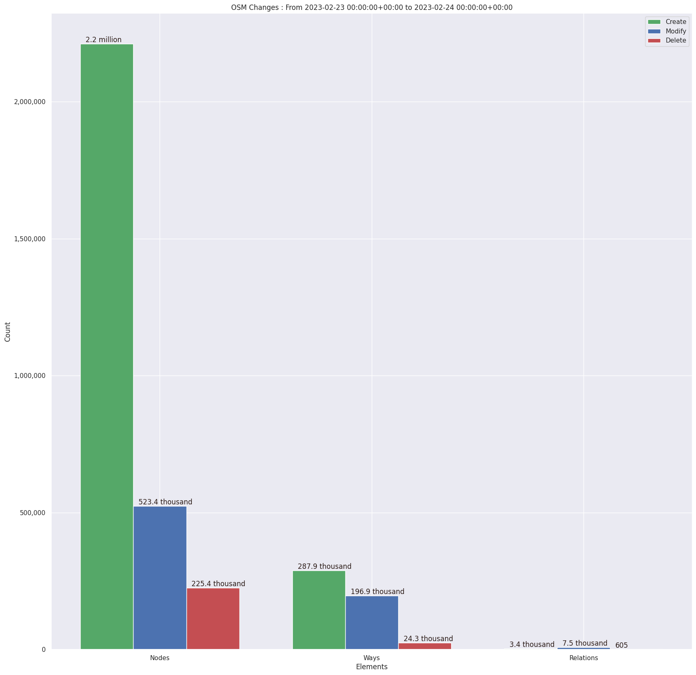
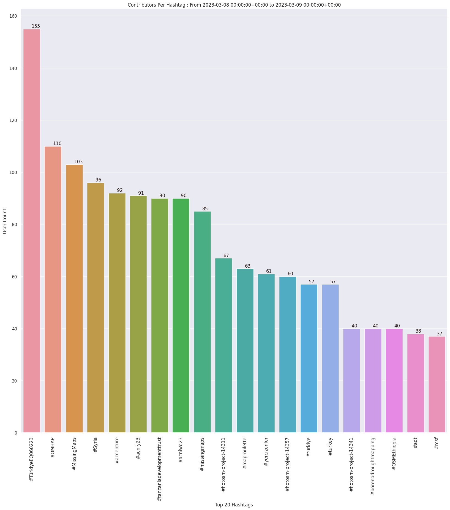
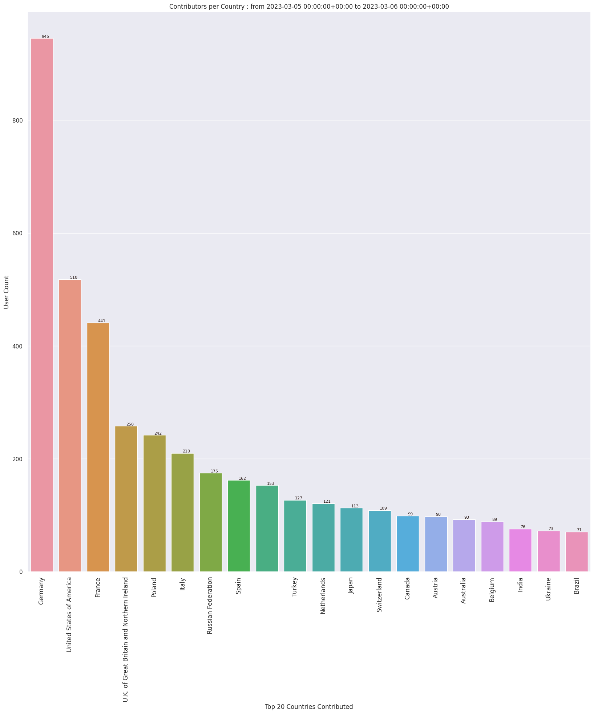
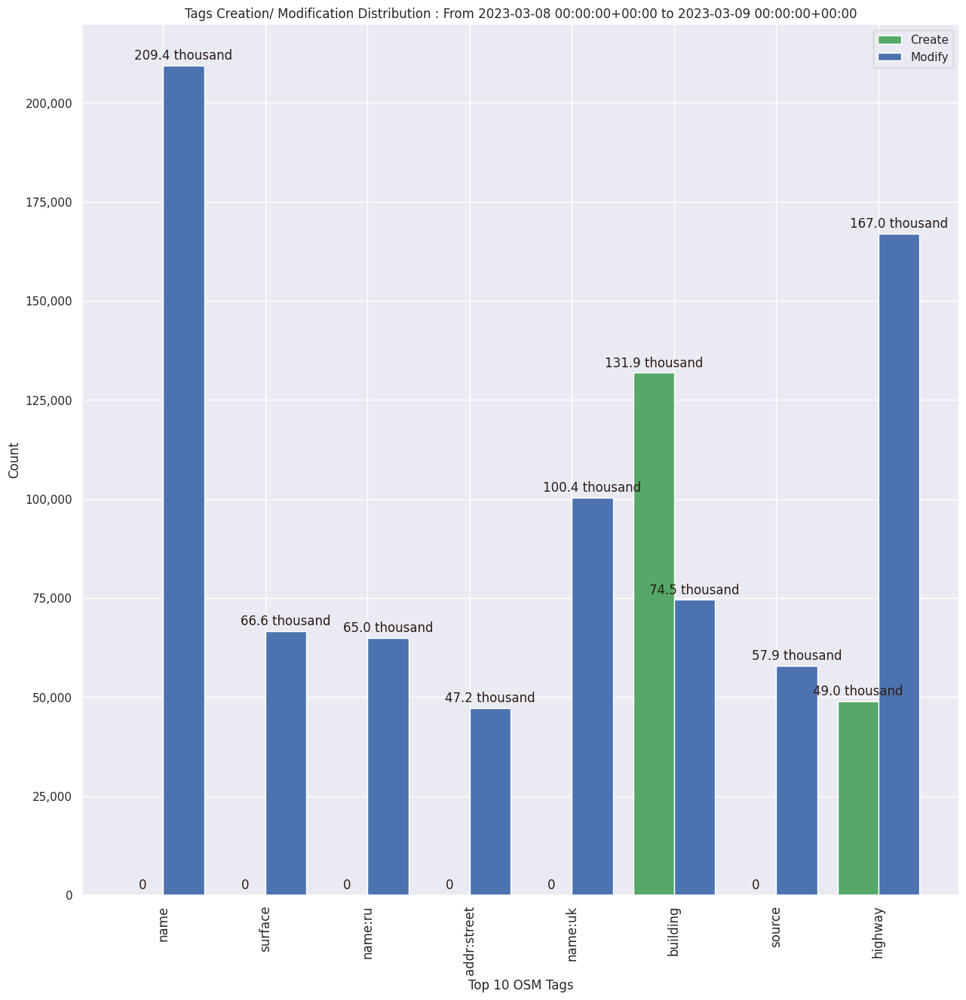

### Last Update : Stats from 2023-02-28 00:00:00+00:00 to 2023-03-01 00:00:00+00:00 (UTC Timezone)

#### 6.1 thousand Users made 42.3 thousand changesets with 3.5 million map changes.
#### 2.4 million OSM Elements were Created, 875.2 thousand Modified & 244.5 thousand Deleted.

Top 5 Users are : 
- ilyessem : 58.9 thousand Map Changes
- kutukola : 55.1 thousand Map Changes
- Guthrie : 47.4 thousand Map Changes
- felipeeugenio : 40.1 thousand Map Changes
- FOSStreetMap : 27.2 thousand Map Changes

Summary of Supplied Tags
- poi = Created: 60.7 thousand, Modified : 49.4 thousand
- building = Created: 146.3 thousand, Modified : 60.9 thousand
- highway = Created: 63.8 thousand, Modified : 126.7 thousand
- waterway = Created: 17.2 thousand, Modified : 3.7 thousand
- amenity = Created: 8.6 thousand, Modified : 20.5 thousand

Top 5 Created tags are :
- building: 146.3 thousand
- highway: 63.8 thousand
- source: 44.5 thousand
- natural: 17.9 thousand
- waterway: 17.2 thousand

Top 5 Modified tags are :
- highway: 126.7 thousand
- name: 95.0 thousand
- building: 60.9 thousand
- surface: 56.7 thousand
- source: 51.6 thousand

Top 5 trending hashtags are:
- #TürkiyeEQ060223 : 263 users
- #adt : 183 users
- #yercizenler : 156 users
- #turkey : 143 users

Top 5 trending Countries where user contributed are:
- Germany : 843 users
- United States of America : 652 users
- France : 408 users
- U.K. of Great Britain and Northern Ireland : 253 users
- Turkey : 224 users

 Charts : 
 
 
 
 
