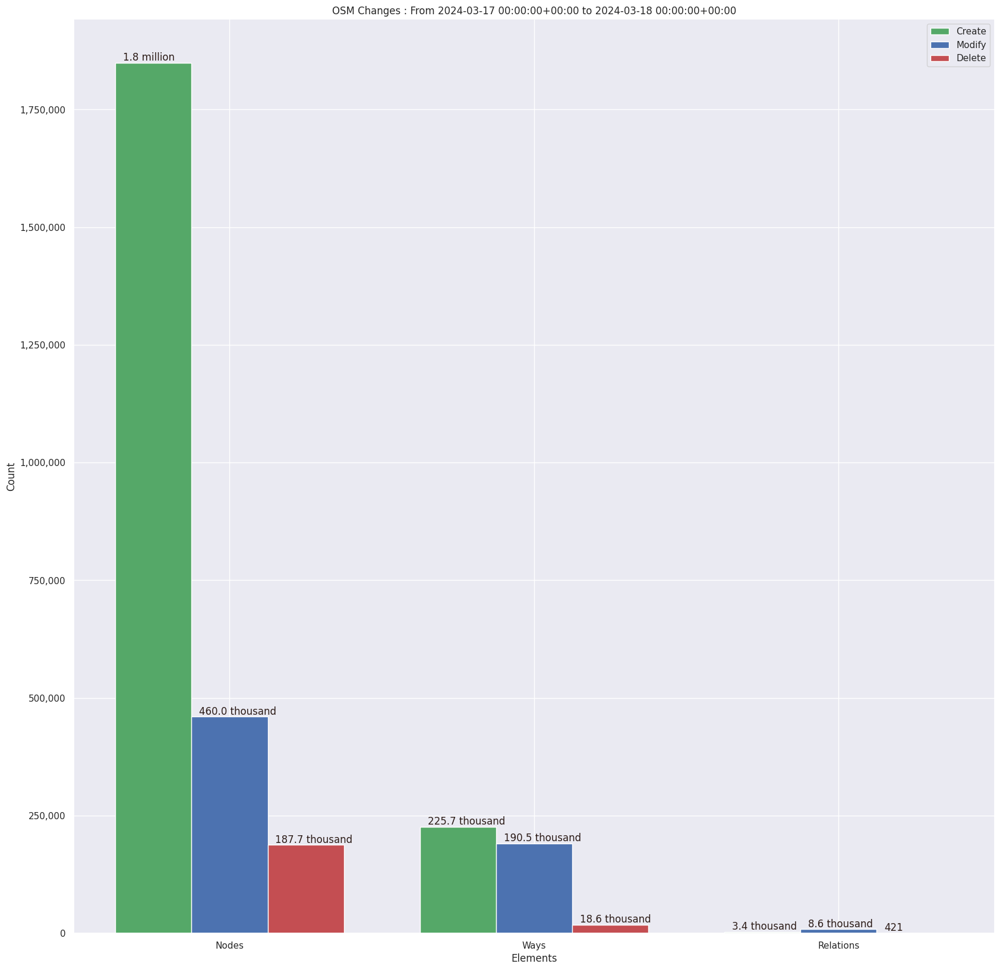
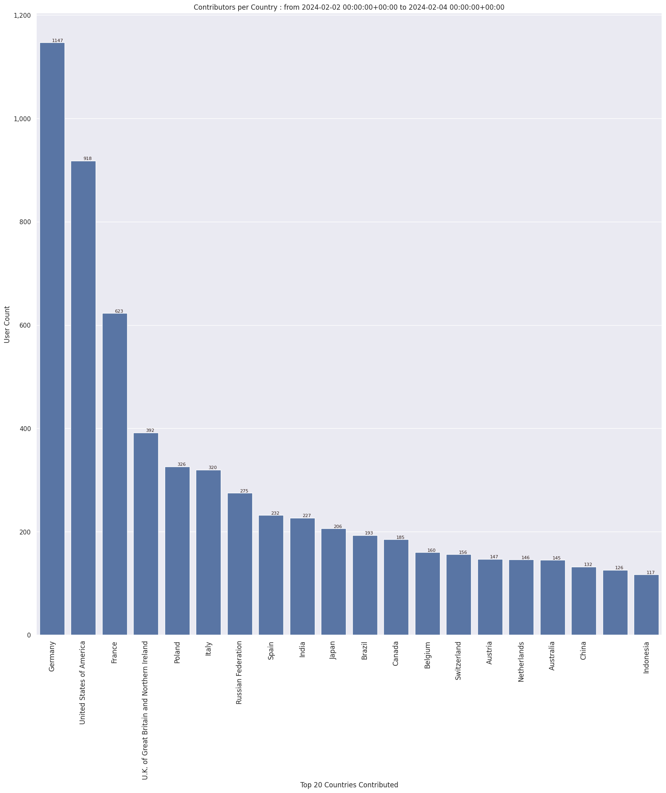
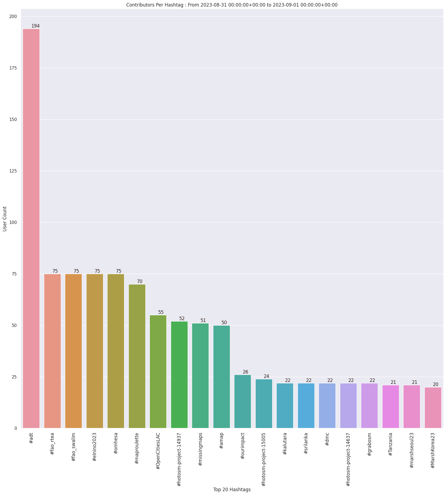
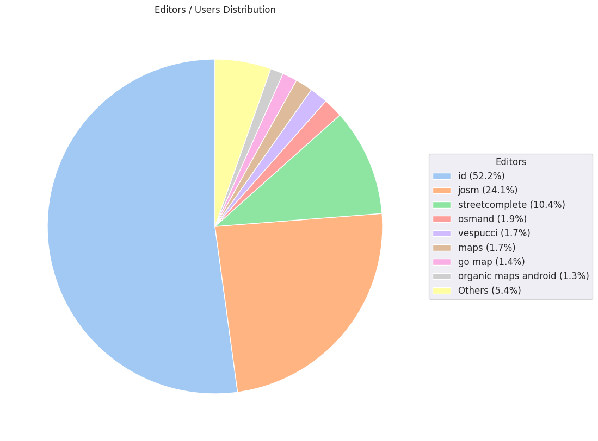
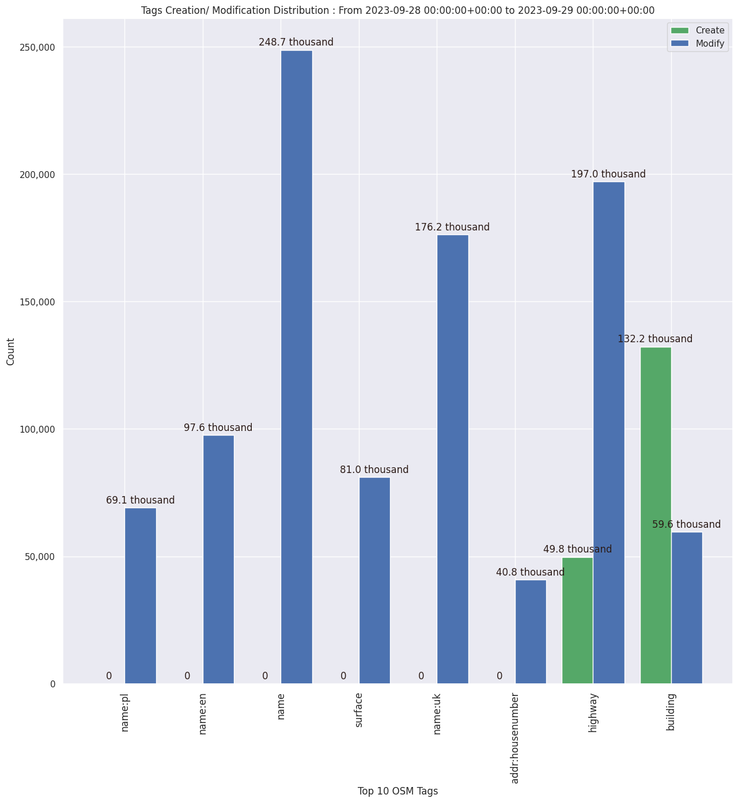

### Last Update : Stats from 2024-02-21 00:00:00+00:00 to 2024-02-22 00:00:00+00:00 (UTC Timezone)

#### 5.9 thousand Users made 41.1 thousand changesets with 4.7 million map changes.
#### 3.7 million OSM Elements were Created, 771.2 thousand Modified & 236.1 thousand Deleted.
Get Full Stats at [stats.csv](/stats/Global/Daily/stats.csv)
 & Get Summary Stats at [stats_summary.csv](/stats/Global/Daily/stats_summary.csv)

Top 5 Users are : 
- dmich9 : 641.4 thousand Map Changes
- jmarchon : 636.5 thousand Map Changes
- NK Whitla : 78.4 thousand Map Changes
- Omnific : 39.2 thousand Map Changes
- Dinsh : 37.7 thousand Map Changes

Summary of Supplied Tags
- poi = Created: 45.2 thousand, Modified : 42.3 thousand
- building = Created: 171.1 thousand, Modified : 56.2 thousand
- highway = Created: 59.6 thousand, Modified : 113.8 thousand
- waterway = Created: 31.5 thousand, Modified : 3.9 thousand
- amenity = Created: 8.4 thousand, Modified : 10.8 thousand

Top 5 Created tags are :
- building: 171.1 thousand
- source: 112.9 thousand
- highway: 59.6 thousand
- natural: 47.1 thousand
- waterway: 31.5 thousand

Top 5 Modified tags are :
- highway: 113.8 thousand
- name: 75.8 thousand
- building: 56.2 thousand
- surface: 51.2 thousand
- addr:street: 40.2 thousand

Top 5 trending hashtags are:
- #adt : 192 users
- #maproulette : 86 users
- #missingmaps : 78 users
- #accenture : 40 users

Top 5 trending editors are:
- iD 2.27.3 : 3155 users
- StreetComplete 56.1 : 550 users
- JOSM/1.5 (18969 en) : 285 users
- JOSM/1.5 (18822 en) : 258 users
- iD 2.21.1 : 252 users

Top 5 trending Countries where user contributed are:
- Germany : 807 users
- United States of America : 653 users
- France : 429 users
- U.K. of Great Britain and Northern Ireland : 264 users
- Poland : 234 users

 Charts : 
 
 
 
 
 
