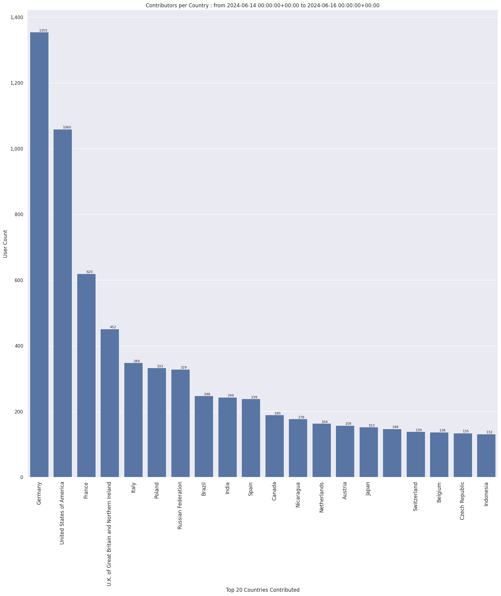

### Last Update : Stats from 2024-02-27 00:00:00+00:00 to 2024-02-28 00:00:00+00:00 (UTC Timezone)

#### 6.1 thousand Users made 40.1 thousand changesets with 4.6 million map changes.
#### 3.5 million OSM Elements were Created, 843.2 thousand Modified & 257.2 thousand Deleted.
Get Full Stats at [stats.csv](/stats/Global/Daily/stats.csv)
 & Get Summary Stats at [stats_summary.csv](/stats/Global/Daily/stats_summary.csv)

Top 5 Users are : 
- jmarchon : 676.9 thousand Map Changes
- dmich9 : 560.1 thousand Map Changes
- Friendly_Ghost : 106.8 thousand Map Changes
- nitemoon : 54.2 thousand Map Changes
- _jcaruso : 53.2 thousand Map Changes

Summary of Supplied Tags
- poi = Created: 54.1 thousand, Modified : 48.7 thousand
- building = Created: 166.8 thousand, Modified : 54.7 thousand
- highway = Created: 59.4 thousand, Modified : 113.8 thousand
- waterway = Created: 33.5 thousand, Modified : 76.6 thousand
- amenity = Created: 10.9 thousand, Modified : 14.8 thousand

Top 5 Created tags are :
- building: 166.8 thousand
- source: 108.4 thousand
- highway: 59.4 thousand
- natural: 54.2 thousand
- waterway: 33.5 thousand

Top 5 Modified tags are :
- source: 137.0 thousand
- highway: 113.8 thousand
- name: 98.6 thousand
- nhd:reach_code: 84.3 thousand
- nhd:com_id: 84.3 thousand

Top 5 trending hashtags are:
- #adt : 186 users
- #maproulette : 82 users
- #DRC : 72 users
- #awsmapathon : 72 users

Top 5 trending editors are:
- iD 2.27.3 : 3257 users
- StreetComplete 56.1 : 518 users
- JOSM/1.5 (18969 en) : 450 users
- iD 2.21.1 : 329 users
- JOSM/1.5 (18969 de) : 146 users

Top 5 trending Countries where user contributed are:
- Germany : 803 users
- United States of America : 684 users
- France : 399 users
- U.K. of Great Britain and Northern Ireland : 274 users
- Russian Federation : 253 users

 Charts : 
 
 
 
 
 
