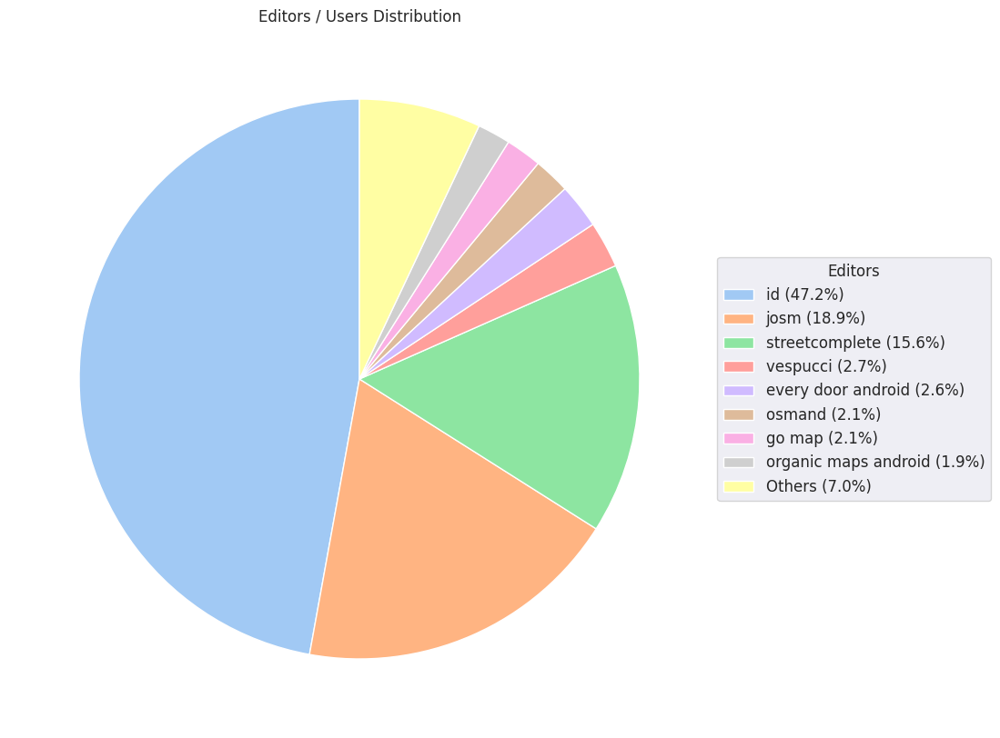

### Last Update : Stats from 2023-10-03 00:00:00+00:00 to 2023-10-04 00:00:00+00:00 (UTC Timezone)

#### 6.4 thousand Users made 54.0 thousand changesets with 3.7 million map changes.
#### 2.5 million OSM Elements were Created, 894.3 thousand Modified & 277.2 thousand Deleted.
Get Full Stats at [stats.csv](/stats/Global/Daily/stats.csv)
 & Get Summary Stats at [stats_summary.csv](/stats/Global/Daily/stats_summary.csv)

Top 5 Users are : 
- NKA : 464.9 thousand Map Changes
- Local-Mapper : 51.7 thousand Map Changes
- Miroff : 51.5 thousand Map Changes
- SvM : 44.3 thousand Map Changes
- okadatsuneo_import : 41.7 thousand Map Changes

Summary of Supplied Tags
- poi = Created: 44.7 thousand, Modified : 80.4 thousand
- building = Created: 126.4 thousand, Modified : 57.3 thousand
- highway = Created: 56.0 thousand, Modified : 186.9 thousand
- waterway = Created: 6.5 thousand, Modified : 5.2 thousand
- amenity = Created: 9.4 thousand, Modified : 32.3 thousand

Top 5 Created tags are :
- building: 126.4 thousand
- highway: 56.0 thousand
- source: 38.8 thousand
- natural: 19.7 thousand
- name: 16.7 thousand

Top 5 Modified tags are :
- highway: 186.9 thousand
- name: 166.4 thousand
- name:uk: 66.5 thousand
- surface: 65.3 thousand
- crossing: 62.0 thousand

Top 5 trending hashtags are:
- #adt : 187 users
- #missingmaps : 70 users
- #maproulette : 64 users
- #amap : 56 users

Top 5 trending editors are:
- iD 2.27.1 : 3233 users
- StreetComplete 54.1 : 473 users
- StreetComplete 54.0 : 428 users
- JOSM/1.5 (18822 en) : 277 users
- iD 2.21.1 : 200 users

Top 5 trending Countries where user contributed are:
- Germany : 1034 users
- United States of America : 754 users
- France : 407 users
- U.K. of Great Britain and Northern Ireland : 287 users
- Italy : 265 users

 Charts : 
 
 
 
 
 
