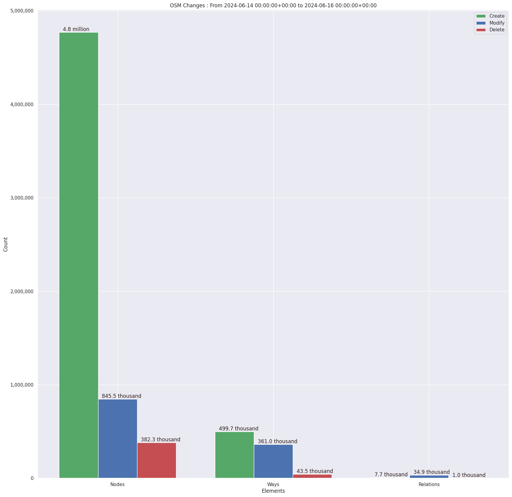

### Last Update : Stats from 2023-06-13 00:00:00+00:00 to 2023-06-14 00:00:00+00:00 (UTC Timezone)

#### 6.3 thousand Users made 42.2 thousand changesets with 3.6 million map changes.
#### 2.8 million OSM Elements were Created, 640.1 thousand Modified & 175.0 thousand Deleted.
Get Full Stats at [stats.csv](/stats/Global/Daily/stats.csv)
 & Get Summary Stats at [stats_summary.csv](/stats/Global/Daily/stats_summary.csv)

Top 5 Users are : 
- jmarchon : 649.4 thousand Map Changes
- GrubbyHorsefly : 115.3 thousand Map Changes
- saifuldehas : 92.1 thousand Map Changes
- Koreller : 29.9 thousand Map Changes
- Evarist Isdory_ImportAccount : 26.9 thousand Map Changes

Summary of Supplied Tags
- poi = Created: 49.0 thousand, Modified : 45.0 thousand
- building = Created: 130.0 thousand, Modified : 52.3 thousand
- highway = Created: 50.9 thousand, Modified : 122.6 thousand
- waterway = Created: 20.0 thousand, Modified : 3.8 thousand
- amenity = Created: 9.8 thousand, Modified : 9.6 thousand

Top 5 Created tags are :
- building: 130.0 thousand
- highway: 50.9 thousand
- source: 44.7 thousand
- natural: 23.4 thousand
- waterway: 20.0 thousand

Top 5 Modified tags are :
- highway: 122.6 thousand
- name: 88.3 thousand
- surface: 55.9 thousand
- building: 52.3 thousand
- source: 41.1 thousand

Top 5 trending hashtags are:
- #adt : 184 users
- #missingmaps : 129 users
- #OpenCitiesLAC : 105 users
- #msgivesback : 82 users

Top 5 trending editors are:
- iD 2.25.2 : 3249 users
- StreetComplete 53.1 : 700 users
- iD 2.21.1 : 356 users
- JOSM/1.5 (18746 en) : 199 users
- JOSM/1.5 (18678 en) : 196 users

Top 5 trending Countries where user contributed are:
- Germany : 894 users
- United States of America : 699 users
- France : 440 users
- U.K. of Great Britain and Northern Ireland : 268 users
- Russian Federation : 263 users

 Charts : 
 
 
 
 
 
