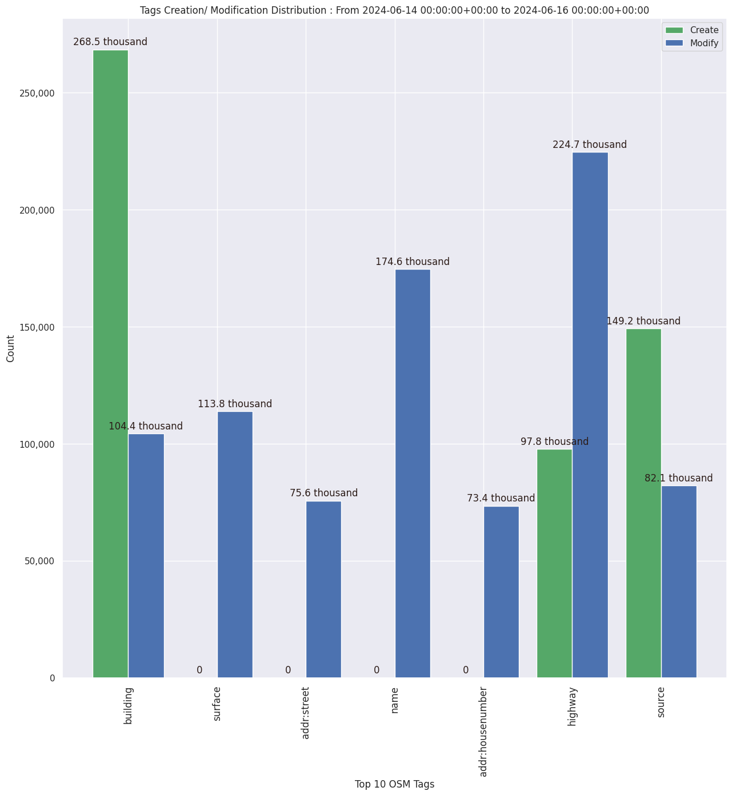

### Last Update : Stats from 2024-03-23 00:00:00+00:00 to 2024-03-25 00:00:00+00:00 (UTC Timezone)

#### 8.0 thousand Users made 74.7 thousand changesets with 7.0 million map changes.
#### 5.2 million OSM Elements were Created, 1.4 million Modified & 376.5 thousand Deleted.
Get Full Stats at [stats.csv](/stats/Global/Daily/stats.csv)
 & Get Summary Stats at [stats_summary.csv](/stats/Global/Daily/stats_summary.csv)

Top 5 Users are : 
- dmich9 : 329.1 thousand Map Changes
- OneStaticIP : 320.7 thousand Map Changes
- Rngrk : 91.3 thousand Map Changes
- jmarchon : 90.1 thousand Map Changes
- NicaTopo : 88.8 thousand Map Changes

Summary of Supplied Tags
- poi = Created: 115.9 thousand, Modified : 83.4 thousand
- building = Created: 302.7 thousand, Modified : 120.6 thousand
- highway = Created: 87.7 thousand, Modified : 257.1 thousand
- waterway = Created: 25.6 thousand, Modified : 10.7 thousand
- amenity = Created: 16.1 thousand, Modified : 21.6 thousand

Top 5 Created tags are :
- building: 302.7 thousand
- source: 119.5 thousand
- highway: 87.7 thousand
- natural: 58.2 thousand
- addr:housenumber: 37.3 thousand

Top 5 Modified tags are :
- highway: 257.1 thousand
- name: 193.6 thousand
- surface: 124.1 thousand
- building: 120.6 thousand
- oneway: 91.8 thousand

Top 5 trending hashtags are:
- #wnah : 103 users
- #OSMAfrica : 81 users
- #missingmaps : 76 users
- #maproulette : 67 users

Top 5 trending editors are:
- iD 2.28.1 : 4018 users
- StreetComplete 57.1 : 1244 users
- JOSM/1.5 (19017 en) : 267 users
- iD 2.21.1 : 242 users
- Every Door Android 4.1 : 194 users

Top 5 trending Countries where user contributed are:
- Germany : 1440 users
- United States of America : 763 users
- France : 675 users
- U.K. of Great Britain and Northern Ireland : 377 users
- Italy : 365 users

 Charts : 
 
 
 
 
 
