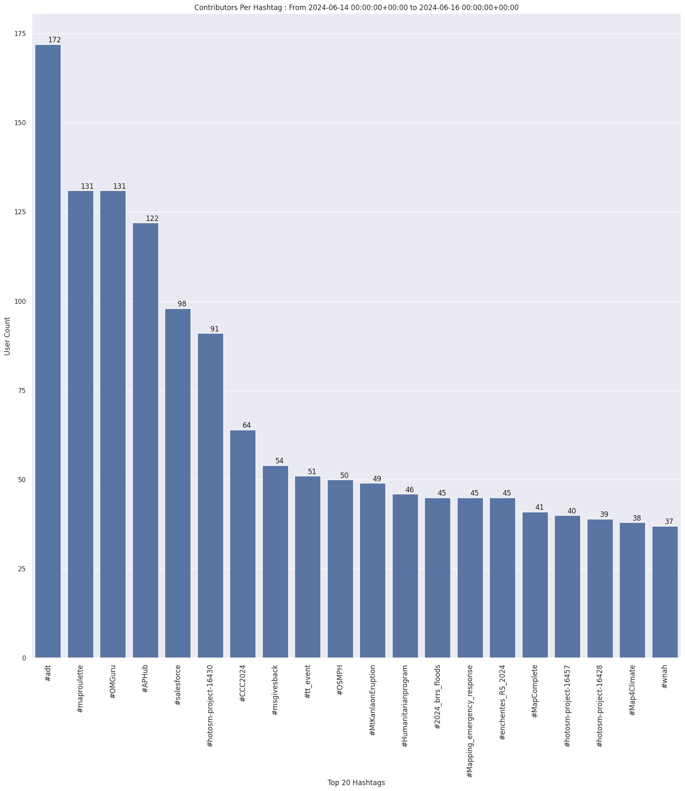

### Last Update : Stats from 2023-10-15 00:00:00+00:00 to 2023-10-16 00:00:00+00:00 (UTC Timezone)

#### 5.4 thousand Users made 43.1 thousand changesets with 3.1 million map changes.
#### 2.0 million OSM Elements were Created, 893.5 thousand Modified & 177.9 thousand Deleted.
Get Full Stats at [stats.csv](/stats/Global/Daily/stats.csv)
 & Get Summary Stats at [stats_summary.csv](/stats/Global/Daily/stats_summary.csv)

Top 5 Users are : 
- Heinz_V : 138.5 thousand Map Changes
- Fizzie41 : 99.3 thousand Map Changes
- btns : 88.4 thousand Map Changes
- Fashioned Eleph : 50.4 thousand Map Changes
- ReleasedBait : 40.6 thousand Map Changes

Summary of Supplied Tags
- poi = Created: 73.9 thousand, Modified : 143.6 thousand
- building = Created: 94.9 thousand, Modified : 61.0 thousand
- highway = Created: 45.9 thousand, Modified : 217.8 thousand
- waterway = Created: 5.0 thousand, Modified : 13.1 thousand
- amenity = Created: 8.6 thousand, Modified : 30.3 thousand

Top 5 Created tags are :
- building: 94.9 thousand
- highway: 45.9 thousand
- addr:housenumber: 28.5 thousand
- source: 27.7 thousand
- addr:street: 27.6 thousand

Top 5 Modified tags are :
- name: 291.8 thousand
- highway: 217.8 thousand
- name:uk: 198.4 thousand
- name:ru: 100.4 thousand
- name:en: 95.3 thousand

Top 5 trending hashtags are:
- #hotosm-project-15658 : 76 users
- #AfghanistanEarthquake2023 : 76 users
- #APHub : 76 users
- #missingmaps : 42 users

Top 5 trending editors are:
- iD 2.27.1 : 2555 users
- StreetComplete 54.1 : 851 users
- JOSM/1.5 (18822 en) : 266 users
- JOSM/1.5 (18822 de) : 192 users
- Go Map!! 3.4.8 : 128 users

Top 5 trending Countries where user contributed are:
- Germany : 993 users
- United States of America : 517 users
- France : 441 users
- U.K. of Great Britain and Northern Ireland : 271 users
- Italy : 205 users

 Charts : 
 
 
 
 
 
