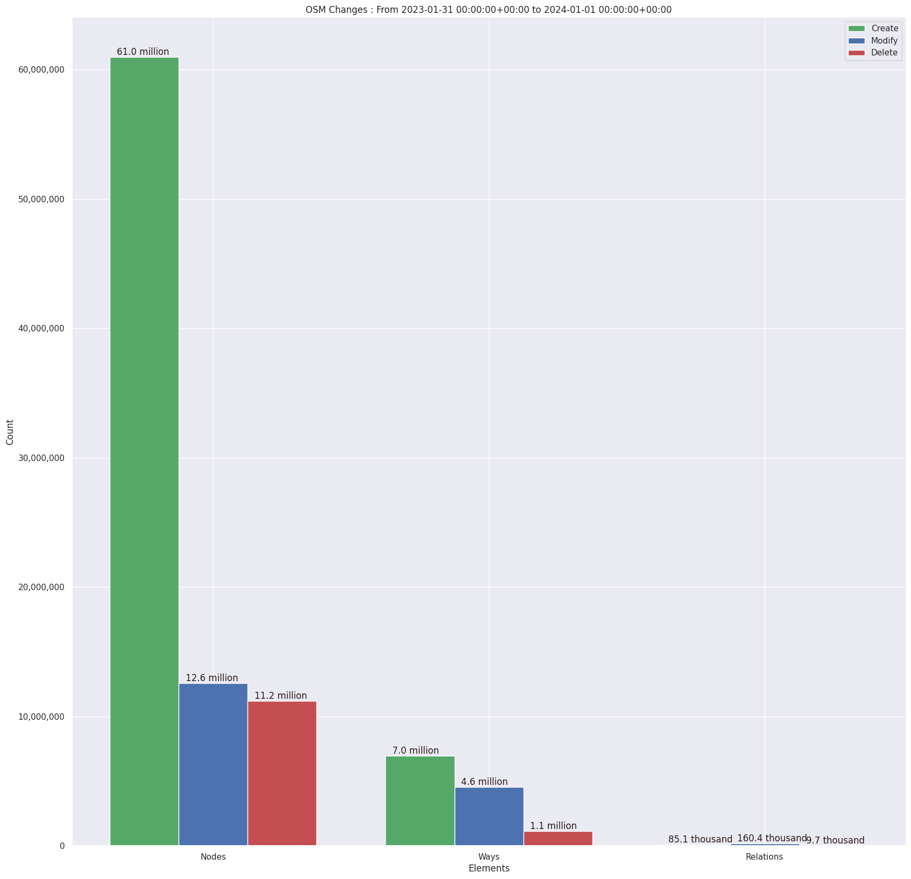
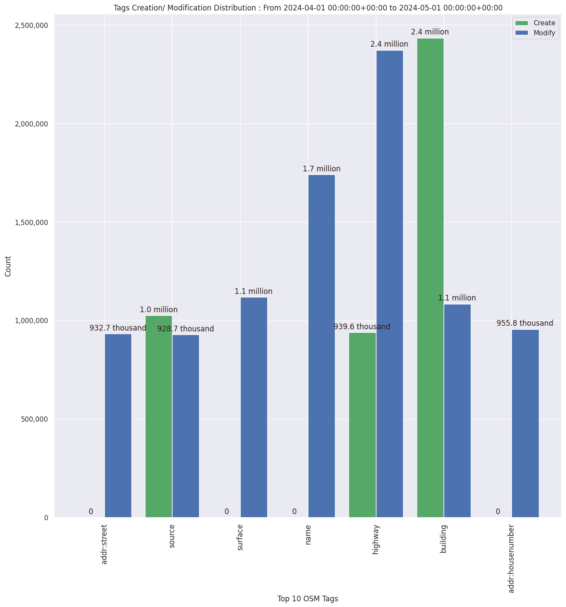

### Last Update : Stats from 2024-01-01 00:00:00+00:00 to 2024-04-01 00:00:00+00:00 (UTC Timezone)

#### 30.3 thousand Users made 661.9 thousand changesets with 71.5 million map changes.
#### 53.4 million OSM Elements were Created, 12.4 million Modified & 5.6 million Deleted.
Get Full Stats at [stats.csv](/stats/Global/Monthly/stats.csv)
 & Get Summary Stats at [stats_summary.csv](/stats/Global/Monthly/stats_summary.csv)

Top 5 Users are : 
- SherbetS_Import : 5.7 million Map Changes
- dmich9 : 5.2 million Map Changes
- jmarchon : 5.2 million Map Changes
- mzve : 743.0 thousand Map Changes
- harahu_import : 592.1 thousand Map Changes

Summary of Supplied Tags
- poi = Created: 1.1 million, Modified : 1.1 million
- building = Created: 2.0 million, Modified : 1.1 million
- highway = Created: 814.2 thousand, Modified : 1.8 million
- waterway = Created: 278.3 thousand, Modified : 67.1 thousand
- amenity = Created: 148.1 thousand, Modified : 319.1 thousand

Top 5 Created tags are :
- building: 2.0 million
- source: 850.7 thousand
- highway: 814.2 thousand
- natural: 604.7 thousand
- addr:housenumber: 521.6 thousand

Top 5 Modified tags are :
- highway: 1.8 million
- name: 1.6 million
- building: 1.1 million
- surface: 812.4 thousand
- addr:city: 791.0 thousand

 Charts : 
 
 
