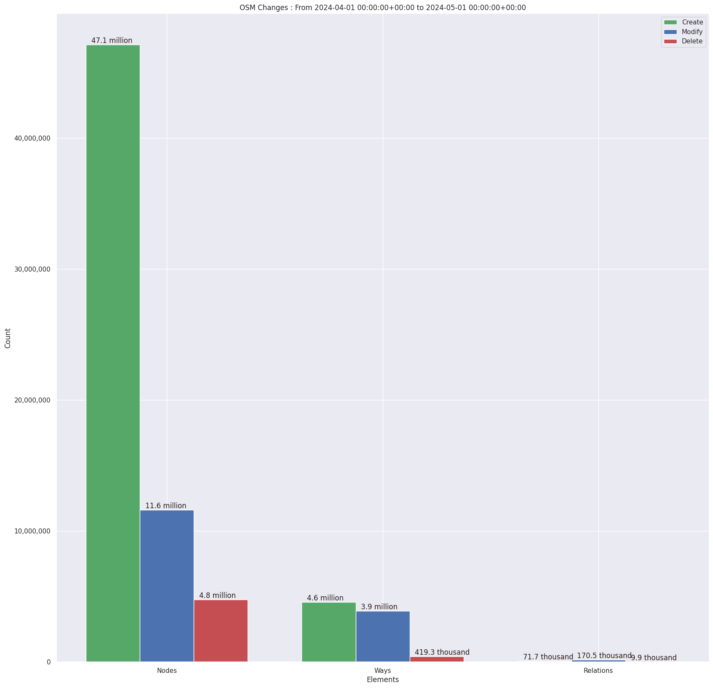

### Last Update : Stats from 2024-04-01 00:00:00+00:00 to 2024-05-01 00:00:00+00:00 (UTC Timezone)

#### 40.4 thousand Users made 878.1 thousand changesets with 72.7 million map changes.
#### 51.8 million OSM Elements were Created, 15.7 million Modified & 5.2 million Deleted.
Get Full Stats at [stats.csv](/stats/Global/Monthly/stats.csv)
 & Get Summary Stats at [stats_summary.csv](/stats/Global/Monthly/stats_summary.csv)

Top 5 Users are : 
- dmich9 : 6.5 million Map Changes
- jmarchon : 4.1 million Map Changes
- Rngrk : 799.1 thousand Map Changes
- Spaghetti Monster🍝 : 466.0 thousand Map Changes
- okadatsuneo_import : 406.4 thousand Map Changes

Summary of Supplied Tags
- poi = Created: 1.1 million, Modified : 1.4 million
- building = Created: 2.4 million, Modified : 1.1 million
- highway = Created: 939.6 thousand, Modified : 2.4 million
- waterway = Created: 227.1 thousand, Modified : 176.6 thousand
- amenity = Created: 172.7 thousand, Modified : 265.4 thousand

Top 5 Created tags are :
- building: 2.4 million
- source: 1.0 million
- highway: 939.6 thousand
- natural: 580.0 thousand
- name: 302.6 thousand

Top 5 Modified tags are :
- highway: 2.4 million
- name: 1.7 million
- surface: 1.1 million
- building: 1.1 million
- addr:housenumber: 955.8 thousand

 Charts : 
 
 
