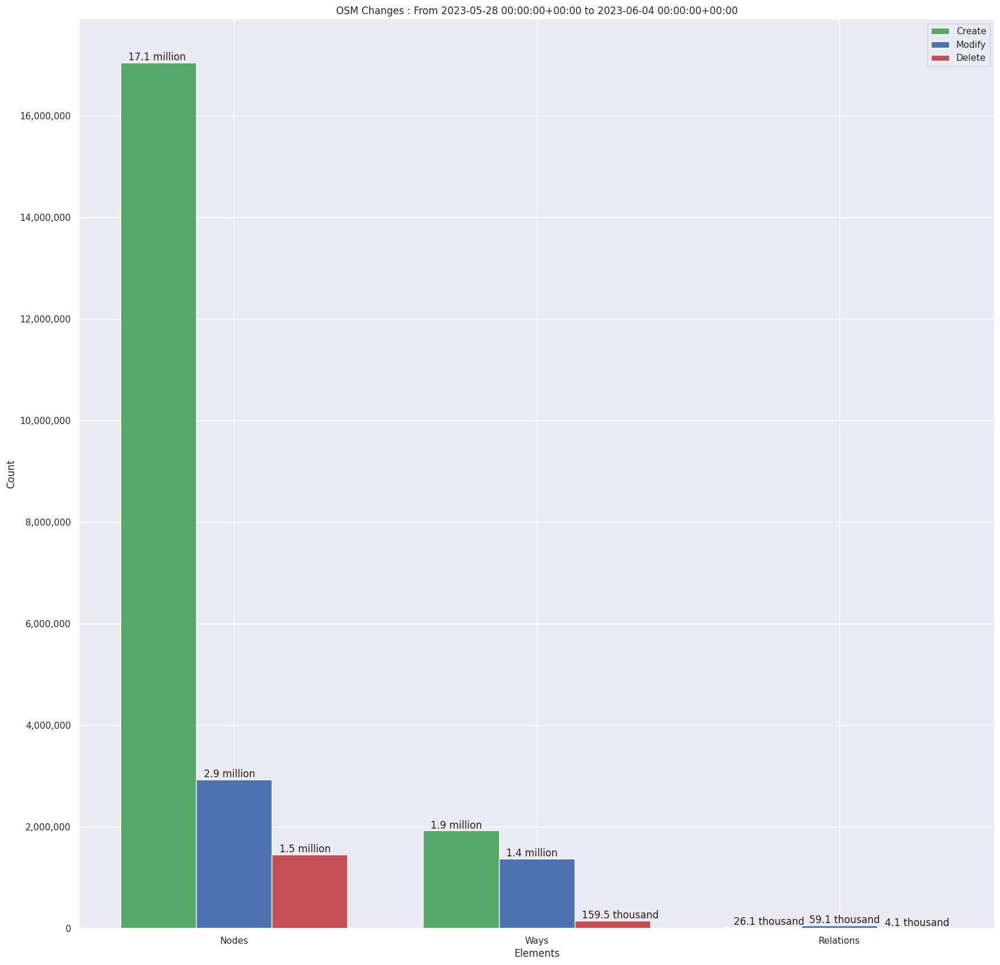
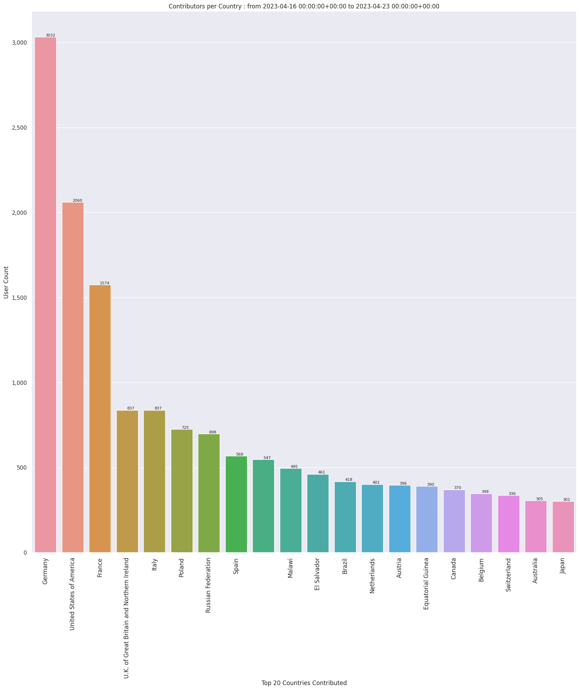
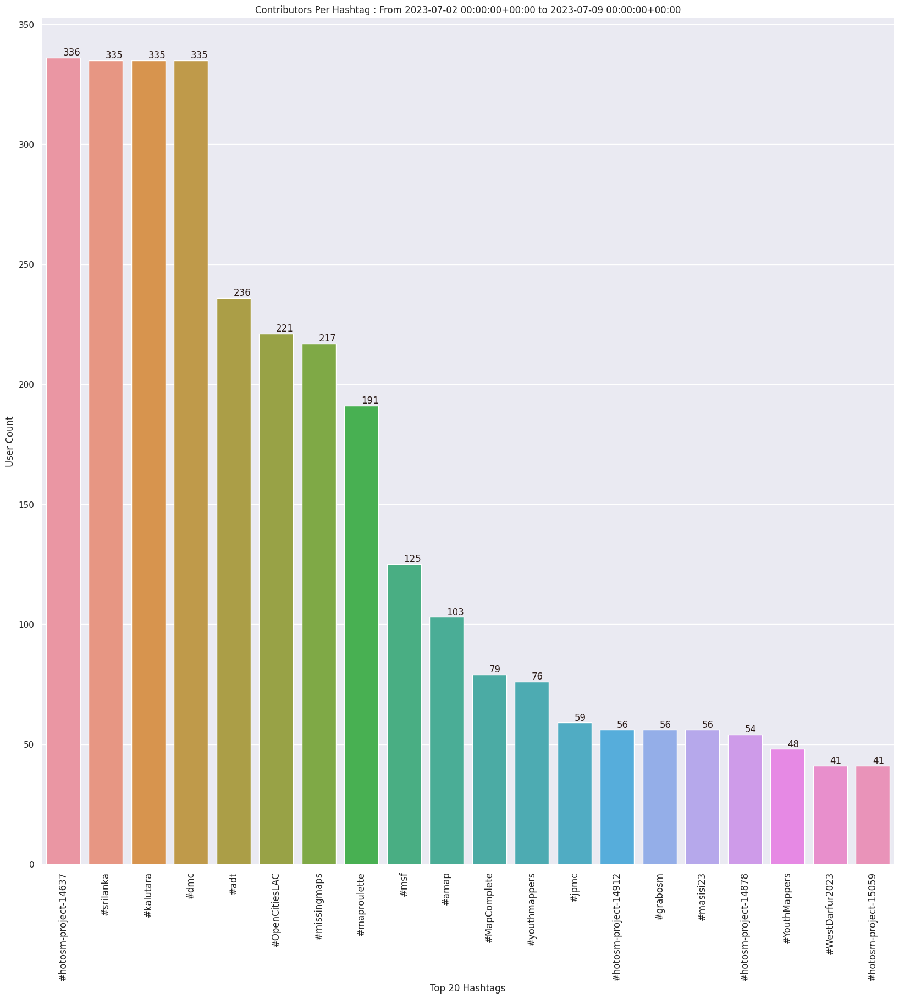
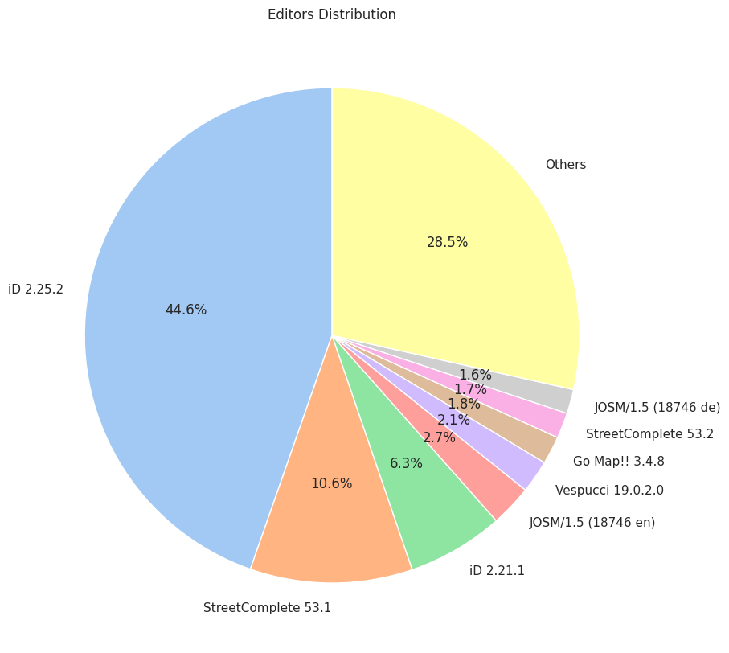
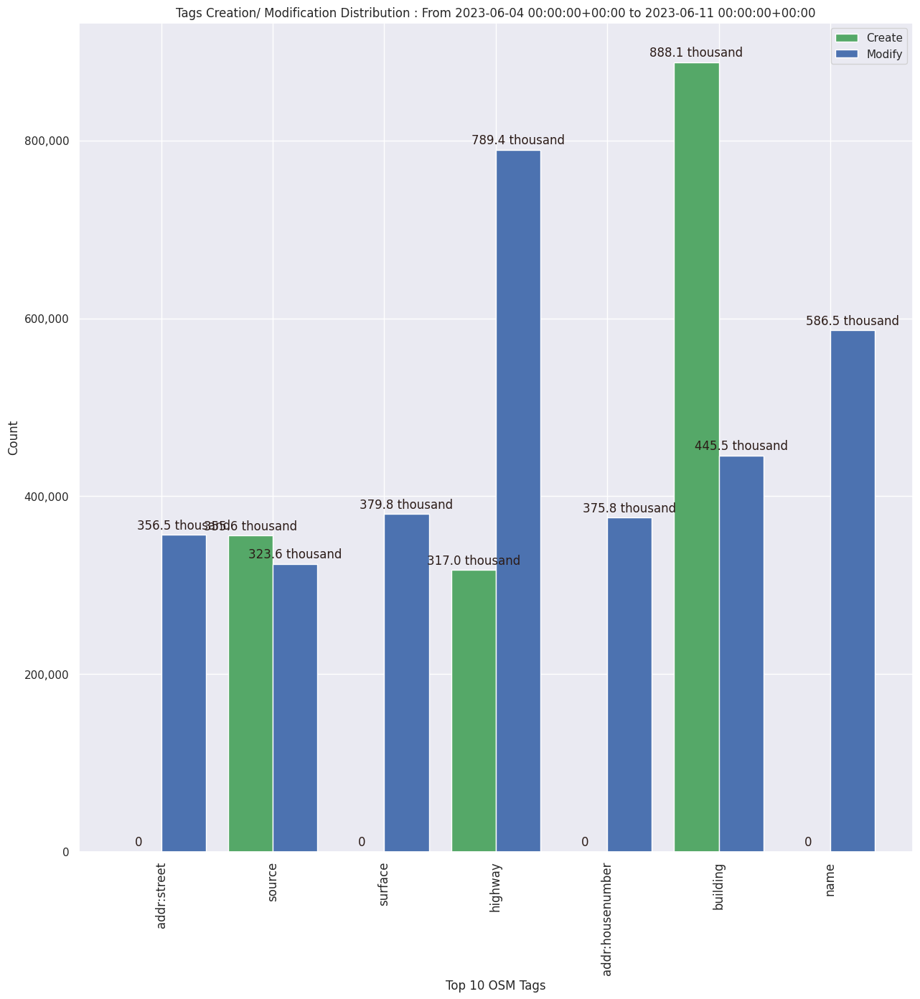

### Last Update : Stats from 2023-06-18 00:00:00+00:00 to 2023-06-25 00:00:00+00:00 (UTC Timezone)

#### 19.2 thousand Users made 273.2 thousand changesets with 26.0 million map changes.
#### 18.7 million OSM Elements were Created, 4.5 million Modified & 2.8 million Deleted.
Get Full Stats at [stats.csv](/stats/Global/Weekly/stats.csv)
 & Get Summary Stats at [stats_summary.csv](/stats/Global/Weekly/stats_summary.csv)

Top 5 Users are : 
- josail : 2.2 million Map Changes
- jmarchon : 1.7 million Map Changes
- SherbetS_Import : 1.6 million Map Changes
- SomeoneElse_Revert : 1.1 million Map Changes
- Superadlen : 674.1 thousand Map Changes

Summary of Supplied Tags
- poi = Created: 561.6 thousand, Modified : 325.9 thousand
- building = Created: 893.1 thousand, Modified : 583.2 thousand
- highway = Created: 327.1 thousand, Modified : 771.5 thousand
- waterway = Created: 75.6 thousand, Modified : 24.0 thousand
- amenity = Created: 65.2 thousand, Modified : 72.2 thousand

Top 5 Created tags are :
- building: 893.1 thousand
- source: 644.4 thousand
- highway: 327.1 thousand
- addr:housenumber: 324.4 thousand
- addr:city: 281.7 thousand

Top 5 Modified tags are :
- highway: 771.5 thousand
- building: 583.2 thousand
- name: 521.3 thousand
- source: 403.0 thousand
- surface: 363.5 thousand

Top 5 trending hashtags are:
- #OpenCitiesLAC : 571 users
- #missingmaps : 377 users
- #msgivesback : 326 users
- #hotosm-project-14637 : 304 users

Top 5 trending editors are:
- iD 2.25.2 : 10511 users
- StreetComplete 53.1 : 2497 users
- iD 2.21.1 : 1481 users
- JOSM/1.5 (18746 en) : 642 users
- Vespucci 19.0.2.0 : 505 users

Top 5 trending Countries where user contributed are:
- Germany : 3031 users
- United States of America : 1957 users
- France : 1434 users
- Italy : 849 users
- U.K. of Great Britain and Northern Ireland : 835 users

 Charts : 
 
 
 
 
 
