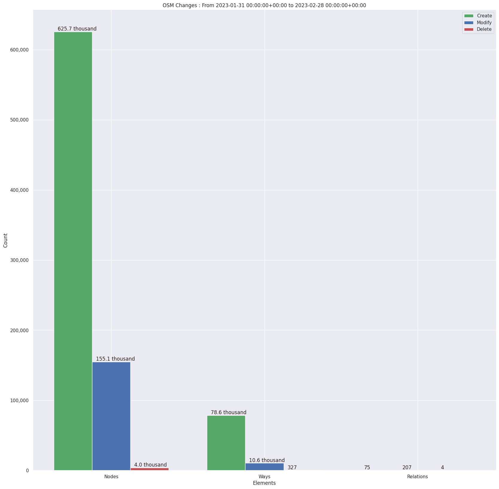
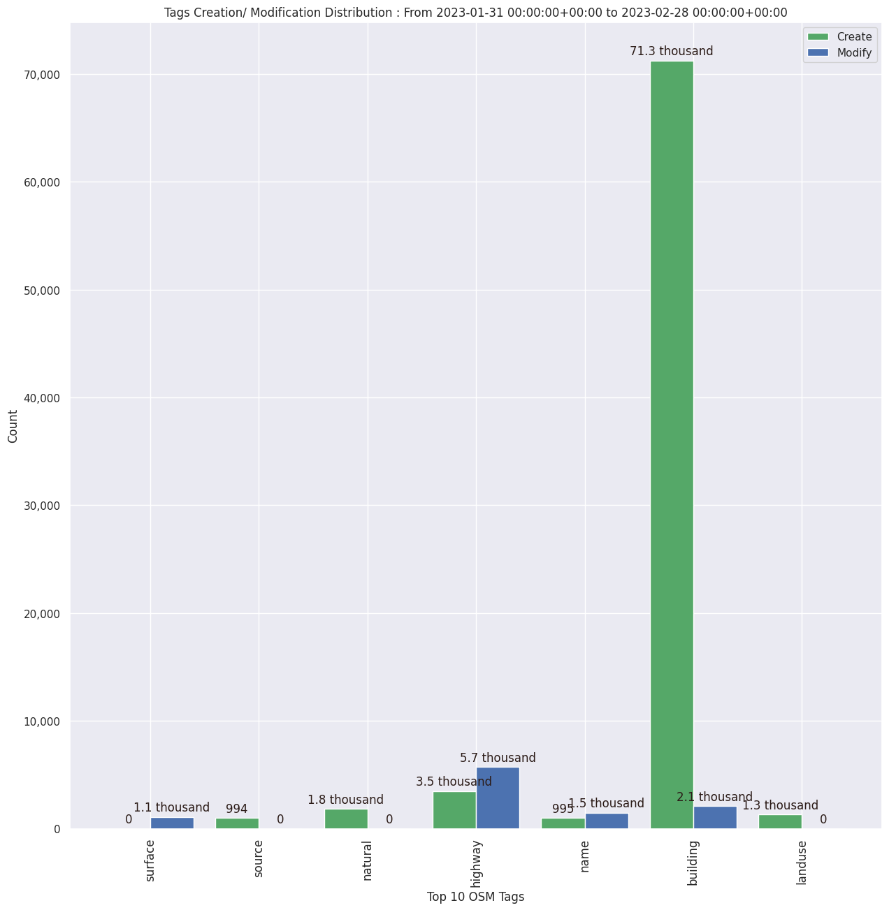

### Last Update : Stats from 2023-01-31 00:00:00+00:00 to 2023-02-28 00:00:00+00:00 (UTC Timezone)

#### 365 Users made 5.2 thousand changesets with 874.6 thousand map changes.
#### 704.3 thousand OSM Elements were Created, 165.9 thousand Modified & 4.4 thousand Deleted.

Top 5 Users are : 
- seichter : 95.6 thousand Map Changes
- Nirmala Rawat : 88.6 thousand Map Changes
- marek kleciak : 82.6 thousand Map Changes
- Lalit_IAAS : 76.1 thousand Map Changes
- Heinz_V : 65.9 thousand Map Changes

Summary of Supplied Tags
- poi = Created: 2.3 thousand, Modified : 785
- building = Created: 71.3 thousand, Modified : 2.1 thousand
- highway = Created: 3.5 thousand, Modified : 5.7 thousand
- waterway = Created: 453, Modified : 873
- amenity = Created: 181, Modified : 263

Top 5 Created tags are :
- building: 71.3 thousand
- highway: 3.5 thousand
- natural: 1.8 thousand
- landuse: 1.3 thousand
- name: 995

Top 5 Modified tags are :
- highway: 5.7 thousand
- building: 2.1 thousand
- name: 1.5 thousand
- surface: 1.1 thousand
- landuse: 899

 Charts : 
 
 
 
 
