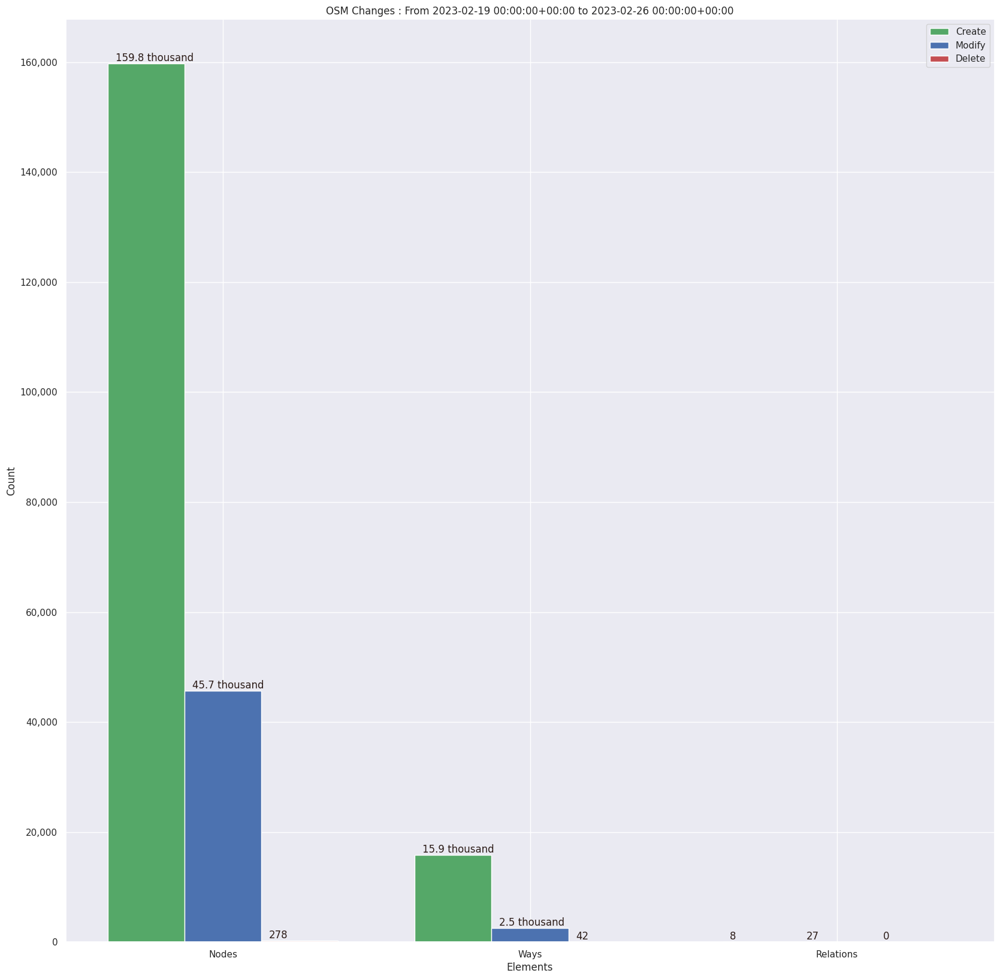
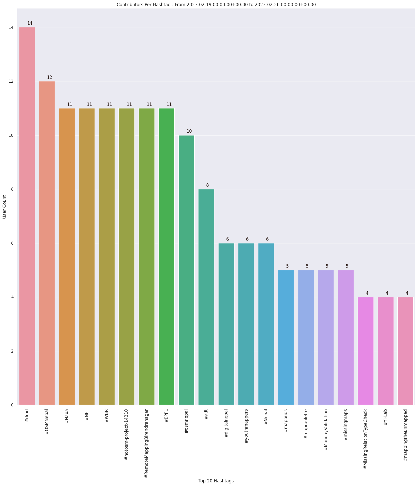
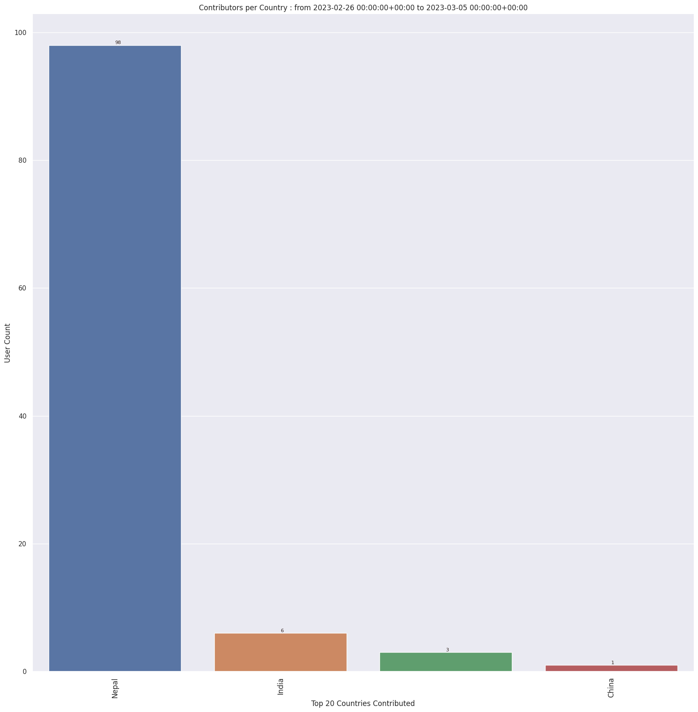
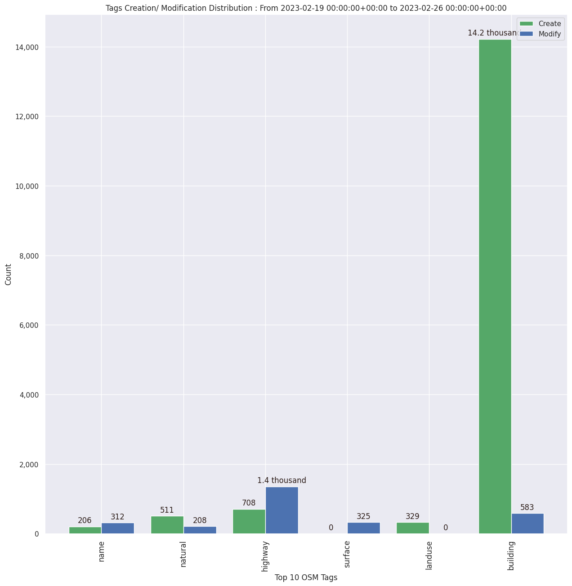

### Last Update :

### Stats From 2023-02-12 00:00:00+00:00 to 2023-02-19 00:00:00+00:00

142 Users made 1214 changesets with 219.8 thousand map changes.
- 179.6 thousand OSM Elements were Created,39.4 thousand Modified & 847 Deleted . Including 20.8 thousand buildings & 727 highways created. Nirmala Rawat tops table with 48.0 thousand changes
- Top three trending hashtags for those stats are #osmnepal : 29, #digitalnepal : 23 & #hotosm-project-14284 : 18
- 
 
 
 
 
