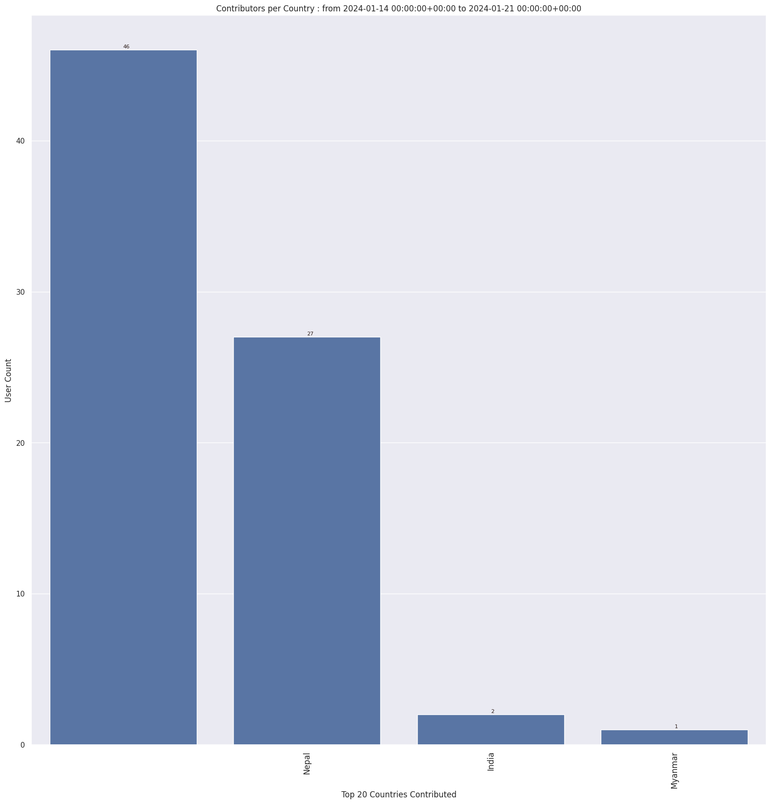

### Last Update : Stats from 2023-04-23 00:00:00+00:00 to 2023-04-30 00:00:00+00:00 (UTC Timezone)

#### 126 Users made 1.1 thousand changesets with 189.5 thousand map changes.
#### 155.8 thousand OSM Elements were Created, 33.1 thousand Modified & 486 Deleted.
Get Full Stats at [stats.csv](/stats/Nepal/Weekly/stats.csv)
 & Get Summary Stats at [stats_summary.csv](/stats/Nepal/Weekly/stats_summary.csv)

Top 5 Users are : 
- Anil Basnet : 51.8 thousand Map Changes
- Rojina Dhakal : 22.7 thousand Map Changes
- marek kleciak : 13.8 thousand Map Changes
- Pooja Dulal : 9.7 thousand Map Changes
- Adrie Sonke : 8.3 thousand Map Changes

Summary of Supplied Tags
- poi = Created: 818, Modified : 303
- building = Created: 15.2 thousand, Modified : 410
- highway = Created: 719, Modified : 4.0 thousand
- waterway = Created: 104, Modified : 139
- amenity = Created: 77, Modified : 158

Top 5 Created tags are :
- building: 15.2 thousand
- name: 749
- highway: 719
- place: 583
- natural: 451

Top 5 Modified tags are :
- highway: 4.0 thousand
- surface: 655
- name: 513
- building: 410
- source: 336

Top 5 trending hashtags are:
- #BIPAD : 14 users
- #Nepal : 13 users
- #digitalnepal : 12 users
- #YILAB : 12 users

Top 5 trending Countries where user contributed are:
- Nepal : 120 users
- China : 3 users
- India : 1 users
- Afghanistan : 1 users

 Charts : 
 
 
 
 
