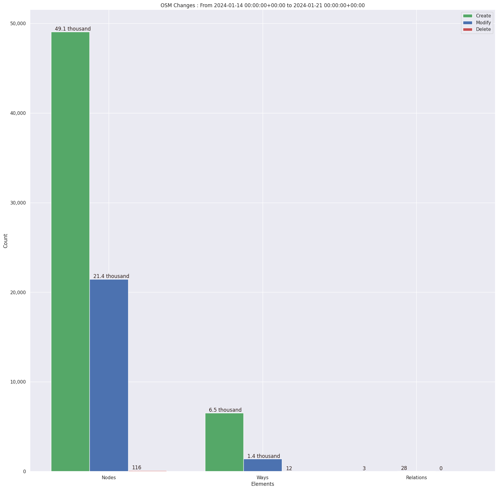

### Last Update : Stats from 2023-04-16 00:00:00+00:00 to 2023-04-23 00:00:00+00:00 (UTC Timezone)

#### 113 Users made 1.1 thousand changesets with 195.7 thousand map changes.
#### 136.9 thousand OSM Elements were Created, 57.9 thousand Modified & 919 Deleted.
Get Full Stats at [stats.csv](/stats/Nepal/Weekly/stats.csv)
 & Get Summary Stats at [stats_summary.csv](/stats/Nepal/Weekly/stats_summary.csv)

Top 5 Users are : 
- Puspa chad : 42.2 thousand Map Changes
- Rojina Dhakal : 26.2 thousand Map Changes
- Anil Basnet : 24.6 thousand Map Changes
- Binisha21 : 22.5 thousand Map Changes
- Heinz_V : 21.0 thousand Map Changes

Summary of Supplied Tags
- poi = Created: 142, Modified : 353
- building = Created: 13.4 thousand, Modified : 605
- highway = Created: 670, Modified : 2.8 thousand
- waterway = Created: 85, Modified : 550
- amenity = Created: 53, Modified : 239

Top 5 Created tags are :
- building: 13.4 thousand
- highway: 670
- natural: 269
- landuse: 190
- name: 135

Top 5 Modified tags are :
- highway: 2.8 thousand
- name: 768
- surface: 695
- building: 605
- waterway: 550

Top 5 trending hashtags are:
- #osmnepal : 12 users
- #maproulette : 12 users
- #AtlasChecks : 11 users
- #youthmappers : 11 users

Top 5 trending Countries where user contributed are:
- Nepal : 108 users
- India : 2 users
- China : 1 users

 Charts : 
 
 
 
 
