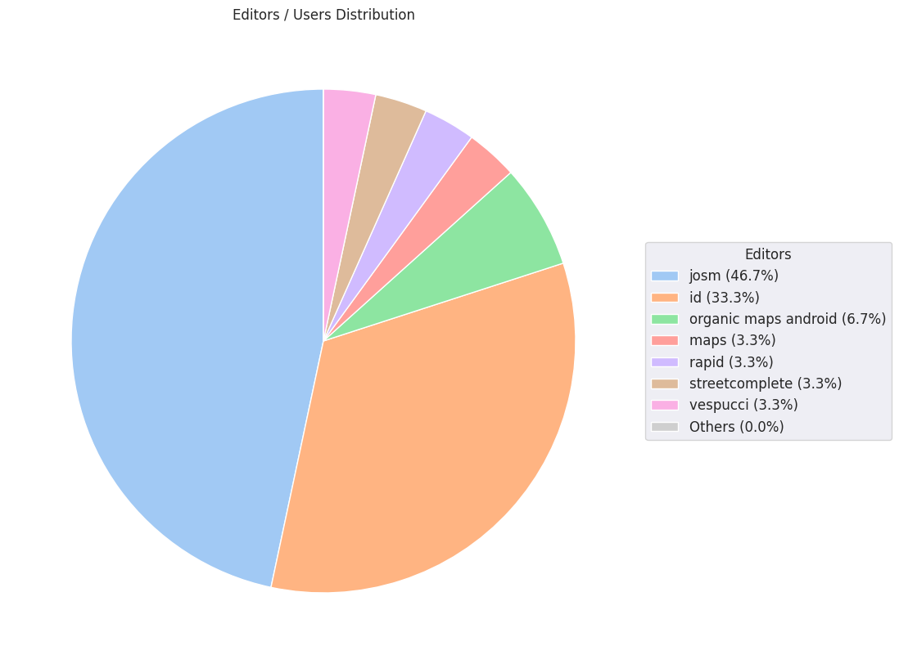

### Last Update : Stats from 2023-10-29 00:00:00+00:00 to 2023-11-05 00:00:00+00:00 (UTC Timezone)

#### 110 Users made 561 changesets with 67.1 thousand map changes.
#### 49.0 thousand OSM Elements were Created, 18.0 thousand Modified & 97 Deleted.
Get Full Stats at [stats.csv](/stats/Nepal/Weekly/stats.csv)
 & Get Summary Stats at [stats_summary.csv](/stats/Nepal/Weekly/stats_summary.csv)

Top 5 Users are : 
- Pragya Joshi : 19.4 thousand Map Changes
- Adrie Sonke : 5.8 thousand Map Changes
- Aarogya Pandey : 5.5 thousand Map Changes
- Ashok Thakulla : 4.2 thousand Map Changes
- Marvin de Hont : 3.9 thousand Map Changes

Summary of Supplied Tags
- poi = Created: 42, Modified : 68
- building = Created: 5.4 thousand, Modified : 518
- highway = Created: 510, Modified : 424
- waterway = Created: 57, Modified : 58
- amenity = Created: 9, Modified : 22

Top 5 Created tags are :
- building: 5.4 thousand
- highway: 510
- landuse: 68
- waterway: 57
- intermittent: 48

Top 5 Modified tags are :
- building: 518
- highway: 424
- name: 179
- source: 95
- surface: 83

Top 5 trending hashtags are:
- #osmnepal : 20 users
- #startnetwork : 14 users
- #disasterresponse : 14 users
- #nepalearthquake2023 : 14 users

Top 5 trending editors are:
- iD 2.27.1 : 26 users
- JOSM/1.5 (18822 en) : 23 users
- iD 2.21.1 : 12 users
- JOSM/1.5 (18822 en_GB) : 4 users
- MAPS.ME android 15.1.71626 : 4 users

Top 5 trending Countries where user contributed are:
- Nepal : 97 users
- India : 9 users
- China : 5 users
- Jammu-Kashmir : 1 users
- Arunachal Pradesh : 1 users

 Charts : 
 
 
 
 
 
