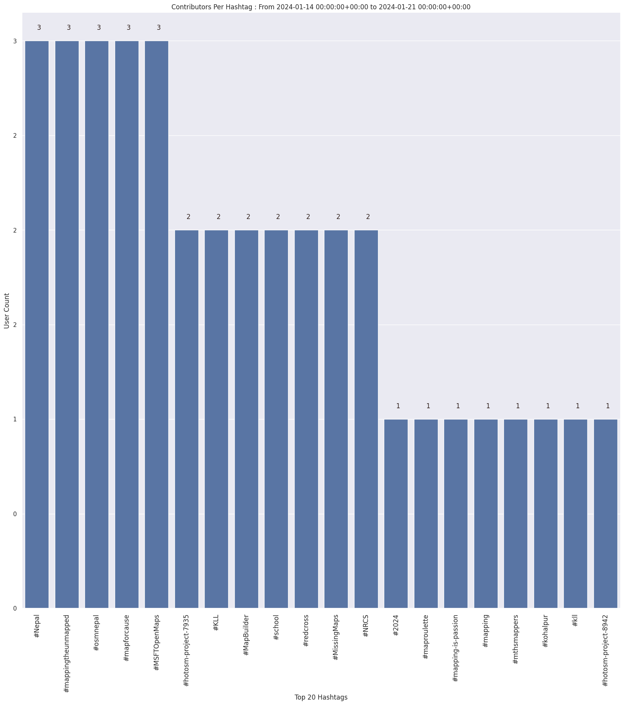

### Last Update : Stats from 2023-03-05 00:00:00+00:00 to 2023-03-12 00:00:00+00:00 (UTC Timezone)

#### 111 Users made 798 changesets with 231.0 thousand map changes.
#### 95.6 thousand OSM Elements were Created, 135.2 thousand Modified & 249 Deleted.

Top 5 Users are : 
- Heinz_V : 100.9 thousand Map Changes
- seichter : 25.3 thousand Map Changes
- Narayan Thapa : 13.8 thousand Map Changes
- Nirmala Rawat : 11.8 thousand Map Changes
- Prabin Pokhrel : 9.8 thousand Map Changes

Summary of Supplied Tags
- poi = Created: 157, Modified : 446
- building = Created: 10.0 thousand, Modified : 391
- highway = Created: 537, Modified : 1.6 thousand
- waterway = Created: 71, Modified : 187
- amenity = Created: 58, Modified : 125

Top 5 Created tags are :
- building: 10.0 thousand
- landuse: 1.0 thousand
- natural: 643
- highway: 537
- water: 504

Top 5 Modified tags are :
- highway: 1.6 thousand
- name: 414
- surface: 395
- building: 391
- landuse: 254

Top 5 trending hashtags are:
- #Nepal : 10 users
- #BIPAD : 9 users
- #YILAB : 8 users
- #DigitalVolunteers : 8 users

Top 5 trending Countries where user contributed are:
- Nepal : 106 users
- China : 4 users
- India : 1 users
- Thailand : 1 users

 Charts : 
 
 
 
 
