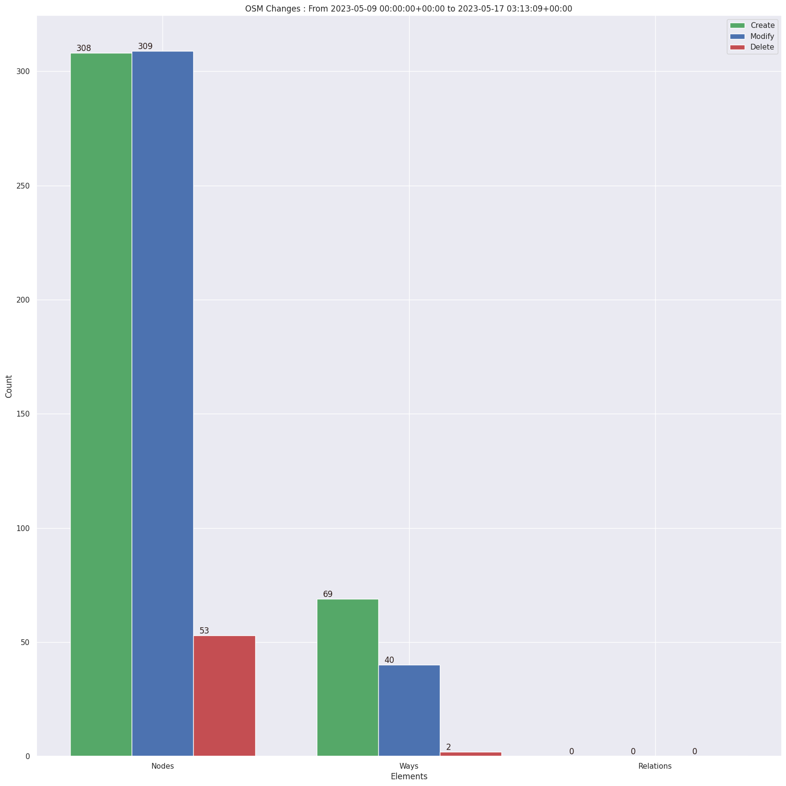
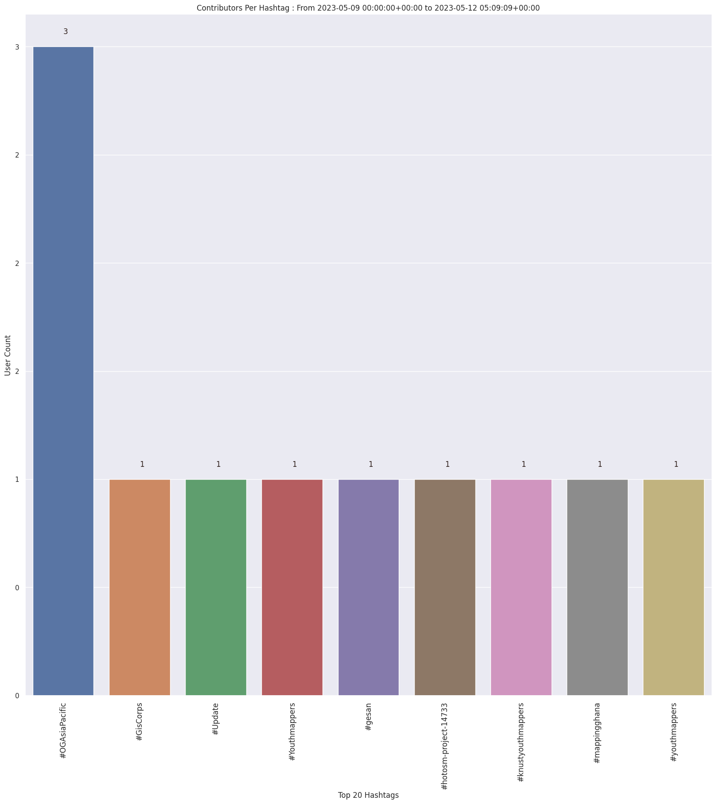
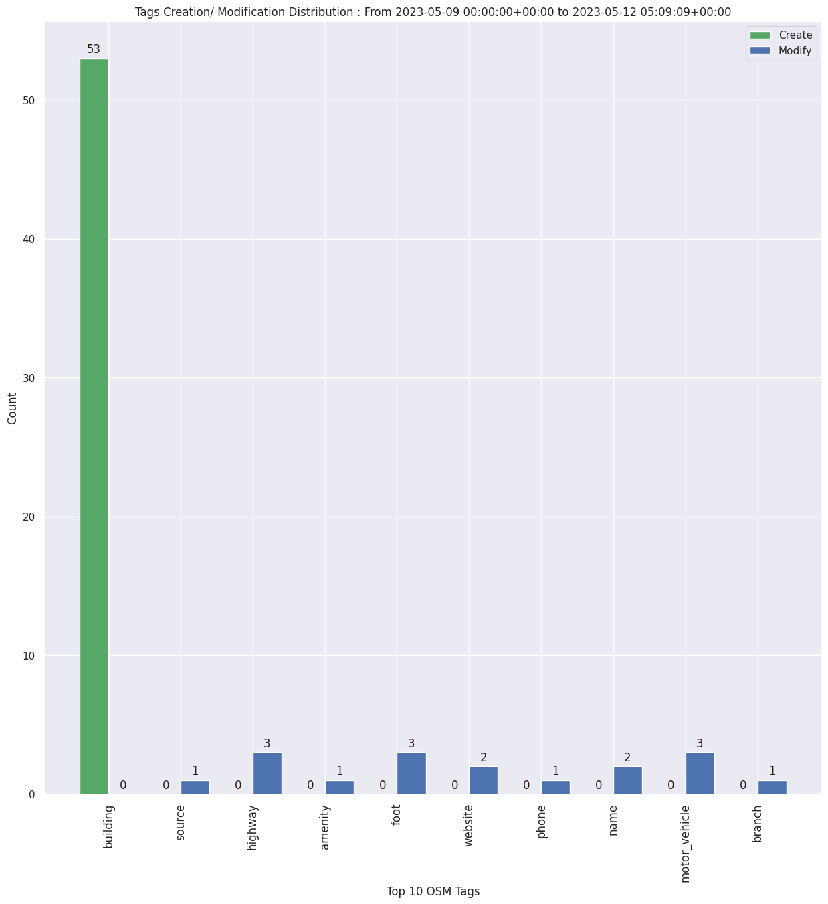

### Last Update : Stats from 2023-05-09 00:00:00+00:00 to 2023-05-10 00:00:00+00:00 (UTC Timezone)

#### 1 Users made 1 changesets with 240 map changes.
#### 240 OSM Elements were Created, 0 Modified & 0 Deleted.
Get Full Stats at [stats.csv](/stats/OGAsiaPacific/Daily/stats.csv)
 & Get Summary Stats at [stats_summary.csv](/stats/OGAsiaPacific/Daily/stats_summary.csv)

Top 5 Users are : 

Summary of Supplied Tags
- poi = Created: 0, Modified : 0
- building = Created: 48, Modified : 0
- highway = Created: 0, Modified : 0
- waterway = Created: 0, Modified : 0
- amenity = Created: 0, Modified : 0
- highway length created = 0 Km

Top 5 Created tags are :
- building: 48

Top 5 Modified tags are :

Top 5 trending hashtags are:
- #hotosm-project-14733 : 1 users
- #GisCorps : 1 users
- #Update : 1 users
- #OGAsiaPacific : 1 users

 Charts : 
 
 
 
