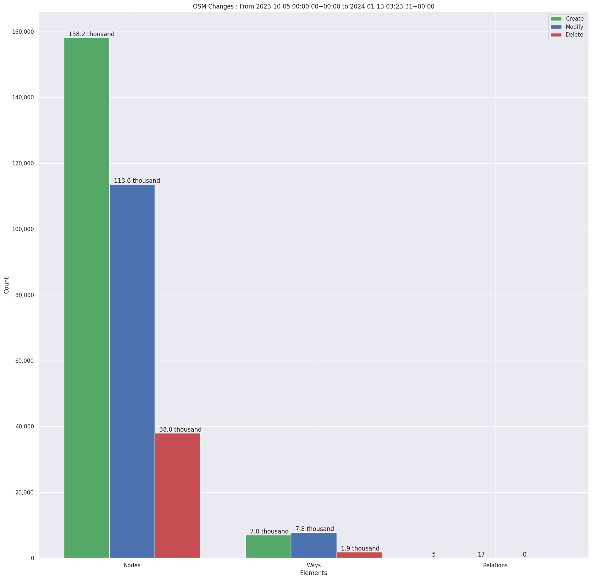
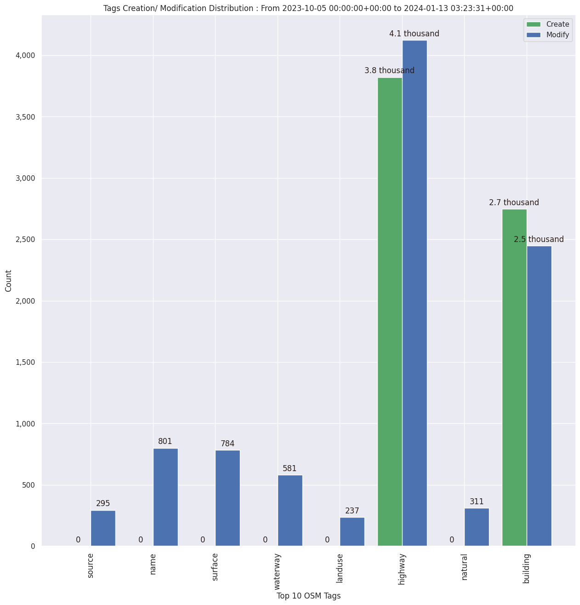

### Last Update : Stats from 2023-10-05 00:00:00+00:00 to 2024-01-13 03:23:31+00:00 (UTC Timezone)

#### 83 Users made 3.1 thousand changesets with 326.5 thousand map changes.
#### 165.2 thousand OSM Elements were Created, 121.4 thousand Modified & 39.9 thousand Deleted.
Get Full Stats at [stats.csv](/stats/SNRMPNepal/Every2days/stats.csv)
 & Get Summary Stats at [stats_summary.csv](/stats/SNRMPNepal/Every2days/stats_summary.csv)

Top 5 Users are : 
- Aarogya Pandey : 70.9 thousand Map Changes
- Shrestha Shristi : 52.6 thousand Map Changes
- Niruta Neeupane : 31.8 thousand Map Changes
- Ashim Paudel : 20.6 thousand Map Changes
- Vivek Dumre : 14.4 thousand Map Changes

Summary of Supplied Tags
- poi = Created: 97, Modified : 309
- building = Created: 2.7 thousand, Modified : 2.5 thousand
- highway = Created: 3.8 thousand, Modified : 4.1 thousand
- waterway = Created: 234, Modified : 581
- amenity = Created: 3, Modified : 49
- highway length created = 1.3 thousand Km

Top 5 Created tags are :
- highway: 3.8 thousand
- building: 2.7 thousand
- waterway: 234
- natural: 102
- surface: 69

Top 5 Modified tags are :
- highway: 4.1 thousand
- building: 2.5 thousand
- name: 801
- surface: 784
- waterway: 581

Top 5 trending hashtags are:
- #aphub : 83 users
- #OMGuru : 83 users
- #SNRMPNepal : 83 users
- #startnetwork : 83 users
- #hotosm-project-15639 : 56 users

Top 5 trending editors are:
- iD 2.21.1 : 43 users
- JOSM/1.5 (18822 en) : 30 users
- JOSM/1.5 (18700 en) : 4 users
- JOSM/1.5 (18772 en) : 4 users
- RapiD 1.1.9-tm.1 : 2 users

Top 5 trending Countries where user contributed are:
- Nepal : 82 users
- China : 6 users
- India : 2 users

 Charts : 
 
 
 
 
 
