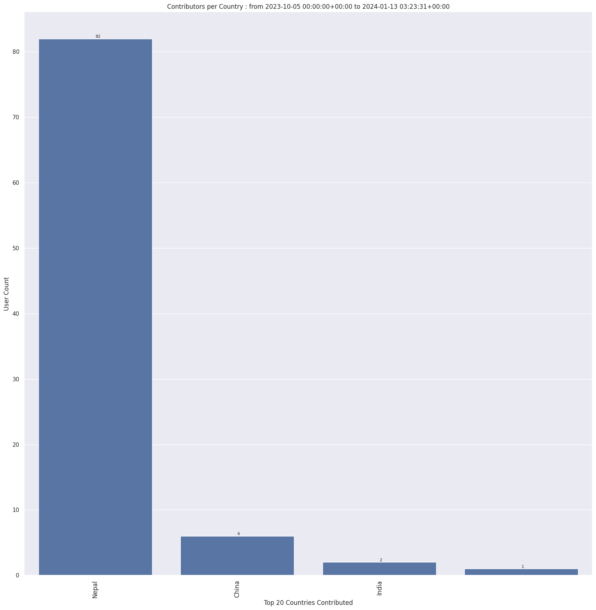

### Last Update : Stats from 2023-10-05 00:00:00+00:00 to 2023-11-19 03:10:01+00:00 (UTC Timezone)

#### 61 Users made 1.8 thousand changesets with 150.6 thousand map changes.
#### 118.4 thousand OSM Elements were Created, 31.2 thousand Modified & 1.0 thousand Deleted.
Get Full Stats at [stats.csv](/stats/SNRMPNepal/Every2days/stats.csv)
 & Get Summary Stats at [stats_summary.csv](/stats/SNRMPNepal/Every2days/stats_summary.csv)

Top 5 Users are : 
- Aarogya Pandey : 55.4 thousand Map Changes
- Ashim Paudel : 20.6 thousand Map Changes
- Gremmy Dhungana : 12.0 thousand Map Changes
- Shrestha Shristi : 7.6 thousand Map Changes
- Nischal Acharya - 642 : 7.3 thousand Map Changes

Summary of Supplied Tags
- poi = Created: 33, Modified : 18
- building = Created: 971, Modified : 1.1 thousand
- highway = Created: 3.1 thousand, Modified : 1.3 thousand
- waterway = Created: 99, Modified : 71
- amenity = Created: 0, Modified : 2
- highway length created = 1.0 thousand Km

Top 5 Created tags are :
- highway: 3.1 thousand
- building: 971
- waterway: 99
- natural: 81
- landuse: 23

Top 5 Modified tags are :
- highway: 1.3 thousand
- building: 1.1 thousand
- surface: 296
- name: 293
- natural: 182

Top 5 trending hashtags are:
- #SNRMPNepal : 61 users
- #startnetwork : 61 users
- #OMGuru : 61 users
- #aphub : 61 users
- #hotosm-project-15639 : 34 users

Top 5 trending editors are:
- iD 2.21.1 : 30 users
- JOSM/1.5 (18822 en) : 20 users
- JOSM/1.5 (18772 en) : 3 users
- JOSM/1.5 (18570 en_GB) : 2 users
- JOSM/1.5 (18700 en) : 2 users

Top 5 trending Countries where user contributed are:
- Nepal : 60 users
- China : 3 users
- India : 1 users

 Charts : 
 
 
 
 
 
