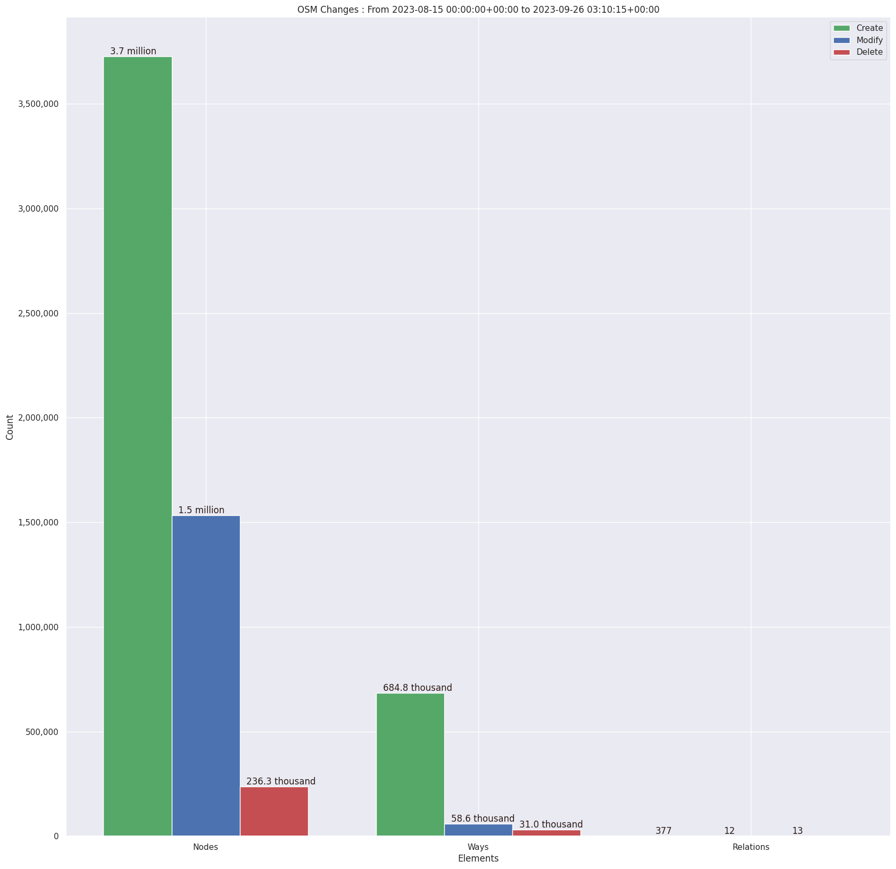
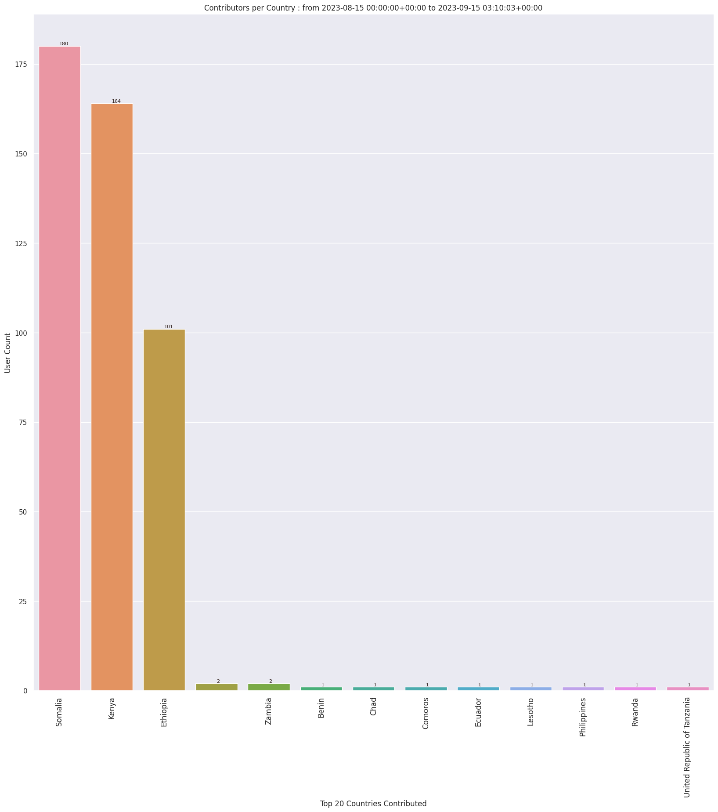
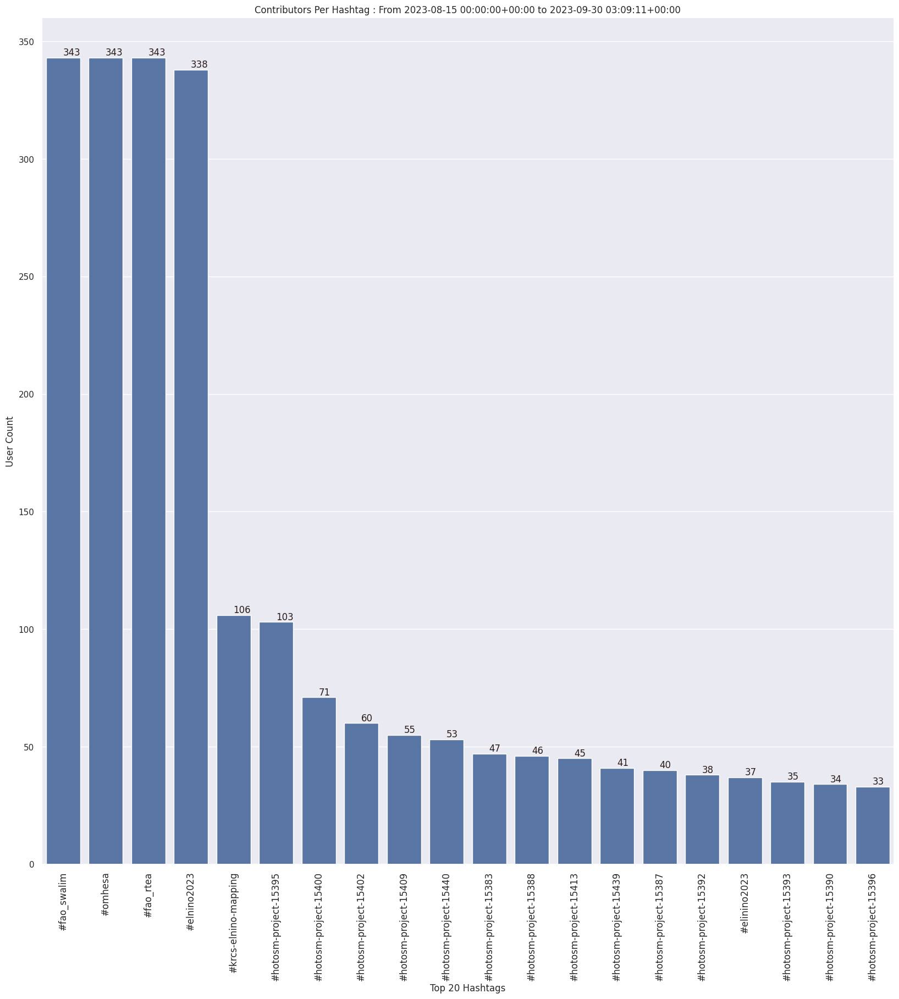
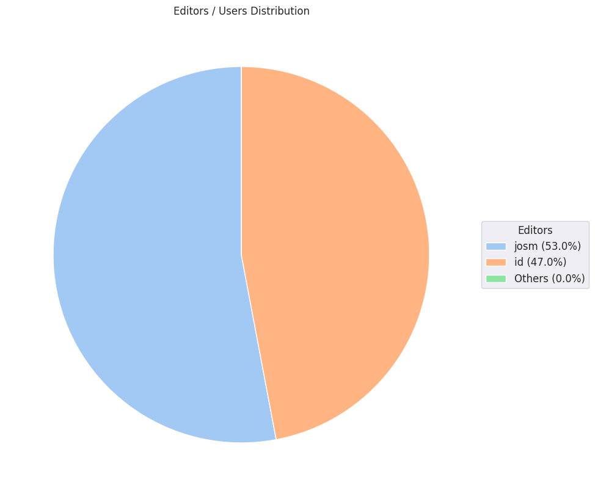
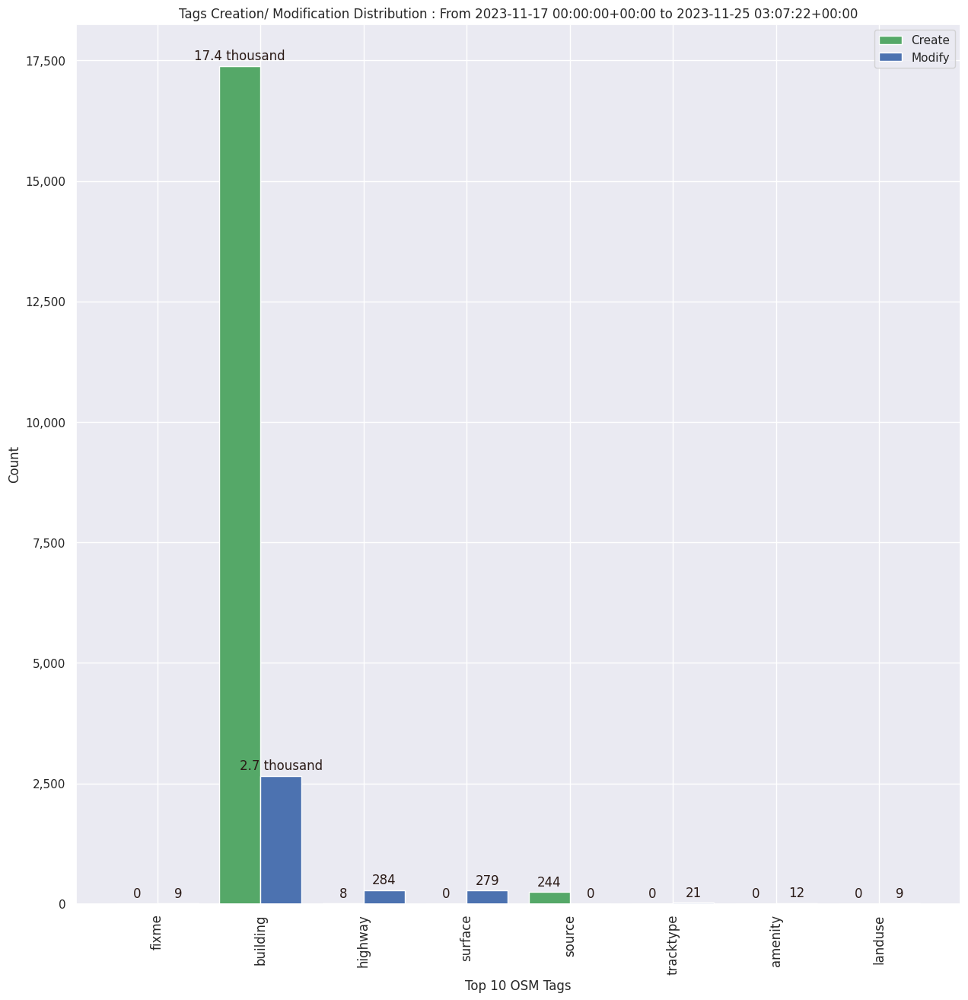

### Last Update : Stats from 2023-08-15 00:00:00+00:00 to 2023-10-31 03:09:46+00:00 (UTC Timezone)

#### 345 Users made 41.2 thousand changesets with 7.4 million map changes.
#### 4.9 million OSM Elements were Created, 2.1 million Modified & 372.0 thousand Deleted.
Get Full Stats at [stats.csv](/stats/elinino2023/Daily/stats.csv)
 & Get Summary Stats at [stats_summary.csv](/stats/elinino2023/Daily/stats_summary.csv)

Top 5 Users are : 
- Angela M Naluonde : 650.0 thousand Map Changes
- Evarist Isdory : 393.0 thousand Map Changes
- JaphetMasunzu : 358.7 thousand Map Changes
- KingVik : 293.3 thousand Map Changes
- ngumenawesamson : 289.5 thousand Map Changes

Summary of Supplied Tags
- poi = Created: 22.2 thousand, Modified : 2.6 thousand
- building = Created: 780.8 thousand, Modified : 59.7 thousand
- highway = Created: 2.2 thousand, Modified : 9.2 thousand
- waterway = Created: 141, Modified : 414
- amenity = Created: 4, Modified : 174
- highway length created = 566 Km

Top 5 Created tags are :
- building: 780.8 thousand
- highway: 2.2 thousand
- landuse: 876
- type: 538
- natural: 473

Top 5 Modified tags are :
- building: 59.7 thousand
- highway: 9.2 thousand
- surface: 4.7 thousand
- source: 3.8 thousand
- landuse: 1.5 thousand

Top 5 trending hashtags are:
- #fao_swalim : 345 users
- #omhesa : 345 users
- #fao_rtea : 345 users
- #elnino2023 : 340 users
- #krcs-elnino-mapping : 106 users

Top 5 trending editors are:
- iD 2.21.1 : 200 users
- JOSM/1.5 (18822 en) : 46 users
- JOSM/1.5 (18789 en) : 28 users
- JOSM/1.5 (18772 en) : 12 users
- JOSM/1.5 (18822 fr) : 9 users

Top 5 trending Countries where user contributed are:
- Somalia : 218 users
- Kenya : 215 users
- Ethiopia : 120 users
- Zambia : 2 users

 Charts : 
 
 
 
 
 
