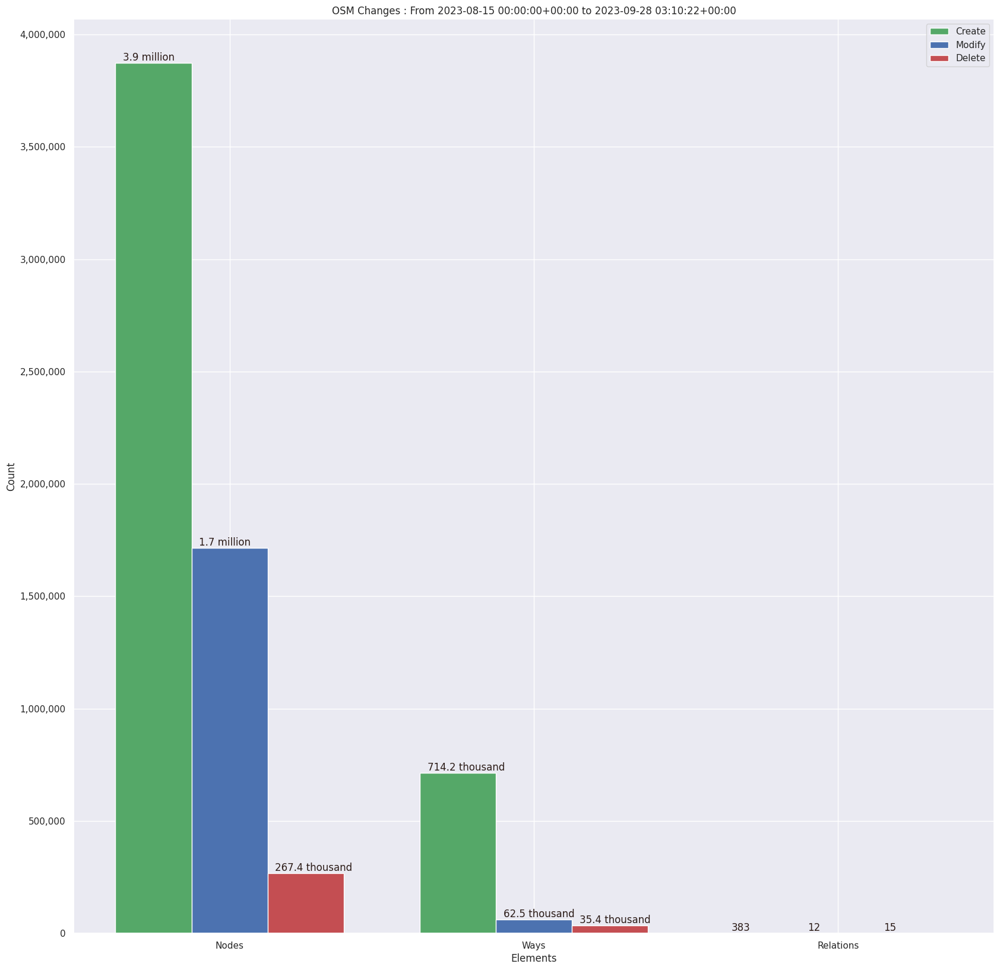
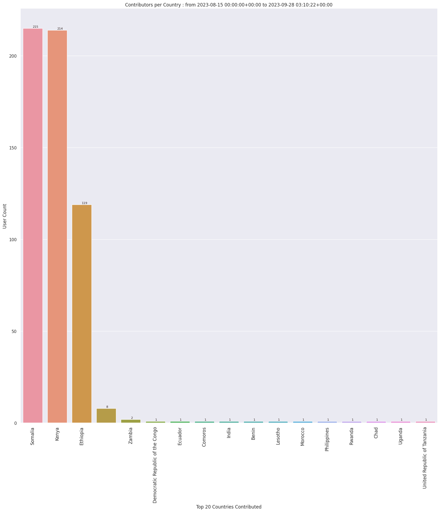

### Last Update : Stats from 2023-11-17 00:00:00+00:00 to 2023-11-26 03:06:53+00:00 (UTC Timezone)

#### 7 Users made 1.2 thousand changesets with 178.6 thousand map changes.
#### 98.2 thousand OSM Elements were Created, 77.4 thousand Modified & 3.0 thousand Deleted.
Get Full Stats at [stats.csv](/stats/elinino2023/Daily/stats.csv)
 & Get Summary Stats at [stats_summary.csv](/stats/elinino2023/Daily/stats_summary.csv)

Top 5 Users are : 
- ngumenawesamson : 46.8 thousand Map Changes
- Qwajo OSM : 44.4 thousand Map Changes
- KingVik : 38.2 thousand Map Changes
- Awania Morish : 25.7 thousand Map Changes
- SSEKITOLEKO : 23.3 thousand Map Changes

Summary of Supplied Tags
- poi = Created: 1, Modified : 6
- building = Created: 18.1 thousand, Modified : 2.8 thousand
- highway = Created: 8, Modified : 291
- waterway = Created: 0, Modified : 1
- amenity = Created: 0, Modified : 13
- highway length created = 0 Km

Top 5 Created tags are :
- building: 18.1 thousand
- source: 244
- highway: 8
- surface: 1
- tourism: 1

Top 5 Modified tags are :
- building: 2.8 thousand
- highway: 291
- surface: 286
- tracktype: 21
- amenity: 13

Top 5 trending hashtags are:
- #elnino2023 : 7 users
- #fao_swalim : 7 users
- #omhesa : 7 users
- #fao_rtea : 7 users
- #hotosm-project-15806 : 6 users

Top 5 trending editors are:
- JOSM/1.5 (18822 en) : 2 users
- JOSM/1.5 (18772 en) : 1 users
- JOSM/1.5 (18789 en) : 1 users
- JOSM/1.5 (18646 en) : 1 users
- JOSM/1.5 (18700 en) : 1 users

Top 5 trending Countries where user contributed are:
- Somalia : 7 users
- Ghana : 1 users
- Kenya : 1 users
- Nigeria : 1 users

 Charts : 
 
 
 
 
 
