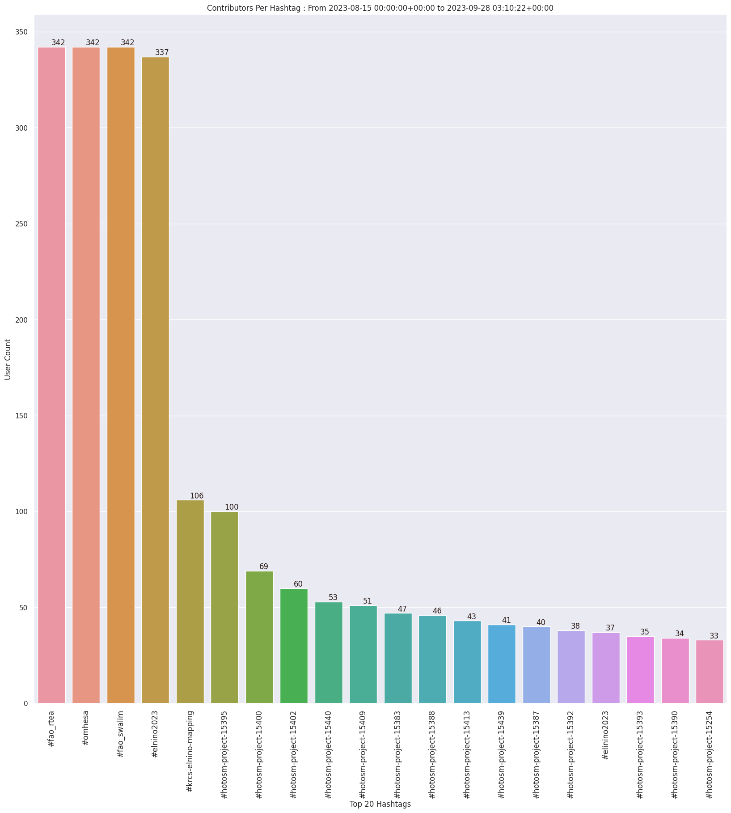

### Last Update : Stats from 2023-08-15 00:00:00+00:00 to 2023-09-23 03:09:17+00:00 (UTC Timezone)

#### 341 Users made 37.0 thousand changesets with 6.0 million map changes.
#### 4.3 million OSM Elements were Created, 1.4 million Modified & 231.0 thousand Deleted.
Get Full Stats at [stats.csv](/stats/elinino2023/Daily/stats.csv)
 & Get Summary Stats at [stats_summary.csv](/stats/elinino2023/Daily/stats_summary.csv)

Top 5 Users are : 
- Angela M Naluonde : 521.4 thousand Map Changes
- Evarist Isdory : 366.0 thousand Map Changes
- JaphetMasunzu : 259.5 thousand Map Changes
- SSEKITOLEKO : 215.8 thousand Map Changes
- zoubinnaba : 202.0 thousand Map Changes

Summary of Supplied Tags
- poi = Created: 22.1 thousand, Modified : 991
- building = Created: 686.0 thousand, Modified : 46.4 thousand
- highway = Created: 1.9 thousand, Modified : 6.9 thousand
- waterway = Created: 74, Modified : 245
- amenity = Created: 3, Modified : 146
- highway length created = 482 Km

Top 5 Created tags are :
- building: 686.0 thousand
- highway: 1.9 thousand
- source: 416
- type: 369
- name: 317

Top 5 Modified tags are :
- building: 46.4 thousand
- highway: 6.9 thousand
- surface: 3.9 thousand
- source: 1.4 thousand
- landuse: 1.2 thousand

Top 5 trending hashtags are:
- #fao_swalim : 341 users
- #fao_rtea : 341 users
- #omhesa : 341 users
- #elnino2023 : 336 users
- #krcs-elnino-mapping : 104 users

Top 5 trending editors are:
- iD 2.21.1 : 198 users
- JOSM/1.5 (18822 en) : 42 users
- JOSM/1.5 (18789 en) : 28 users
- JOSM/1.5 (18772 en) : 12 users
- JOSM/1.5 (18822 fr) : 9 users

Top 5 trending Countries where user contributed are:
- Somalia : 214 users
- Kenya : 214 users
- Ethiopia : 117 users
- Zambia : 2 users

 Charts : 
 
 
 
 
 
