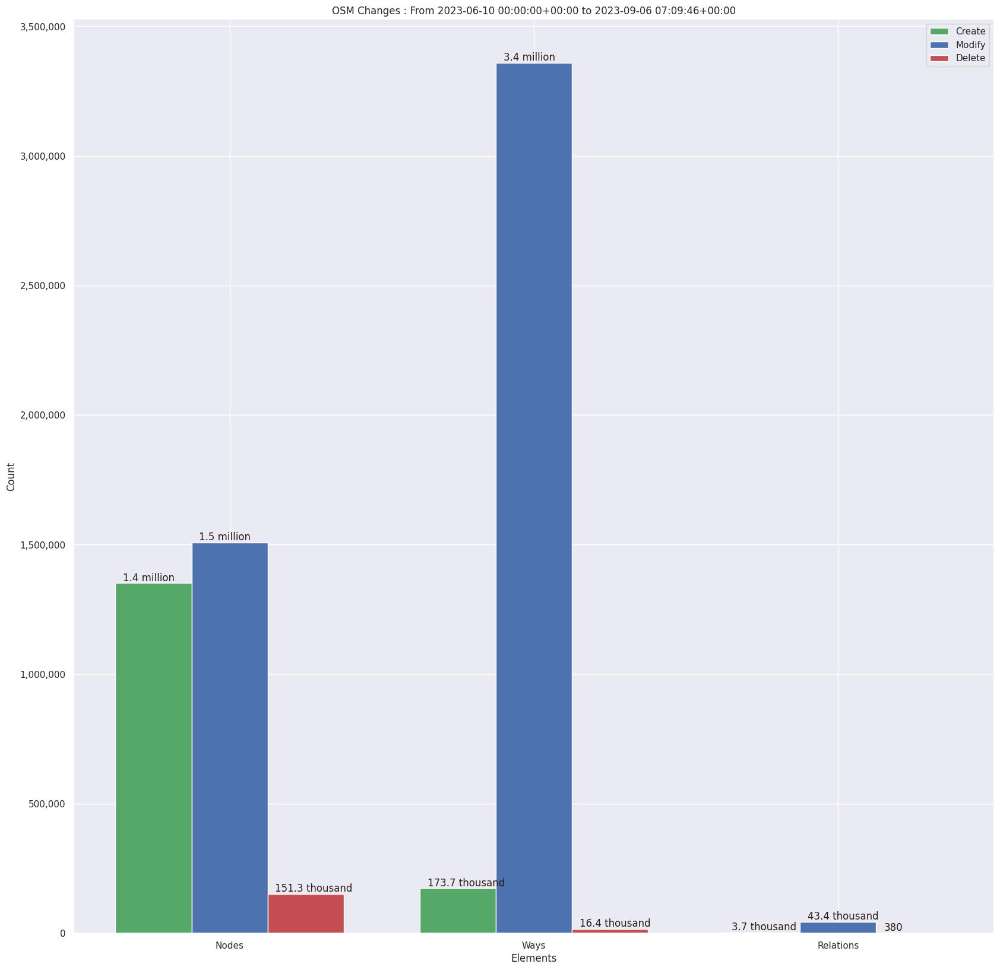
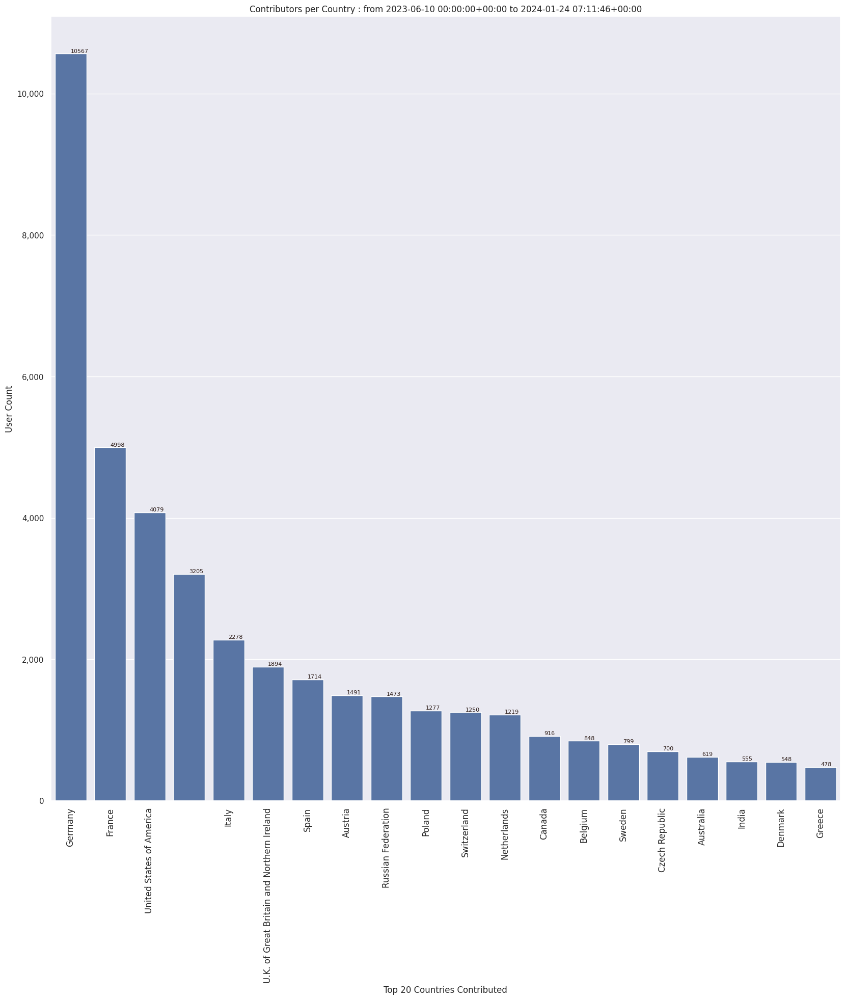
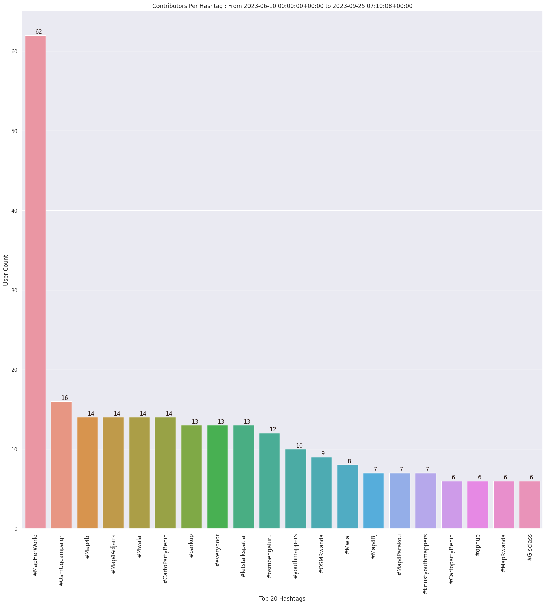
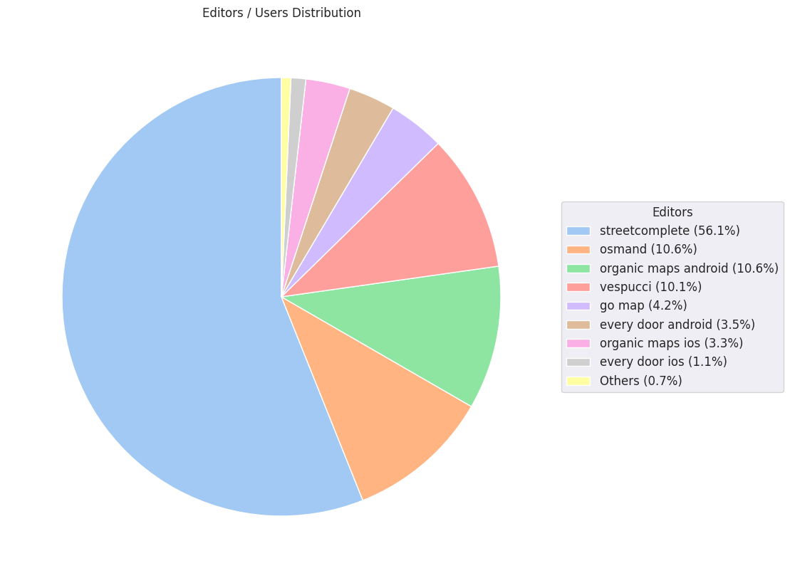
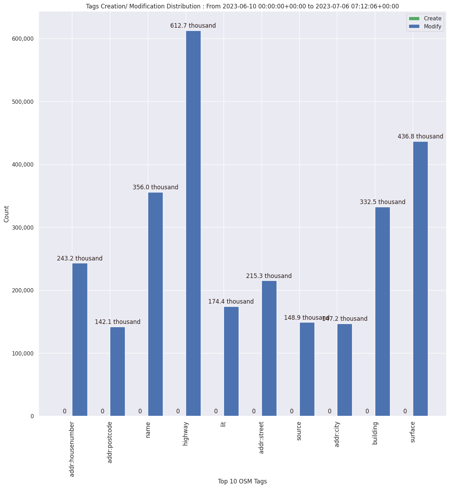

### Last Update : Stats from 2023-06-10 00:00:00+00:00 to 2023-08-23 07:10:16+00:00 (UTC Timezone)

#### 22.0 thousand Users made 869.5 thousand changesets with 5.5 million map changes.
#### 1.3 million OSM Elements were Created, 4.1 million Modified & 138.4 thousand Deleted.
Get Full Stats at [stats.csv](/stats/fieldmappers/Daily/stats.csv)
 & Get Summary Stats at [stats_summary.csv](/stats/fieldmappers/Daily/stats_summary.csv)

Top 5 Users are : 
- Cubano153 : 80.8 thousand Map Changes
- Đuro Jiří : 76.9 thousand Map Changes
- biketeur : 72.7 thousand Map Changes
- WN6 : 67.6 thousand Map Changes
- padvinder : 51.8 thousand Map Changes

Summary of Supplied Tags
- poi = Created: 305.1 thousand, Modified : 871.4 thousand
- amenity = Created: 100.5 thousand, Modified : 294.0 thousand

Top 5 Created tags are :
- name: 105.0 thousand
- amenity: 100.5 thousand
- highway: 98.0 thousand
- addr:housenumber: 45.6 thousand
- addr:street: 44.3 thousand

Top 5 Modified tags are :
- highway: 2.0 million
- surface: 1.4 million
- name: 1.1 million
- building: 1.0 million
- addr:housenumber: 698.1 thousand

Top 5 trending hashtags are:
- #MapHerWorld : 60 users
- #OsmUgcampaign : 16 users
- #Map4Adjarra : 14 users
- #Mwalai : 14 users

Top 5 trending editors are:
- StreetComplete 53.3 : 8360 users
- StreetComplete 53.2 : 5697 users
- StreetComplete 53.1 : 4478 users
- Go Map!! 3.4.8 : 1715 users
- Vespucci 19.0.3.0 : 1283 users

Top 5 trending Countries where user contributed are:
- Germany : 5820 users
- France : 2918 users
- United States of America : 2051 users
- Italy : 1260 users

 Charts : 
 
 
 
 
 
