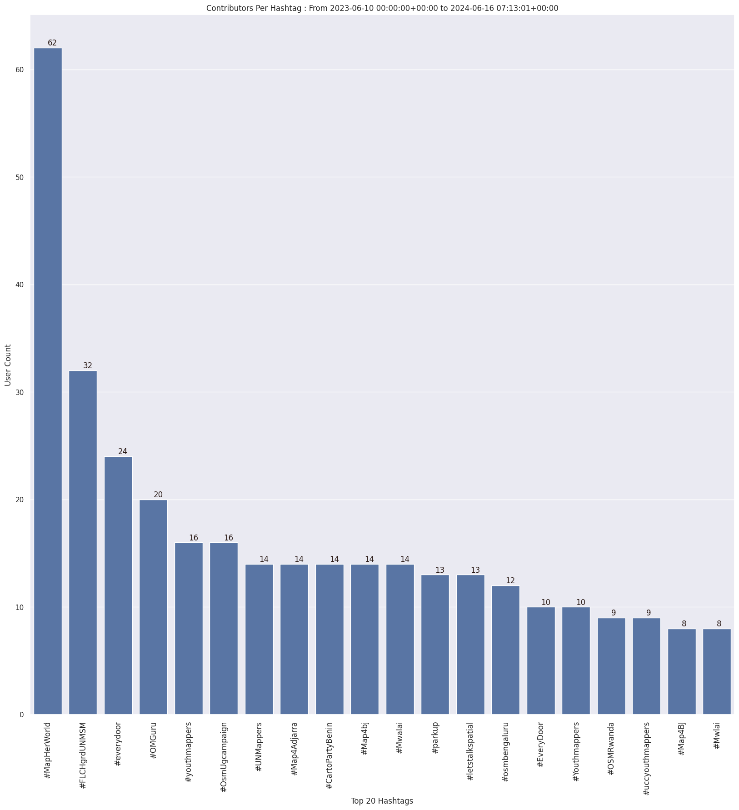

### Last Update : Stats from 2023-06-10 00:00:00+00:00 to 2023-11-29 07:11:34+00:00 (UTC Timezone)

#### 34.6 thousand Users made 1.9 million changesets with 12.7 million map changes.
#### 3.2 million OSM Elements were Created, 9.2 million Modified & 342.5 thousand Deleted.
Get Full Stats at [stats.csv](/stats/fieldmappers/Daily/stats.csv)
 & Get Summary Stats at [stats_summary.csv](/stats/fieldmappers/Daily/stats_summary.csv)

Top 5 Users are : 
- Đuro Jiří : 339.7 thousand Map Changes
- PizzaTreeIsland : 226.8 thousand Map Changes
- biketeur : 154.1 thousand Map Changes
- WN6 : 137.2 thousand Map Changes
- padvinder : 121.3 thousand Map Changes

Summary of Supplied Tags
- poi = Created: 673.3 thousand, Modified : 2.0 million
- amenity = Created: 219.1 thousand, Modified : 641.3 thousand

Top 5 Created tags are :
- highway: 238.3 thousand
- name: 233.4 thousand
- amenity: 219.1 thousand
- addr:housenumber: 105.6 thousand
- addr:street: 100.3 thousand

Top 5 Modified tags are :
- highway: 4.4 million
- surface: 3.1 million
- name: 2.6 million
- building: 2.2 million
- addr:housenumber: 1.5 million

Top 5 trending hashtags are:
- #MapHerWorld : 62 users
- #FLCHgrdUNMSM : 32 users
- #OsmUgcampaign : 16 users
- #everydoor : 15 users

Top 5 trending editors are:
- StreetComplete 53.3 : 10221 users
- StreetComplete 54.0 : 7435 users
- StreetComplete 55.0 : 5846 users
- StreetComplete 54.1 : 5829 users
- StreetComplete 53.2 : 5773 users

Top 5 trending Countries where user contributed are:
- Germany : 9434 users
- France : 4475 users
- United States of America : 3537 users
- Italy : 2073 users

 Charts : 
 
 
 
 
 
