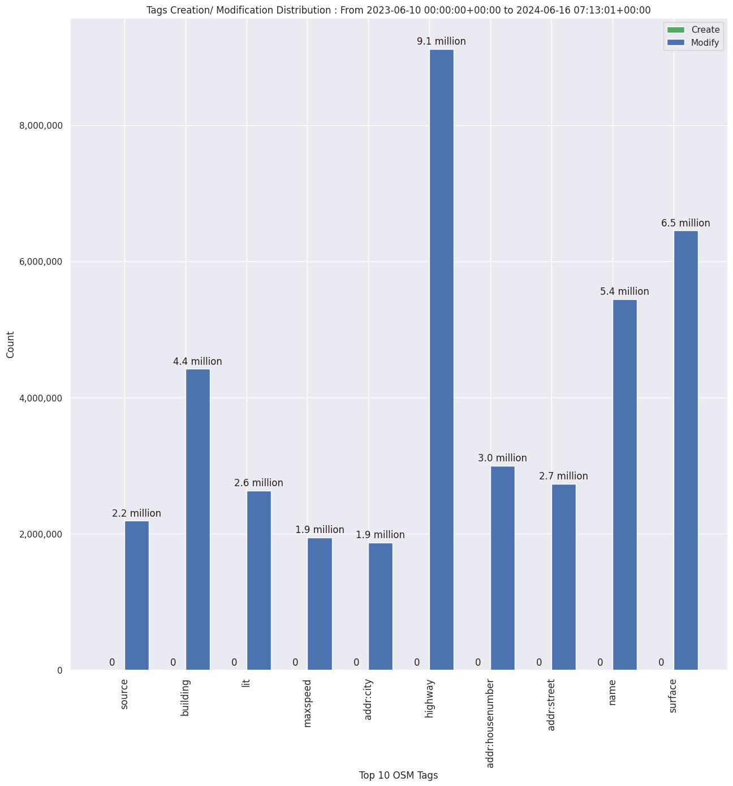

### Last Update : Stats from 2023-06-10 00:00:00+00:00 to 2023-08-05 07:08:16+00:00 (UTC Timezone)

#### 18.4 thousand Users made 634.8 thousand changesets with 4.0 million map changes.
#### 897.4 thousand OSM Elements were Created, 3.0 million Modified & 102.3 thousand Deleted.
Get Full Stats at [stats.csv](/stats/fieldmappers/Daily/stats.csv)
 & Get Summary Stats at [stats_summary.csv](/stats/fieldmappers/Daily/stats_summary.csv)

Top 5 Users are : 
- WN6 : 63.9 thousand Map Changes
- Cubano153 : 61.7 thousand Map Changes
- biketeur : 53.2 thousand Map Changes
- padvinder : 45.5 thousand Map Changes
- Đuro Jiří : 45.1 thousand Map Changes

Summary of Supplied Tags
- poi = Created: 223.3 thousand, Modified : 643.9 thousand
- amenity = Created: 72.4 thousand, Modified : 214.4 thousand

Top 5 Created tags are :
- name: 78.0 thousand
- amenity: 72.4 thousand
- highway: 70.5 thousand
- addr:housenumber: 31.6 thousand
- addr:street: 31.1 thousand

Top 5 Modified tags are :
- highway: 1.4 million
- surface: 1.0 million
- name: 834.4 thousand
- building: 754.4 thousand
- addr:housenumber: 527.1 thousand

Top 5 trending hashtags are:
- #MapHerWorld : 60 users
- #OsmUgcampaign : 16 users
- #Map4bj : 14 users
- #CartoPartyBenin : 14 users

Top 5 trending editors are:
- StreetComplete 53.3 : 5662 users
- StreetComplete 53.2 : 5628 users
- StreetComplete 53.1 : 4448 users
- Go Map!! 3.4.8 : 1436 users
- Vespucci 19.0.2.0 : 1216 users

Top 5 trending Countries where user contributed are:
- Germany : 4904 users
- France : 2332 users
- United States of America : 1705 users
- Italy : 926 users

 Charts : 
 
 
 
 
 
