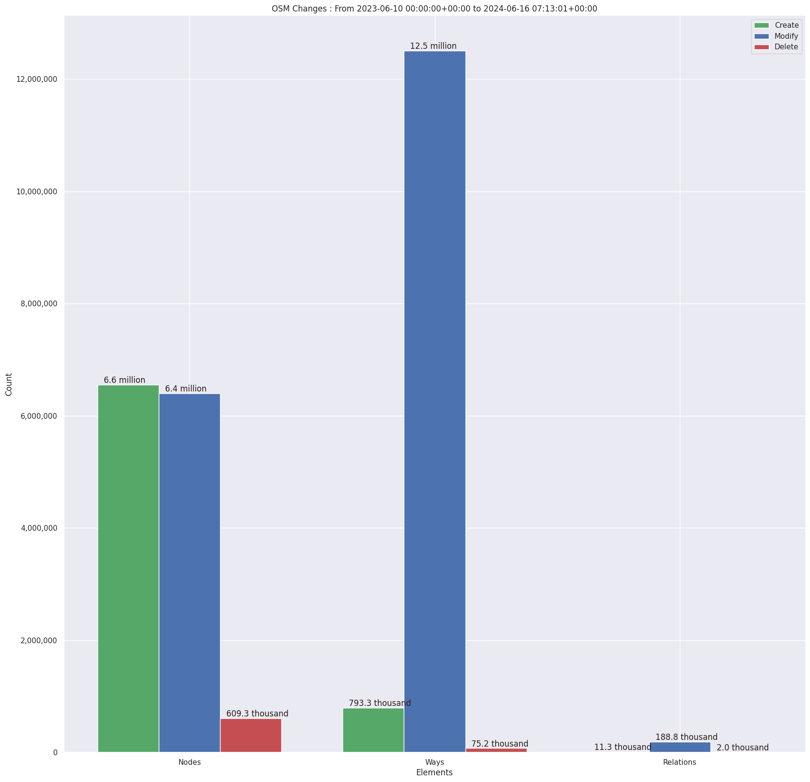

### Last Update : Stats from 2023-06-10 00:00:00+00:00 to 2024-02-13 07:11:16+00:00 (UTC Timezone)

#### 40.3 thousand Users made 2.5 million changesets with 17.3 million map changes.
#### 4.5 million OSM Elements were Created, 12.4 million Modified & 472.2 thousand Deleted.
Get Full Stats at [stats.csv](/stats/fieldmappers/Daily/stats.csv)
 & Get Summary Stats at [stats_summary.csv](/stats/fieldmappers/Daily/stats_summary.csv)

Top 5 Users are : 
- Đuro Jiří : 510.4 thousand Map Changes
- PizzaTreeIsland : 466.3 thousand Map Changes
- biketeur : 266.1 thousand Map Changes
- WN6 : 261.9 thousand Map Changes
- padvinder : 186.1 thousand Map Changes

Summary of Supplied Tags
- poi = Created: 901.1 thousand, Modified : 2.6 million
- amenity = Created: 286.0 thousand, Modified : 831.4 thousand

Top 5 Created tags are :
- name: 319.3 thousand
- highway: 318.6 thousand
- amenity: 286.0 thousand
- addr:housenumber: 152.2 thousand
- addr:street: 144.1 thousand

Top 5 Modified tags are :
- highway: 5.9 million
- surface: 4.2 million
- name: 3.5 million
- building: 3.0 million
- addr:housenumber: 2.0 million

Top 5 trending hashtags are:
- #MapHerWorld : 62 users
- #FLCHgrdUNMSM : 32 users
- #everydoor : 18 users
- #OsmUgcampaign : 16 users

Top 5 trending editors are:
- StreetComplete 53.3 : 10254 users
- StreetComplete 54.0 : 7484 users
- StreetComplete 55.0 : 6245 users
- StreetComplete 55.1 : 6054 users
- StreetComplete 54.1 : 5902 users

Top 5 trending Countries where user contributed are:
- Germany : 10917 users
- France : 5164 users
- United States of America : 4206 users
- Italy : 2344 users

 Charts : 
 
 
 
 
 
