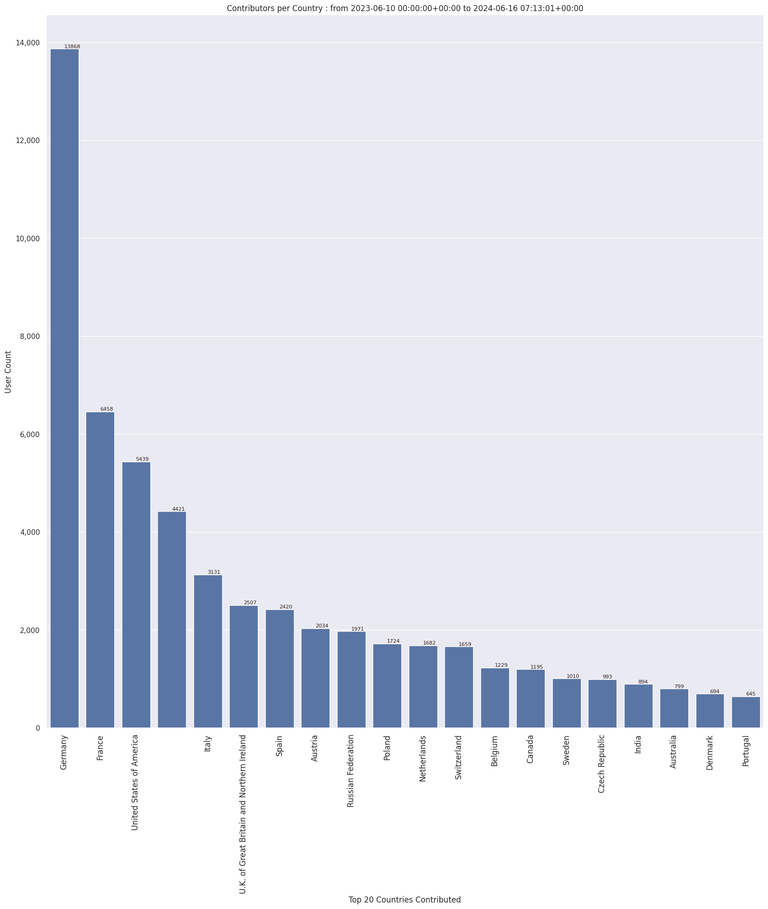

### Last Update : Stats from 2023-06-10 00:00:00+00:00 to 2023-10-25 07:10:38+00:00 (UTC Timezone)

#### 31.6 thousand Users made 1.6 million changesets with 10.4 million map changes.
#### 2.4 million OSM Elements were Created, 7.6 million Modified & 276.1 thousand Deleted.
Get Full Stats at [stats.csv](/stats/fieldmappers/Daily/stats.csv)
 & Get Summary Stats at [stats_summary.csv](/stats/fieldmappers/Daily/stats_summary.csv)

Top 5 Users are : 
- Đuro Jiří : 265.0 thousand Map Changes
- biketeur : 115.3 thousand Map Changes
- WN6 : 104.9 thousand Map Changes
- Cubano153 : 102.8 thousand Map Changes
- padvinder : 95.1 thousand Map Changes

Summary of Supplied Tags
- poi = Created: 560.3 thousand, Modified : 1.6 million
- amenity = Created: 185.3 thousand, Modified : 539.0 thousand

Top 5 Created tags are :
- highway: 192.9 thousand
- name: 191.8 thousand
- amenity: 185.3 thousand
- addr:housenumber: 85.2 thousand
- addr:street: 81.3 thousand

Top 5 Modified tags are :
- highway: 3.7 million
- surface: 2.6 million
- name: 2.1 million
- building: 1.9 million
- addr:housenumber: 1.3 million

Top 5 trending hashtags are:
- #MapHerWorld : 62 users
- #FLCHgrdUNMSM : 32 users
- #OsmUgcampaign : 16 users
- #everydoor : 15 users

Top 5 trending editors are:
- StreetComplete 53.3 : 10193 users
- StreetComplete 54.0 : 7347 users
- StreetComplete 53.2 : 5769 users
- StreetComplete 54.1 : 5321 users
- StreetComplete 53.1 : 4506 users

Top 5 trending Countries where user contributed are:
- Germany : 8670 users
- France : 4049 users
- United States of America : 3201 users
- Italy : 1897 users

 Charts : 
 
 
 
 
 
