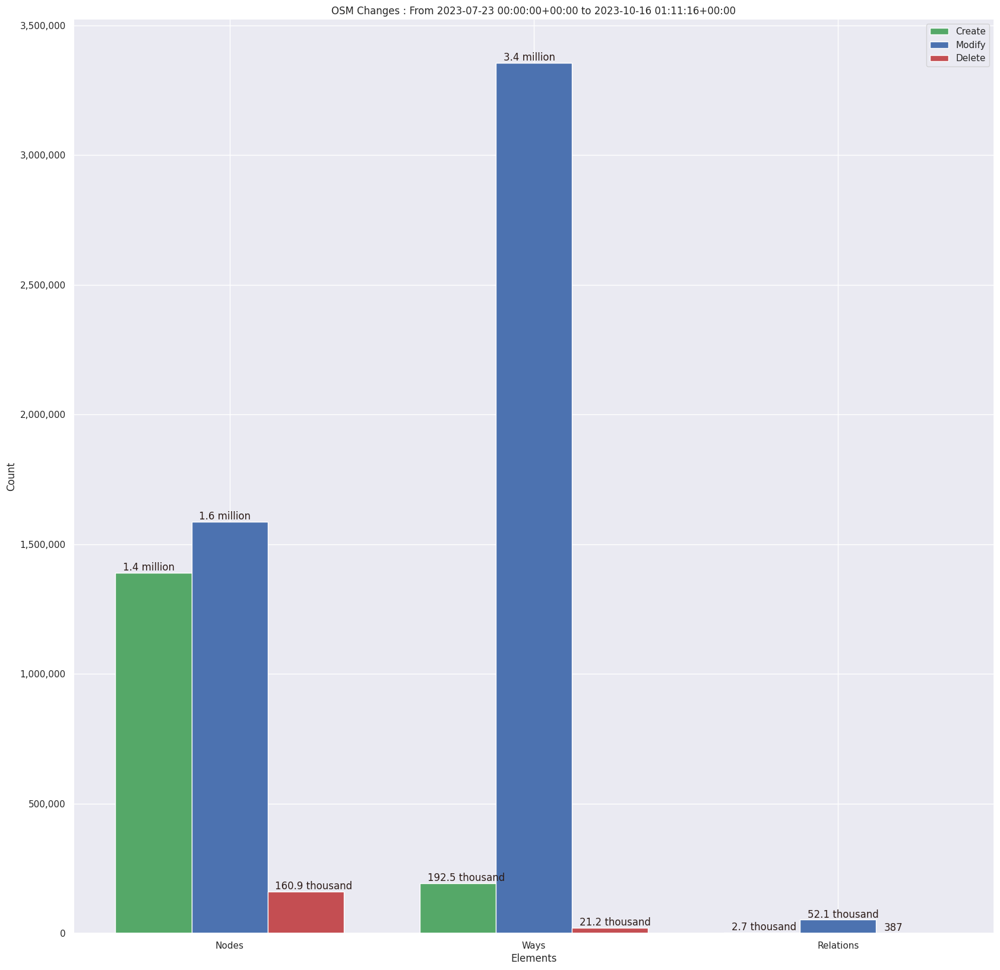
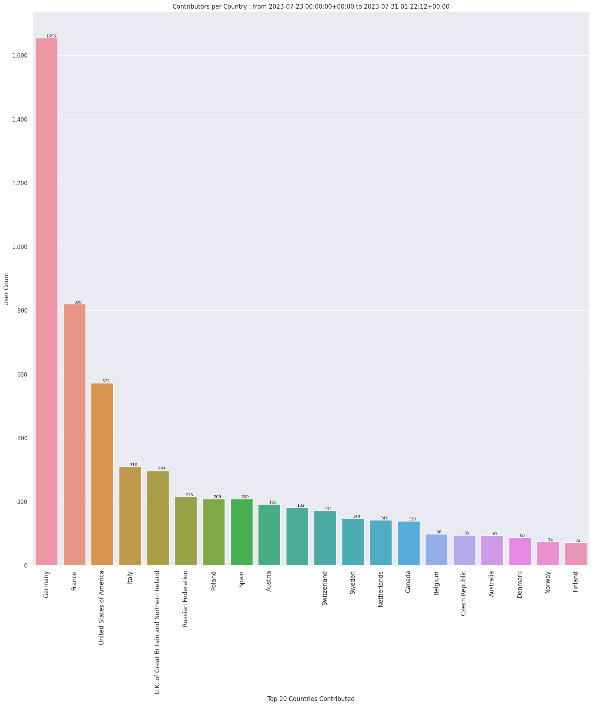
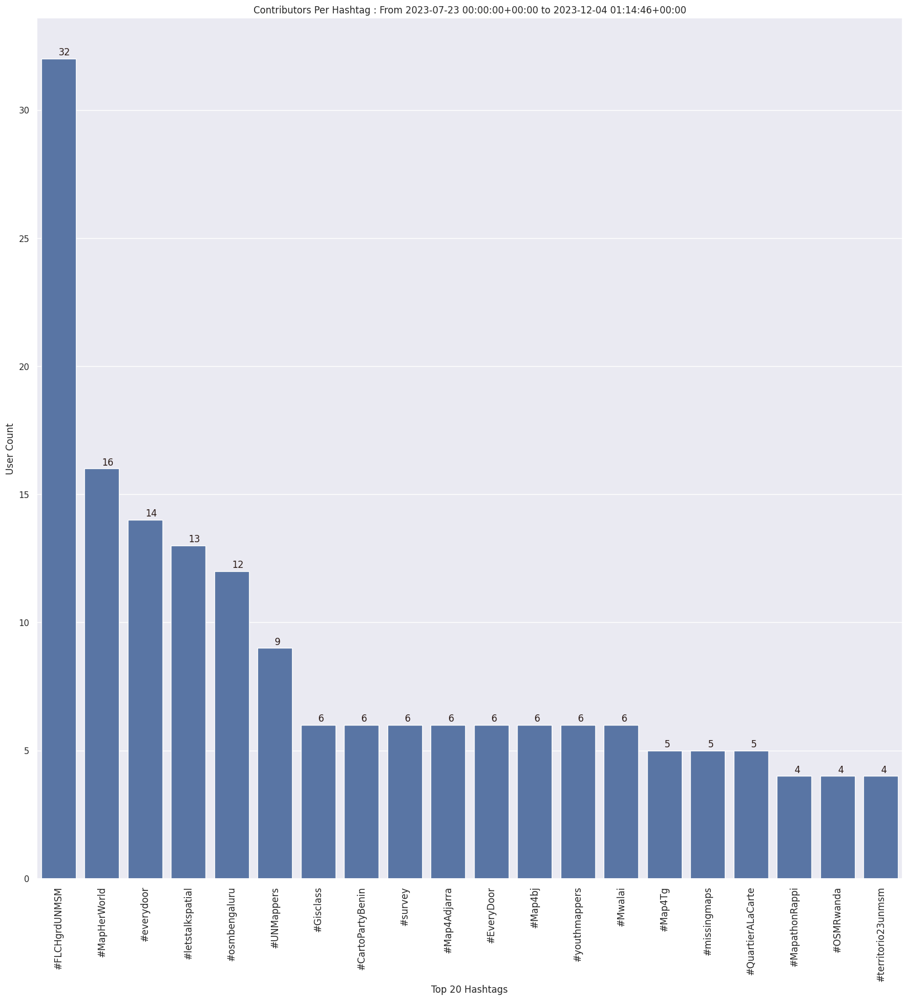
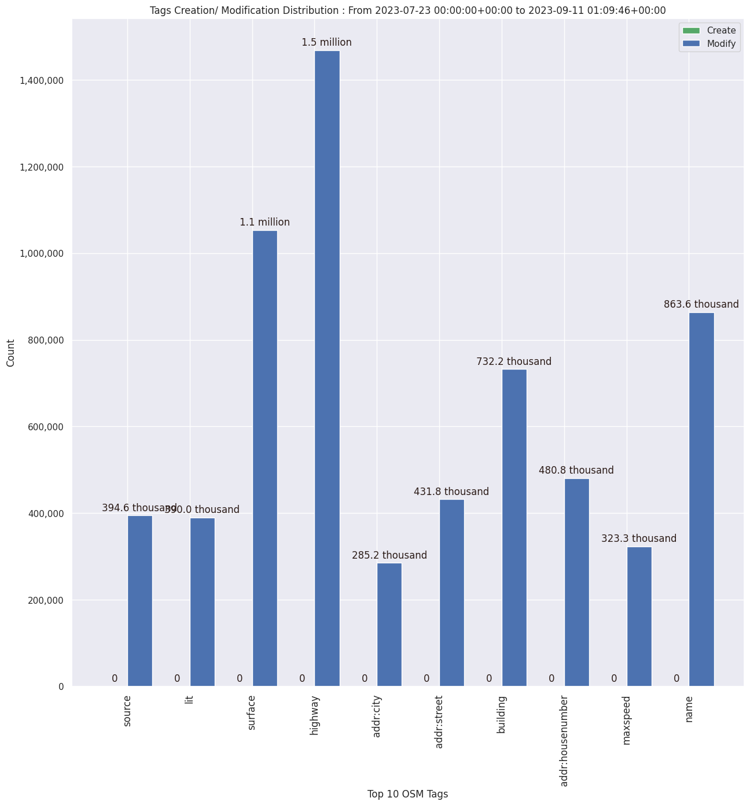

### Last Update : Stats from 2023-07-23 00:00:00+00:00 to 2024-01-22 01:18:37+00:00 (UTC Timezone)

#### 34.4 thousand Users made 1.9 million changesets with 13.0 million map changes.
#### 3.4 million OSM Elements were Created, 9.2 million Modified & 352.2 thousand Deleted.
Get Full Stats at [stats.csv](/stats/fieldmappers/Weekly/stats.csv)
 & Get Summary Stats at [stats_summary.csv](/stats/fieldmappers/Weekly/stats_summary.csv)

Top 5 Users are : 
- Đuro Jiří : 434.3 thousand Map Changes
- PizzaTreeIsland : 372.3 thousand Map Changes
- biketeur : 187.9 thousand Map Changes
- WN6 : 167.2 thousand Map Changes
- padvinder : 125.0 thousand Map Changes

Summary of Supplied Tags
- poi = Created: 665.5 thousand, Modified : 1.9 million
- amenity = Created: 213.3 thousand, Modified : 618.0 thousand

Top 5 Created tags are :
- highway: 243.0 thousand
- name: 234.9 thousand
- amenity: 213.3 thousand
- addr:housenumber: 113.4 thousand
- building: 113.0 thousand

Top 5 Modified tags are :
- highway: 4.4 million
- surface: 3.1 million
- name: 2.6 million
- building: 2.2 million
- addr:housenumber: 1.5 million

Top 5 trending hashtags are:
- #FLCHgrdUNMSM : 32 users
- #MapHerWorld : 16 users
- #everydoor : 15 users
- #letstalkspatial : 13 users

Top 5 trending editors are:
- StreetComplete 53.3 : 9533 users
- StreetComplete 54.0 : 7477 users
- StreetComplete 55.0 : 6219 users
- StreetComplete 55.1 : 5981 users
- StreetComplete 54.1 : 5891 users

Top 5 trending Countries where user contributed are:
- Germany : 9443 users
- France : 4367 users
- United States of America : 3516 users
- Italy : 1961 users
- U.K. of Great Britain and Northern Ireland : 1657 users

 Charts : 
 
 
 
 
 
