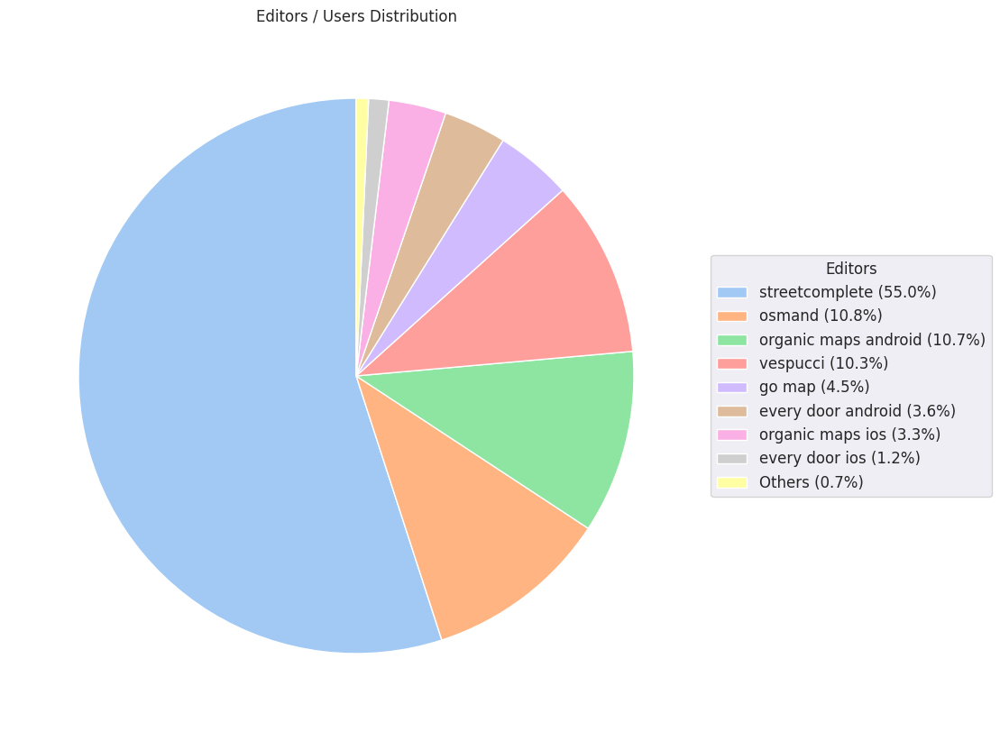

### Last Update : Stats from 2023-07-23 00:00:00+00:00 to 2024-04-22 01:13:01+00:00 (UTC Timezone)

#### 41.6 thousand Users made 2.7 million changesets with 19.4 million map changes.
#### 5.2 million OSM Elements were Created, 13.7 million Modified & 510.2 thousand Deleted.
Get Full Stats at [stats.csv](/stats/fieldmappers/Weekly/stats.csv)
 & Get Summary Stats at [stats_summary.csv](/stats/fieldmappers/Weekly/stats_summary.csv)

Top 5 Users are : 
- PizzaTreeIsland : 729.0 thousand Map Changes
- Đuro Jiří : 680.8 thousand Map Changes
- biketeur : 271.7 thousand Map Changes
- Реdактор : 221.5 thousand Map Changes
- padvinder : 217.8 thousand Map Changes

Summary of Supplied Tags
- poi = Created: 1.0 million, Modified : 2.8 million
- amenity = Created: 321.2 thousand, Modified : 912.7 thousand

Top 5 Created tags are :
- highway: 360.1 thousand
- name: 344.5 thousand
- amenity: 321.2 thousand
- building: 166.7 thousand
- addr:housenumber: 164.8 thousand

Top 5 Modified tags are :
- highway: 6.5 million
- surface: 4.6 million
- name: 3.9 million
- building: 3.2 million
- addr:housenumber: 2.1 million

Top 5 trending hashtags are:
- #FLCHgrdUNMSM : 32 users
- #everydoor : 18 users
- #MapHerWorld : 16 users
- #OMGuru : 15 users

Top 5 trending editors are:
- StreetComplete 53.3 : 9564 users
- StreetComplete 54.0 : 7504 users
- StreetComplete 57.1 : 6814 users
- StreetComplete 55.0 : 6306 users
- StreetComplete 55.1 : 6125 users

Top 5 trending Countries where user contributed are:
- Germany : 11475 users
- France : 5250 users
- United States of America : 4301 users
- Italy : 2466 users
- U.K. of Great Britain and Northern Ireland : 2011 users

 Charts : 
 
 
 
 
 
