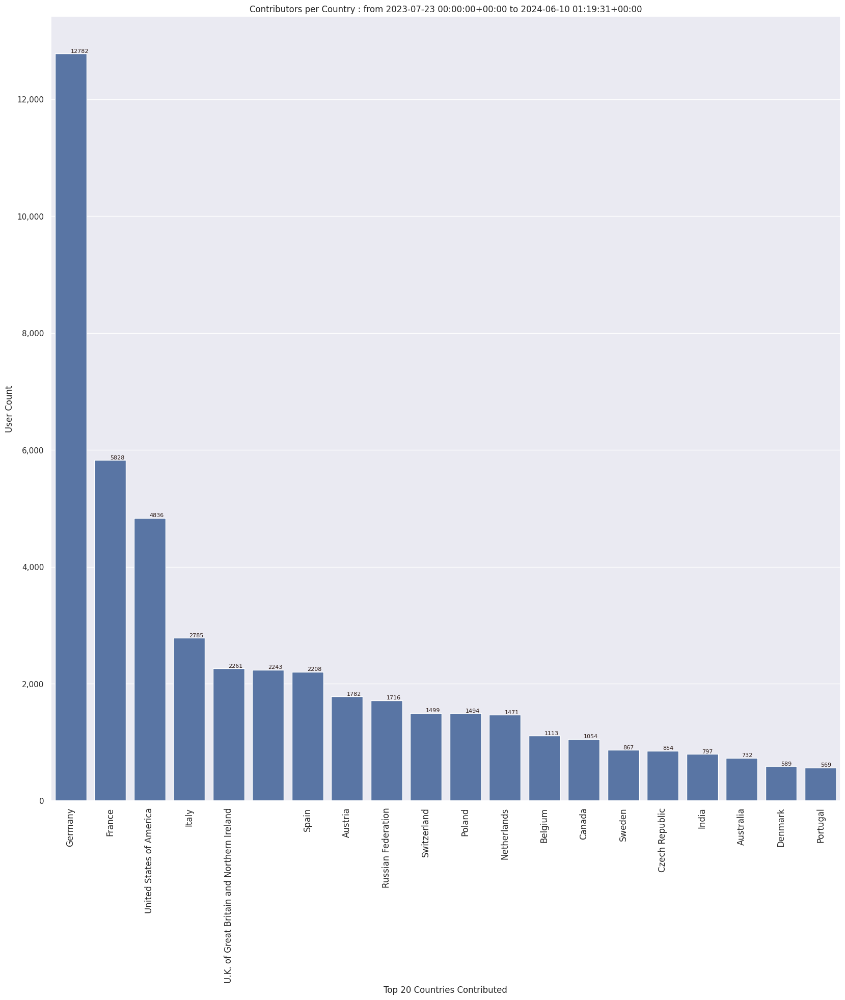

### Last Update : Stats from 2023-07-23 00:00:00+00:00 to 2024-06-03 01:17:17+00:00 (UTC Timezone)

#### 45.6 thousand Users made 3.2 million changesets with 22.5 million map changes.
#### 6.2 million OSM Elements were Created, 15.8 million Modified & 576.4 thousand Deleted.
Get Full Stats at [stats.csv](/stats/fieldmappers/Weekly/stats.csv)
 & Get Summary Stats at [stats_summary.csv](/stats/fieldmappers/Weekly/stats_summary.csv)

Top 5 Users are : 
- PizzaTreeIsland : 915.9 thousand Map Changes
- Đuro Jiří : 809.8 thousand Map Changes
- biketeur : 347.0 thousand Map Changes
- Реdактор : 335.8 thousand Map Changes
- padvinder : 237.8 thousand Map Changes

Summary of Supplied Tags
- poi = Created: 1.2 million, Modified : 3.3 million
- amenity = Created: 380.1 thousand, Modified : 1.1 million

Top 5 Created tags are :
- highway: 417.4 thousand
- name: 394.2 thousand
- amenity: 380.1 thousand
- building: 191.9 thousand
- addr:housenumber: 185.1 thousand

Top 5 Modified tags are :
- highway: 7.5 million
- surface: 5.3 million
- name: 4.5 million
- building: 3.6 million
- addr:housenumber: 2.4 million

Top 5 trending hashtags are:
- #FLCHgrdUNMSM : 32 users
- #everydoor : 21 users
- #OMGuru : 20 users
- #MapHerWorld : 16 users

Top 5 trending editors are:
- StreetComplete 53.3 : 9566 users
- StreetComplete 54.0 : 7513 users
- StreetComplete 57.1 : 6989 users
- StreetComplete 55.0 : 6318 users
- StreetComplete 55.1 : 6137 users

Top 5 trending Countries where user contributed are:
- Germany : 12591 users
- France : 5748 users
- United States of America : 4745 users
- Italy : 2752 users
- U.K. of Great Britain and Northern Ireland : 2222 users

 Charts : 
 
 
 
 
 
