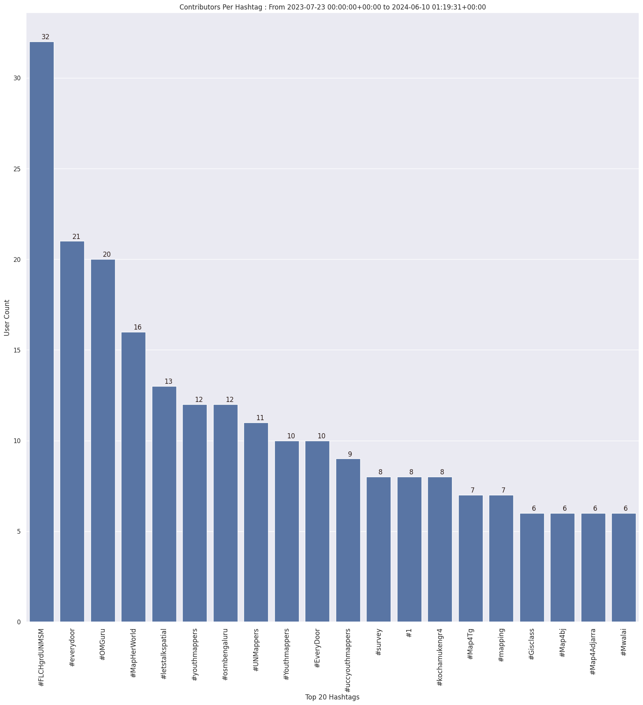

### Last Update : Stats from 2023-07-23 00:00:00+00:00 to 2024-05-13 01:15:31+00:00 (UTC Timezone)

#### 43.4 thousand Users made 2.9 million changesets with 20.7 million map changes.
#### 5.6 million OSM Elements were Created, 14.6 million Modified & 539.1 thousand Deleted.
Get Full Stats at [stats.csv](/stats/fieldmappers/Weekly/stats.csv)
 & Get Summary Stats at [stats_summary.csv](/stats/fieldmappers/Weekly/stats_summary.csv)

Top 5 Users are : 
- PizzaTreeIsland : 824.0 thousand Map Changes
- Đuro Jiří : 748.8 thousand Map Changes
- biketeur : 312.0 thousand Map Changes
- Реdактор : 260.3 thousand Map Changes
- padvinder : 230.7 thousand Map Changes

Summary of Supplied Tags
- poi = Created: 1.1 million, Modified : 3.0 million
- amenity = Created: 344.9 thousand, Modified : 974.2 thousand

Top 5 Created tags are :
- highway: 383.3 thousand
- name: 364.0 thousand
- amenity: 344.9 thousand
- building: 179.5 thousand
- addr:housenumber: 174.5 thousand

Top 5 Modified tags are :
- highway: 6.9 million
- surface: 4.9 million
- name: 4.2 million
- building: 3.4 million
- addr:housenumber: 2.3 million

Top 5 trending hashtags are:
- #FLCHgrdUNMSM : 32 users
- #everydoor : 19 users
- #MapHerWorld : 16 users
- #OMGuru : 16 users

Top 5 trending editors are:
- StreetComplete 53.3 : 9564 users
- StreetComplete 54.0 : 7508 users
- StreetComplete 57.1 : 6942 users
- StreetComplete 55.0 : 6312 users
- StreetComplete 55.1 : 6132 users

Top 5 trending Countries where user contributed are:
- Germany : 11993 users
- France : 5465 users
- United States of America : 4493 users
- Italy : 2592 users
- U.K. of Great Britain and Northern Ireland : 2088 users

 Charts : 
 
 
 
 
 
