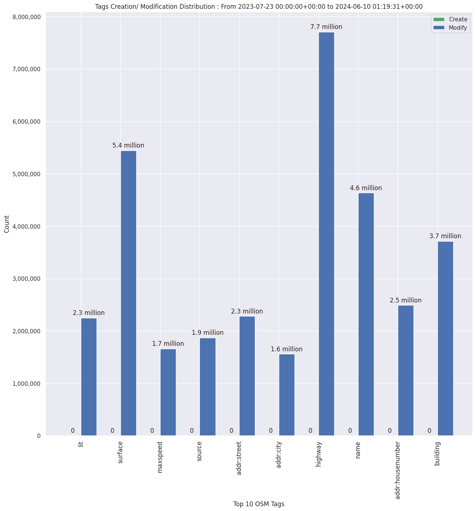

### Last Update : Stats from 2023-07-23 00:00:00+00:00 to 2024-03-25 01:11:01+00:00 (UTC Timezone)

#### 39.1 thousand Users made 2.4 million changesets with 17.1 million map changes.
#### 4.5 million OSM Elements were Created, 12.1 million Modified & 460.2 thousand Deleted.
Get Full Stats at [stats.csv](/stats/fieldmappers/Weekly/stats.csv)
 & Get Summary Stats at [stats_summary.csv](/stats/fieldmappers/Weekly/stats_summary.csv)

Top 5 Users are : 
- PizzaTreeIsland : 642.3 thousand Map Changes
- Đuro Jiří : 603.8 thousand Map Changes
- biketeur : 243.7 thousand Map Changes
- WN6 : 214.2 thousand Map Changes
- padvinder : 194.0 thousand Map Changes

Summary of Supplied Tags
- poi = Created: 874.0 thousand, Modified : 2.5 million
- amenity = Created: 277.3 thousand, Modified : 800.1 thousand

Top 5 Created tags are :
- highway: 314.9 thousand
- name: 306.7 thousand
- amenity: 277.3 thousand
- addr:housenumber: 150.2 thousand
- building: 142.0 thousand

Top 5 Modified tags are :
- highway: 5.7 million
- surface: 4.1 million
- name: 3.5 million
- building: 2.9 million
- addr:housenumber: 1.9 million

Top 5 trending hashtags are:
- #FLCHgrdUNMSM : 32 users
- #everydoor : 18 users
- #MapHerWorld : 16 users
- #OMGuru : 14 users

Top 5 trending editors are:
- StreetComplete 53.3 : 9555 users
- StreetComplete 54.0 : 7499 users
- StreetComplete 55.0 : 6285 users
- StreetComplete 55.1 : 6110 users
- StreetComplete 54.1 : 5922 users

Top 5 trending Countries where user contributed are:
- Germany : 10654 users
- France : 4893 users
- United States of America : 4007 users
- Italy : 2253 users
- U.K. of Great Britain and Northern Ireland : 1890 users

 Charts : 
 
 
 
 
 
