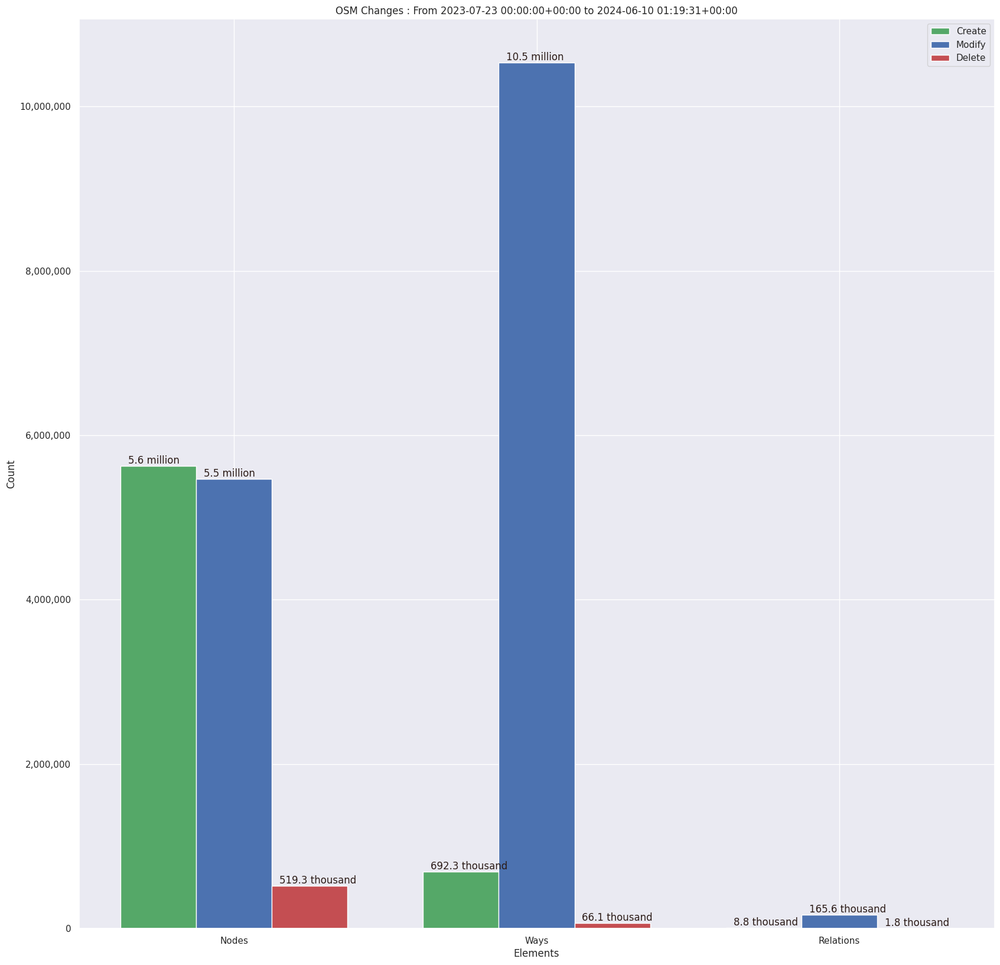

### Last Update : Stats from 2023-07-23 00:00:00+00:00 to 2024-05-27 01:16:46+00:00 (UTC Timezone)

#### 45.0 thousand Users made 3.1 million changesets with 21.9 million map changes.
#### 6.0 million OSM Elements were Created, 15.4 million Modified & 563.4 thousand Deleted.
Get Full Stats at [stats.csv](/stats/fieldmappers/Weekly/stats.csv)
 & Get Summary Stats at [stats_summary.csv](/stats/fieldmappers/Weekly/stats_summary.csv)

Top 5 Users are : 
- PizzaTreeIsland : 877.5 thousand Map Changes
- Đuro Jiří : 792.1 thousand Map Changes
- biketeur : 338.9 thousand Map Changes
- Реdактор : 308.0 thousand Map Changes
- padvinder : 237.8 thousand Map Changes

Summary of Supplied Tags
- poi = Created: 1.1 million, Modified : 3.3 million
- amenity = Created: 369.5 thousand, Modified : 1.0 million

Top 5 Created tags are :
- highway: 407.4 thousand
- name: 384.5 thousand
- amenity: 369.5 thousand
- building: 188.5 thousand
- addr:housenumber: 182.3 thousand

Top 5 Modified tags are :
- highway: 7.3 million
- surface: 5.2 million
- name: 4.4 million
- building: 3.6 million
- addr:housenumber: 2.4 million

Top 5 trending hashtags are:
- #FLCHgrdUNMSM : 32 users
- #OMGuru : 20 users
- #everydoor : 20 users
- #MapHerWorld : 16 users

Top 5 trending editors are:
- StreetComplete 53.3 : 9564 users
- StreetComplete 54.0 : 7513 users
- StreetComplete 57.1 : 6976 users
- StreetComplete 55.0 : 6315 users
- StreetComplete 55.1 : 6137 users

Top 5 trending Countries where user contributed are:
- Germany : 12419 users
- France : 5675 users
- United States of America : 4665 users
- Italy : 2692 users
- U.K. of Great Britain and Northern Ireland : 2187 users

 Charts : 
 
 
 
 
 
