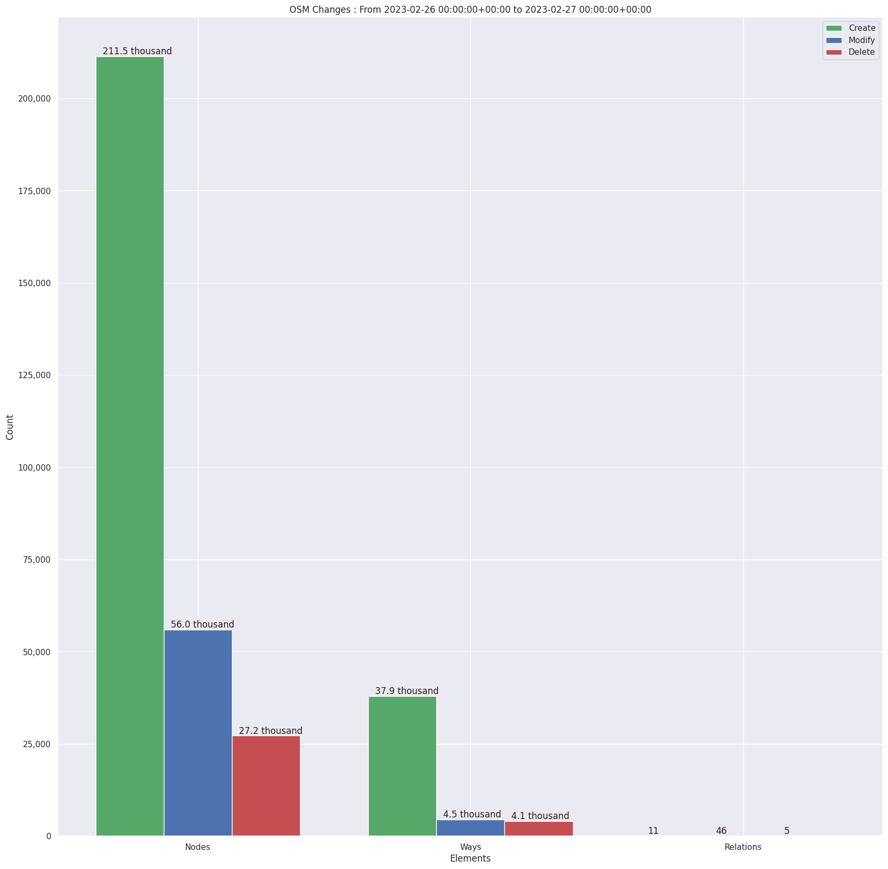
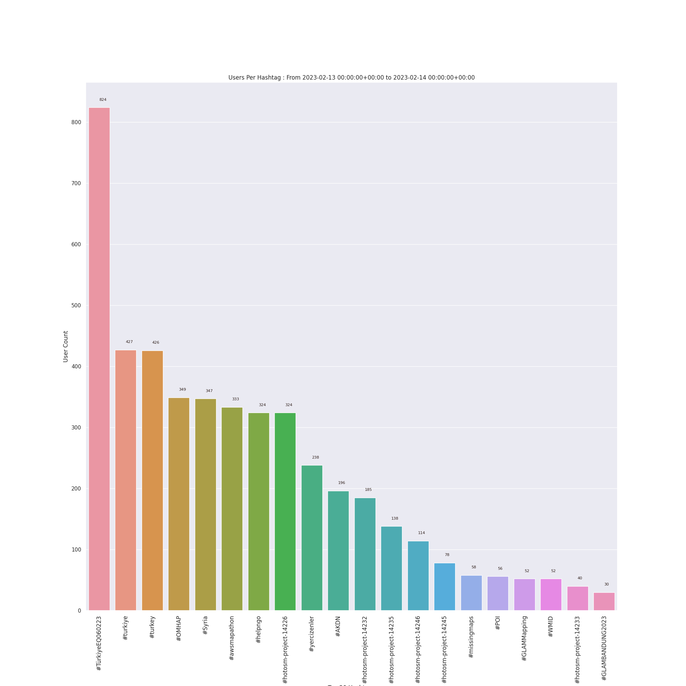
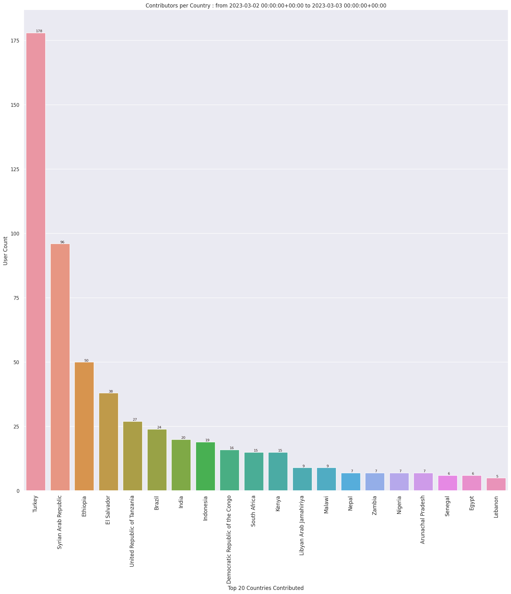
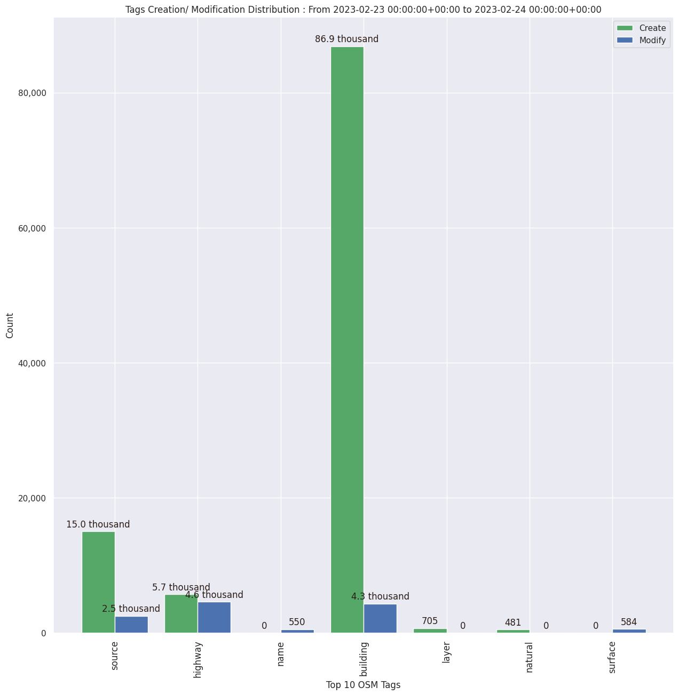

### Last Update : Stats from 2023-02-27 00:00:00+00:00 to 2023-02-28 00:00:00+00:00 (UTC Timezone)

#### 469 Users made 4.0 thousand changesets with 546.9 thousand map changes.
#### 379.9 thousand OSM Elements were Created, 123.8 thousand Modified & 43.3 thousand Deleted.

Top 5 Users are : 
- UPegasus : 18.2 thousand Map Changes
- TeBaMa : 12.0 thousand Map Changes
- Norike12 : 11.2 thousand Map Changes
- Ang96 : 9.8 thousand Map Changes
- Dibikshya Shrestha : 9.7 thousand Map Changes

Summary of Supplied Tags
- poi = Created: 1.7 thousand, Modified : 295
- building = Created: 55.2 thousand, Modified : 5.6 thousand
- highway = Created: 2.9 thousand, Modified : 3.2 thousand
- waterway = Created: 106, Modified : 96
- amenity = Created: 1.5 thousand, Modified : 104

Top 5 Created tags are :
- building: 55.2 thousand
- source: 5.8 thousand
- highway: 2.9 thousand
- addr:district: 1.6 thousand
- amenity: 1.5 thousand

Top 5 Modified tags are :
- building: 5.6 thousand
- highway: 3.2 thousand
- source: 2.7 thousand
- surface: 499
- name: 437

Top 5 trending hashtags are:
- #TürkiyeEQ060223 : 242 users
- #MissingMaps : 141 users
- #yercizenler : 129 users
- #turkey : 123 users
- #turkiye : 123 users

Top 5 trending Countries where user contributed are:
- Turkey : 142 users
- Syrian Arab Republic : 124 users
- Brazil : 43 users
- Indonesia : 24 users
- Lebanon : 22 users

 Charts : 
 
 
 
 
