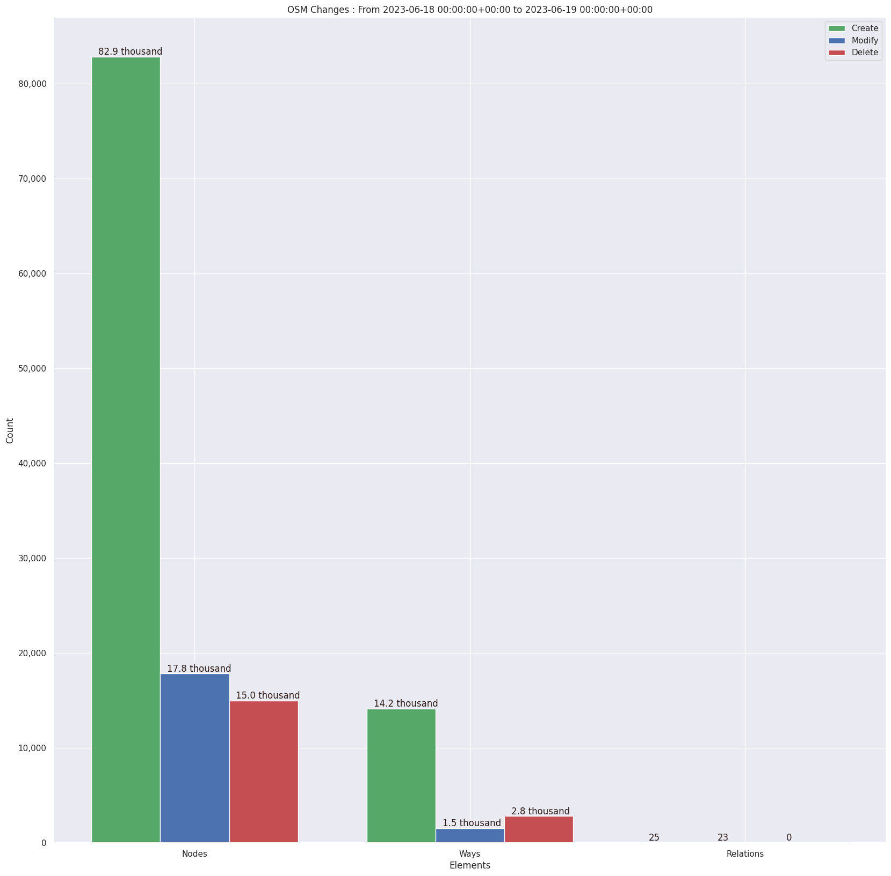
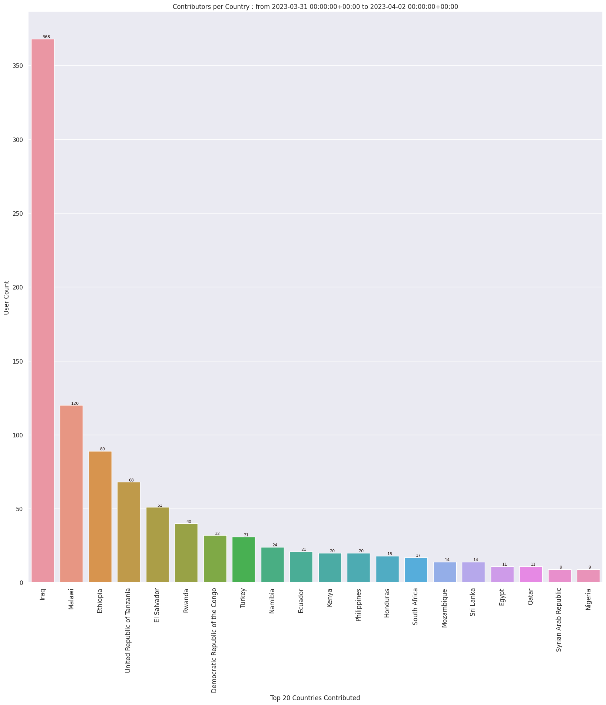
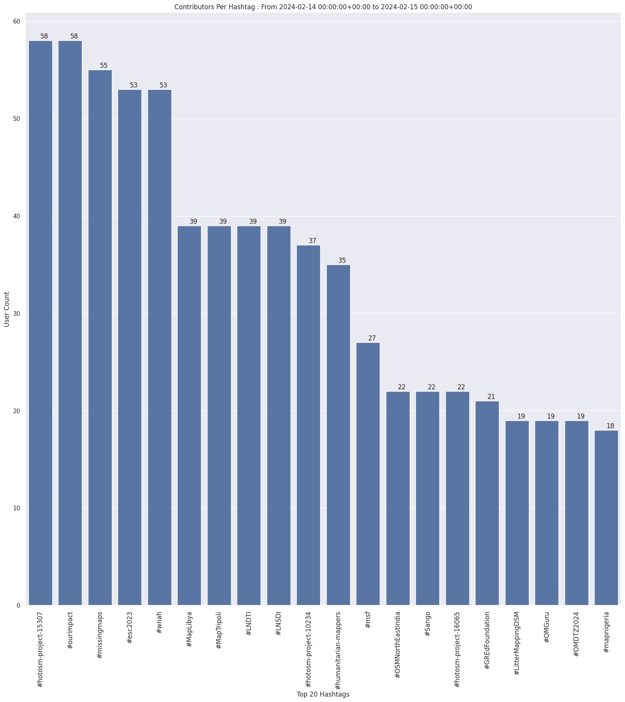
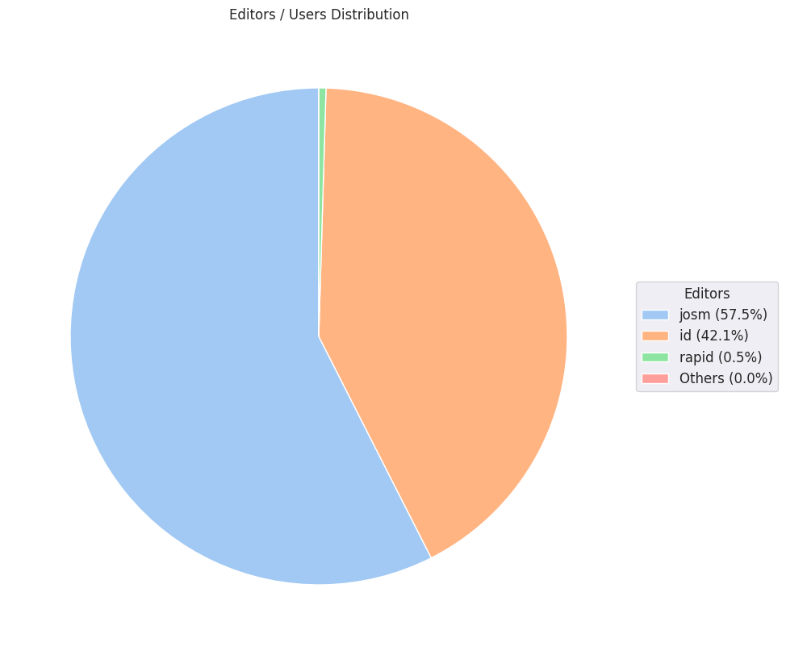
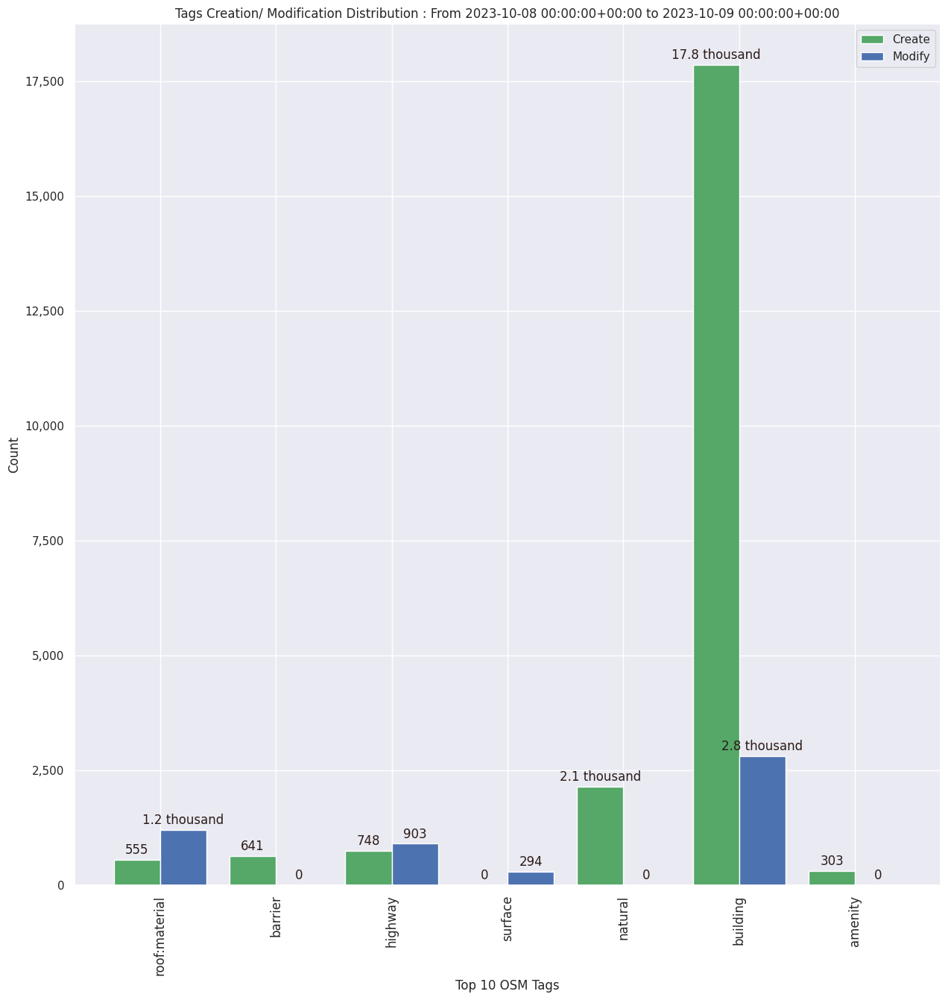

### Last Update : Stats from 2024-01-22 00:00:00+00:00 to 2024-01-24 00:00:00+00:00 (UTC Timezone)

#### 521 Users made 6.1 thousand changesets with 714.5 thousand map changes.
#### 470.0 thousand OSM Elements were Created, 185.6 thousand Modified & 58.9 thousand Deleted.
Get Full Stats at [stats.csv](/stats/hotosm/Daily/stats.csv)
 & Get Summary Stats at [stats_summary.csv](/stats/hotosm/Daily/stats_summary.csv)

Top 5 Users are : 
- la_nenemini : 35.0 thousand Map Changes
- Jorieke V : 21.2 thousand Map Changes
- Hessel54 : 20.8 thousand Map Changes
- Thishara : 13.9 thousand Map Changes
- Marvin de Hont : 13.8 thousand Map Changes

Summary of Supplied Tags
- poi = Created: 98, Modified : 336
- building = Created: 68.1 thousand, Modified : 7.2 thousand
- highway = Created: 2.4 thousand, Modified : 3.5 thousand
- waterway = Created: 136, Modified : 175
- amenity = Created: 63, Modified : 46

Top 5 Created tags are :
- building: 68.1 thousand
- source: 2.6 thousand
- highway: 2.4 thousand
- landuse: 1.2 thousand
- natural: 328

Top 5 Modified tags are :
- building: 7.2 thousand
- highway: 3.5 thousand
- source: 1.8 thousand
- surface: 700
- landuse: 683

Top 5 trending hashtags are:
- #CrisisMapping : 91 users
- #令和6年能登半島地震 : 90 users
- #missingmaps : 87 users
- #hotosm-project-15476 : 72 users
- #moroccoearthquake2023 : 72 users

Top 5 trending editors are:
- iD 2.21.1 : 370 users
- JOSM/1.5 (18822 en) : 32 users
- JOSM/1.5 (18907 en) : 20 users
- JOSM/1.5 (18940 en) : 18 users
- JOSM/1.5 (18822 ar) : 9 users

Top 5 trending Countries where user contributed are:
- Japan : 87 users
- Morocco : 71 users
- Honduras : 70 users
- Kenya : 60 users
- India : 34 users

 Charts : 
 
 
 
 
 
