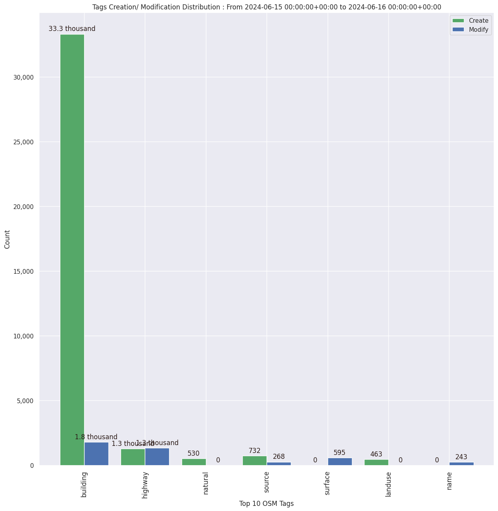

### Last Update : Stats from 2024-04-16 00:00:00+00:00 to 2024-04-17 00:00:00+00:00 (UTC Timezone)

#### 633 Users made 5.6 thousand changesets with 630.4 thousand map changes.
#### 443.3 thousand OSM Elements were Created, 151.3 thousand Modified & 35.9 thousand Deleted.
Get Full Stats at [stats.csv](/stats/hotosm/Daily/stats.csv)
 & Get Summary Stats at [stats_summary.csv](/stats/hotosm/Daily/stats_summary.csv)

Top 5 Users are : 
- ujinevich : 22.1 thousand Map Changes
- Frans S : 16.5 thousand Map Changes
- Austinenoni : 15.1 thousand Map Changes
- OKIKIRI FAVOUR : 14.8 thousand Map Changes
- Huygens_Jnr : 14.4 thousand Map Changes

Summary of Supplied Tags
- poi = Created: 255, Modified : 150
- building = Created: 63.6 thousand, Modified : 6.2 thousand
- highway = Created: 2.0 thousand, Modified : 4.5 thousand
- waterway = Created: 93, Modified : 167
- amenity = Created: 32, Modified : 45

Top 5 Created tags are :
- building: 63.6 thousand
- source: 3.6 thousand
- highway: 2.0 thousand
- landuse: 511
- surface: 495

Top 5 Modified tags are :
- building: 6.2 thousand
- highway: 4.5 thousand
- surface: 2.4 thousand
- source: 1.2 thousand
- name: 304

Top 5 trending hashtags are:
- #onemillionactofscience : 108 users
- #uniquemappersnetwork2024 : 108 users
- #uniquemappersnetwork : 108 users
- #uniquemappersteam : 108 users
- #MapUmuahiaNorth : 108 users

Top 5 trending editors are:
- iD 2.21.1 : 479 users
- JOSM/1.5 (19039 en) : 19 users
- JOSM/1.5 (18969 en) : 17 users
- JOSM/1.5 (18822 en) : 17 users
- JOSM/1.5 (19017 en) : 15 users

Top 5 trending Countries where user contributed are:
- India : 170 users
- Nigeria : 160 users
- Mozambique : 42 users
- Papua New Guinea : 35 users
- Taiwan : 32 users

 Charts : 
 
 
 
 
 
