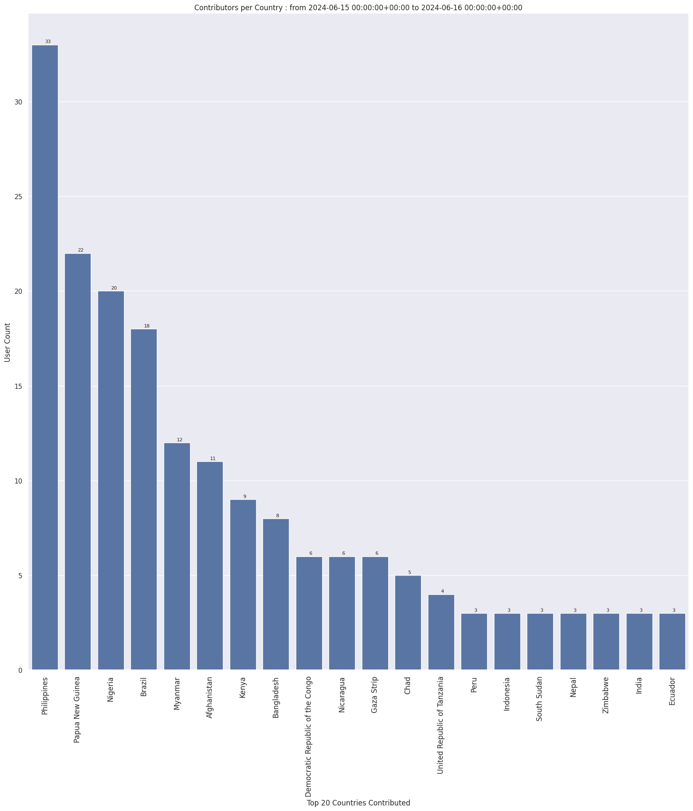

### Last Update : Stats from 2024-04-22 00:00:00+00:00 to 2024-04-23 00:00:00+00:00 (UTC Timezone)

#### 462 Users made 5.5 thousand changesets with 847.5 thousand map changes.
#### 670.5 thousand OSM Elements were Created, 140.0 thousand Modified & 36.9 thousand Deleted.
Get Full Stats at [stats.csv](/stats/hotosm/Daily/stats.csv)
 & Get Summary Stats at [stats_summary.csv](/stats/hotosm/Daily/stats_summary.csv)

Top 5 Users are : 
- Libor Bednarik : 21.6 thousand Map Changes
- Niruta Neeupane : 18.5 thousand Map Changes
- ujinevich : 17.7 thousand Map Changes
- Dibikshya Shrestha : 16.1 thousand Map Changes
- Sangeeta BC : 14.9 thousand Map Changes

Summary of Supplied Tags
- poi = Created: 206, Modified : 124
- building = Created: 109.6 thousand, Modified : 4.7 thousand
- highway = Created: 1.2 thousand, Modified : 2.9 thousand
- waterway = Created: 63, Modified : 142
- amenity = Created: 45, Modified : 41

Top 5 Created tags are :
- building: 109.6 thousand
- source: 8.0 thousand
- highway: 1.2 thousand
- landuse: 516
- construction: 362

Top 5 Modified tags are :
- building: 4.7 thousand
- highway: 2.9 thousand
- surface: 1.3 thousand
- source: 765
- landuse: 437

Top 5 trending hashtags are:
- #OMGuru : 102 users
- #APHub : 75 users
- #esc2023 : 67 users
- #OSMPNG : 67 users
- #PNGearthquakeMarch2024 : 67 users

Top 5 trending editors are:
- iD 2.21.1 : 279 users
- JOSM/1.5 (19039 en) : 31 users
- JOSM/1.5 (19017 en) : 25 users
- JOSM/1.5 (18969 en) : 23 users
- JOSM/1.5 (18822 en) : 16 users

Top 5 trending Countries where user contributed are:
- Nigeria : 80 users
- Papua New Guinea : 68 users
- India : 43 users
- Kenya : 33 users
- Taiwan : 22 users

 Charts : 
 
 
 
 
 
