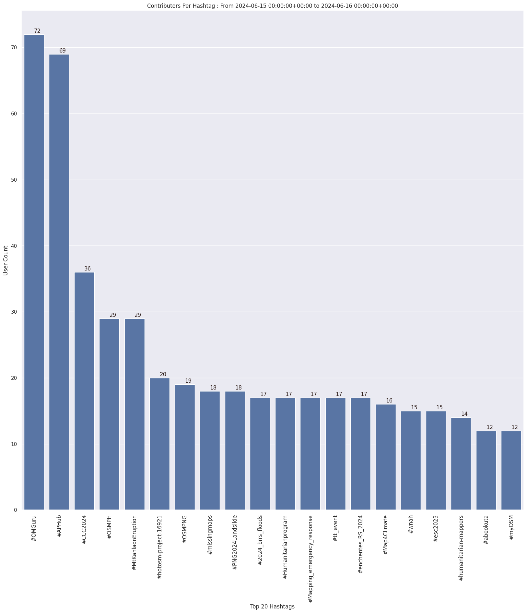

### Last Update : Stats from 2023-05-30 00:00:00+00:00 to 2023-05-31 00:00:00+00:00 (UTC Timezone)

#### 346 Users made 3.3 thousand changesets with 479.8 thousand map changes.
#### 378.4 thousand OSM Elements were Created, 59.1 thousand Modified & 42.2 thousand Deleted.
Get Full Stats at [stats.csv](/stats/hotosm/Daily/stats.csv)
 & Get Summary Stats at [stats_summary.csv](/stats/hotosm/Daily/stats_summary.csv)

Top 5 Users are : 
- Dariene Joy Galon : 66.7 thousand Map Changes
- June Costales : 59.9 thousand Map Changes
- KY17 : 12.9 thousand Map Changes
- NOWAMAANI : 12.0 thousand Map Changes
- mjgk : 10.3 thousand Map Changes

Summary of Supplied Tags
- poi = Created: 912, Modified : 385
- building = Created: 56.6 thousand, Modified : 4.0 thousand
- highway = Created: 1.2 thousand, Modified : 1.4 thousand
- waterway = Created: 98, Modified : 138
- amenity = Created: 260, Modified : 152

Top 5 Created tags are :
- building: 56.6 thousand
- source: 2.7 thousand
- natural: 2.3 thousand
- man_made: 1.7 thousand
- highway: 1.2 thousand

Top 5 Modified tags are :
- building: 4.0 thousand
- highway: 1.4 thousand
- source: 511
- surface: 312
- roof:material: 310

Top 5 trending hashtags are:
- #OpenCitiesLAC : 89 users
- #ourimpact : 62 users
- #gvm2023 : 61 users
- #missingmaps : 60 users
- #hotosm-project-14749 : 40 users

Top 5 trending Countries where user contributed are:
- Honduras : 81 users
- Philippines : 49 users
- Malawi : 39 users
- Nigeria : 18 users
- India : 18 users

 Charts : 
 
 
 
 
