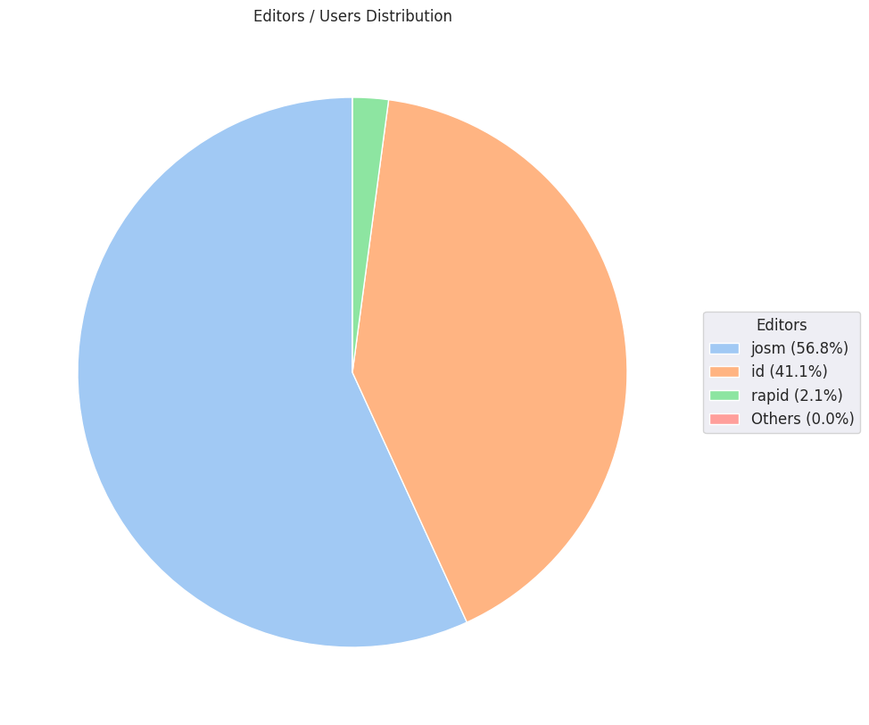

### Last Update : Stats from 2024-02-14 00:00:00+00:00 to 2024-02-15 00:00:00+00:00 (UTC Timezone)

#### 394 Users made 4.0 thousand changesets with 971.4 thousand map changes.
#### 751.2 thousand OSM Elements were Created, 170.4 thousand Modified & 49.8 thousand Deleted.
Get Full Stats at [stats.csv](/stats/hotosm/Daily/stats.csv)
 & Get Summary Stats at [stats_summary.csv](/stats/hotosm/Daily/stats_summary.csv)

Top 5 Users are : 
- anthaas : 24.9 thousand Map Changes
- OKIKIRI FAVOUR : 19.5 thousand Map Changes
- Ttara : 18.2 thousand Map Changes
- Joy Esther : 18.2 thousand Map Changes
- Hessel54 : 16.9 thousand Map Changes

Summary of Supplied Tags
- poi = Created: 73, Modified : 112
- building = Created: 124.8 thousand, Modified : 7.1 thousand
- highway = Created: 2.2 thousand, Modified : 3.6 thousand
- waterway = Created: 378, Modified : 259
- amenity = Created: 11, Modified : 31

Top 5 Created tags are :
- building: 124.8 thousand
- source: 32.4 thousand
- highway: 2.2 thousand
- waterway: 378
- landuse: 255

Top 5 Modified tags are :
- building: 7.1 thousand
- highway: 3.6 thousand
- source: 984
- surface: 647
- tracktype: 365

Top 5 trending hashtags are:
- #hotosm-project-15307 : 58 users
- #ourimpact : 58 users
- #missingmaps : 55 users
- #wnah : 53 users
- #esc2023 : 53 users

Top 5 trending editors are:
- iD 2.21.1 : 206 users
- JOSM/1.5 (18969 en) : 44 users
- JOSM/1.5 (18940 en) : 35 users
- JOSM/1.5 (18822 en) : 24 users
- JOSM/1.5 (18907 en) : 12 users

Top 5 trending Countries where user contributed are:
- Honduras : 76 users
- Nigeria : 58 users
- Libyan Arab Jamahiriya : 39 users
- Kenya : 32 users
- India : 28 users

 Charts : 
 
 
 
 
 
