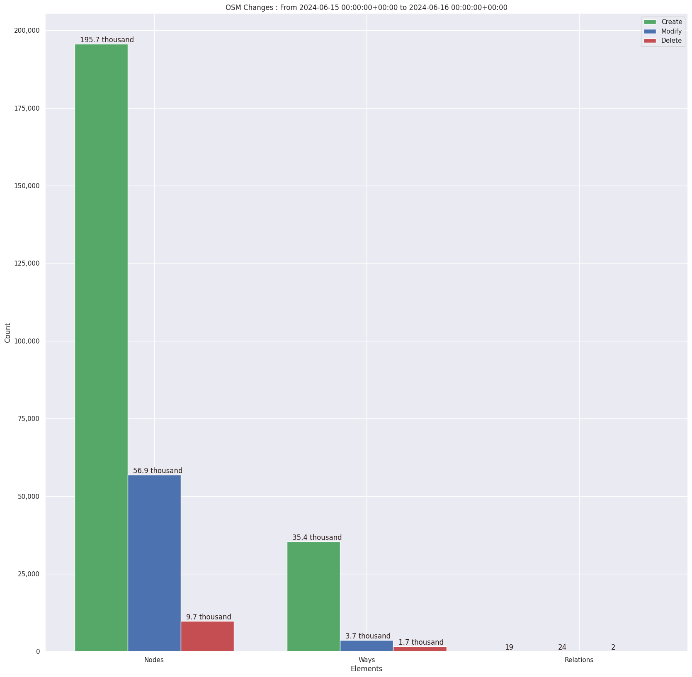

### Last Update : Stats from 2024-01-10 00:00:00+00:00 to 2024-01-11 00:00:00+00:00 (UTC Timezone)

#### 383 Users made 2.7 thousand changesets with 363.0 thousand map changes.
#### 262.0 thousand OSM Elements were Created, 77.1 thousand Modified & 23.9 thousand Deleted.
Get Full Stats at [stats.csv](/stats/hotosm/Daily/stats.csv)
 & Get Summary Stats at [stats_summary.csv](/stats/hotosm/Daily/stats_summary.csv)

Top 5 Users are : 
- ryoro : 26.5 thousand Map Changes
- Patrik_B : 21.2 thousand Map Changes
- Thishara : 15.5 thousand Map Changes
- Rizki907 : 13.8 thousand Map Changes
- Norbert Dichter : 7.6 thousand Map Changes

Summary of Supplied Tags
- poi = Created: 43, Modified : 282
- building = Created: 39.2 thousand, Modified : 2.7 thousand
- highway = Created: 1.5 thousand, Modified : 2.0 thousand
- waterway = Created: 60, Modified : 142
- amenity = Created: 23, Modified : 72

Top 5 Created tags are :
- building: 39.2 thousand
- highway: 1.5 thousand
- source: 645
- area: 226
- landuse: 219

Top 5 Modified tags are :
- building: 2.7 thousand
- highway: 2.0 thousand
- source: 1.3 thousand
- surface: 328
- name: 277

Top 5 trending hashtags are:
- #令和6年能登半島地震 : 134 users
- #CrisisMapping : 134 users
- #missingmaps : 54 users
- #hotosm-project-15900 : 44 users
- #hotosm-project-15902 : 44 users

Top 5 trending editors are:
- iD 2.21.1 : 284 users
- JOSM/1.5 (18822 en) : 20 users
- JOSM/1.5 (18907 en) : 17 users
- JOSM/1.5 (18907 ja) : 6 users
- JOSM/1.5 (18907 en_GB) : 6 users

Top 5 trending Countries where user contributed are:
- Japan : 114 users
- Kenya : 50 users
- Honduras : 34 users
- Morocco : 24 users

 Charts : 
 
 
 
 
 
