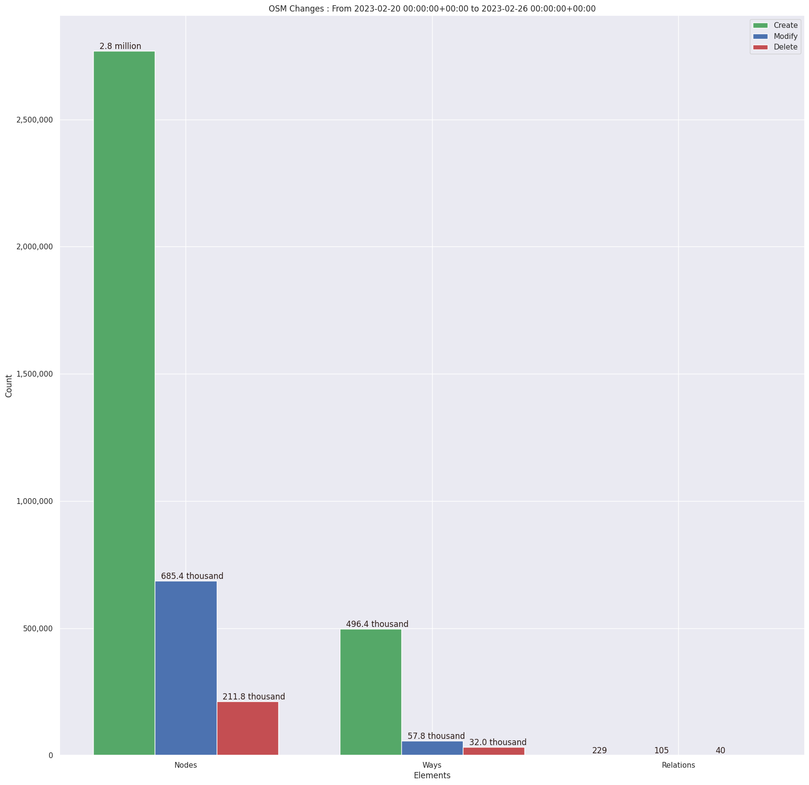
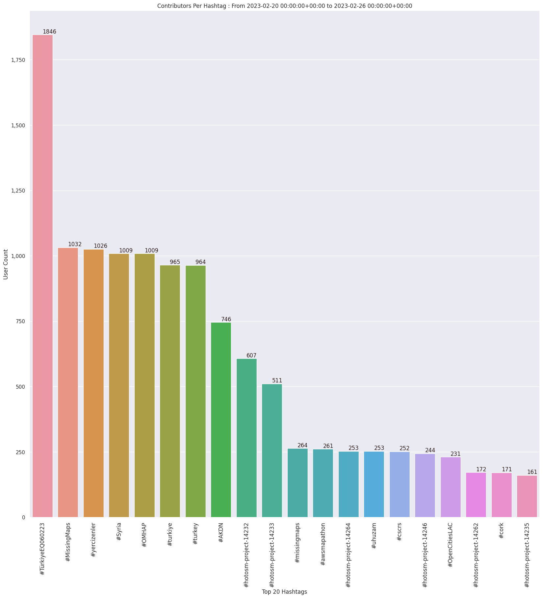
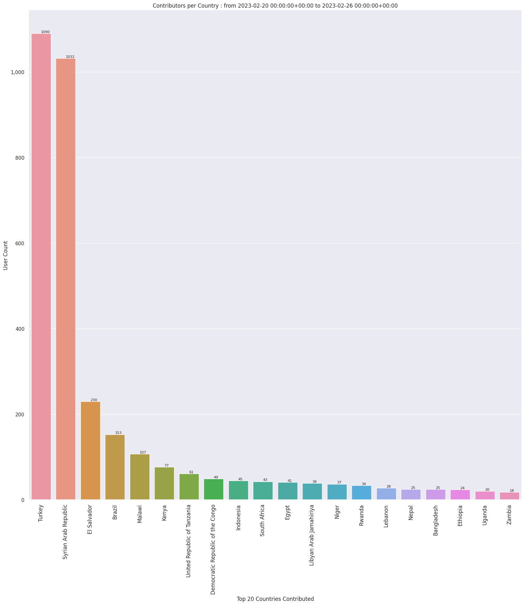
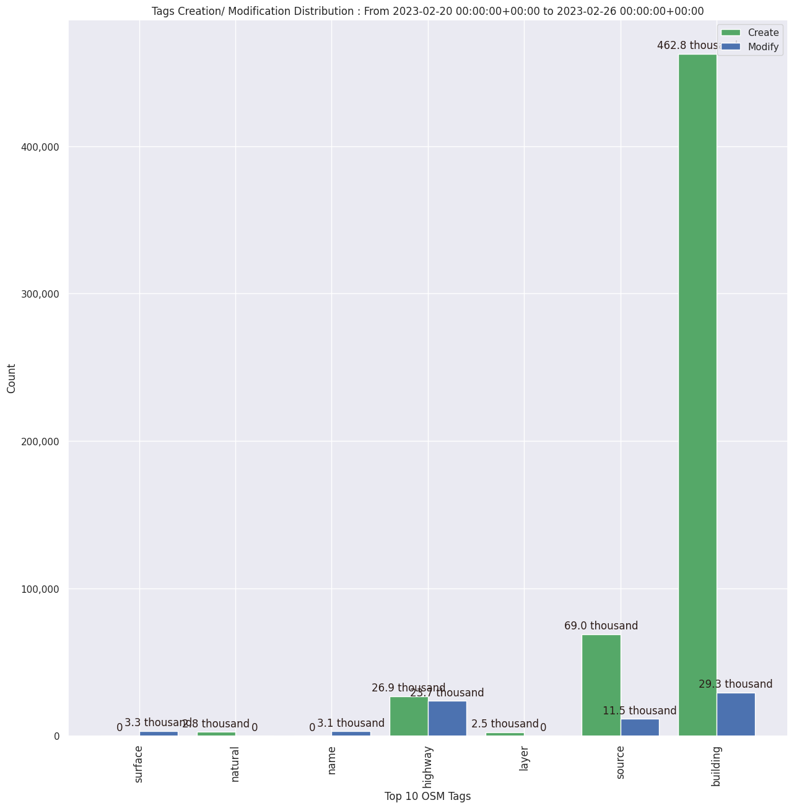

### Last Update : Stats from 2023-02-20 00:00:00+00:00 to 2023-02-26 00:00:00+00:00 (UTC Timezone)

#### 2.7 thousand Users made 33.6 thousand changesets with 4.3 million map changes.
#### 3.3 million OSM Elements were Created, 743.3 thousand Modified & 243.8 thousand Deleted.

Top 5 Users are : 
- Roselyn Peralta : 88.8 thousand Map Changes
- nyainariantsoa : 74.7 thousand Map Changes
- anneeeeeeee : 58.5 thousand Map Changes
- UPegasus : 52.4 thousand Map Changes
- Narindra Fidintsoa : 51.5 thousand Map Changes

Summary of Supplied Tags
- poi = Created: 2.3 thousand, Modified : 1.2 thousand
- building = Created: 462.8 thousand, Modified : 29.3 thousand
- highway = Created: 26.9 thousand, Modified : 23.7 thousand
- waterway = Created: 643, Modified : 710
- amenity = Created: 791, Modified : 801

Top 5 Created tags are :
- building: 462.8 thousand
- source: 69.0 thousand
- highway: 26.9 thousand
- natural: 2.8 thousand
- layer: 2.5 thousand

Top 5 Modified tags are :
- building: 29.3 thousand
- highway: 23.7 thousand
- source: 11.5 thousand
- surface: 3.3 thousand
- name: 3.1 thousand

Top 5 trending hashtags are:
- #TürkiyeEQ060223 : 1846 users
- #MissingMaps : 1032 users
- #yercizenler : 1026 users
- #OMHAP : 1009 users
- #Syria : 1009 users

Top 5 trending Countries where user contributed are:
- Turkey : 1090 users
- Syrian Arab Republic : 1032 users
- El Salvador : 230 users
- Brazil : 153 users
- Malawi : 107 users

 Charts : 
 
 
 
 
