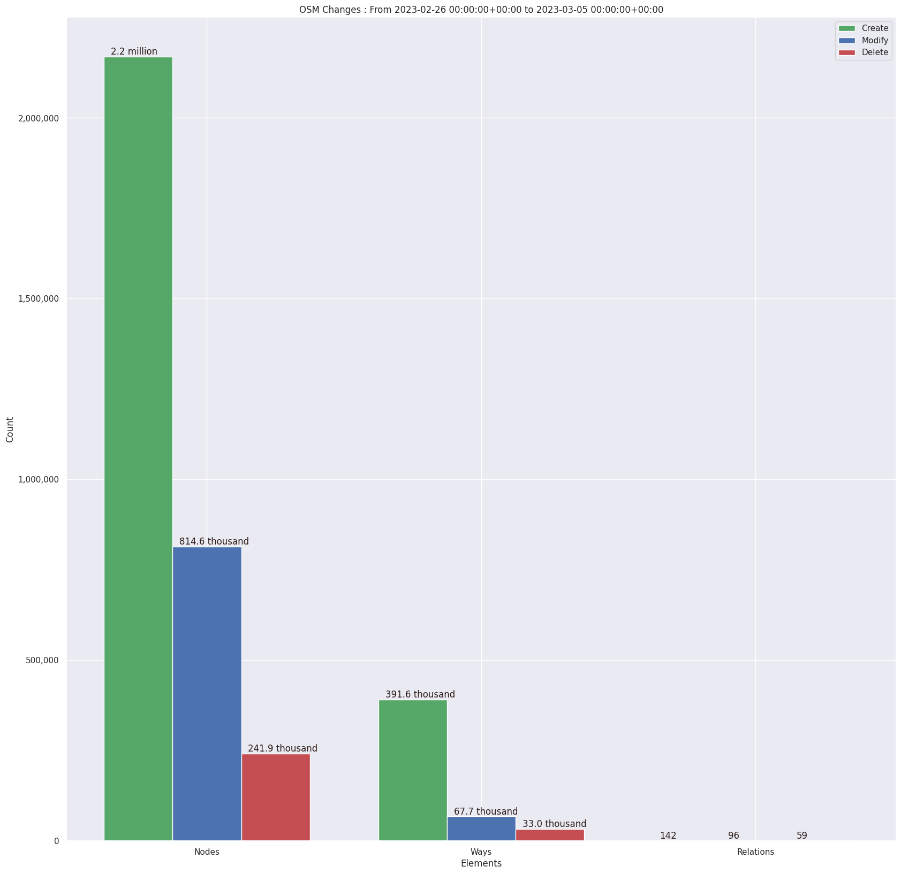
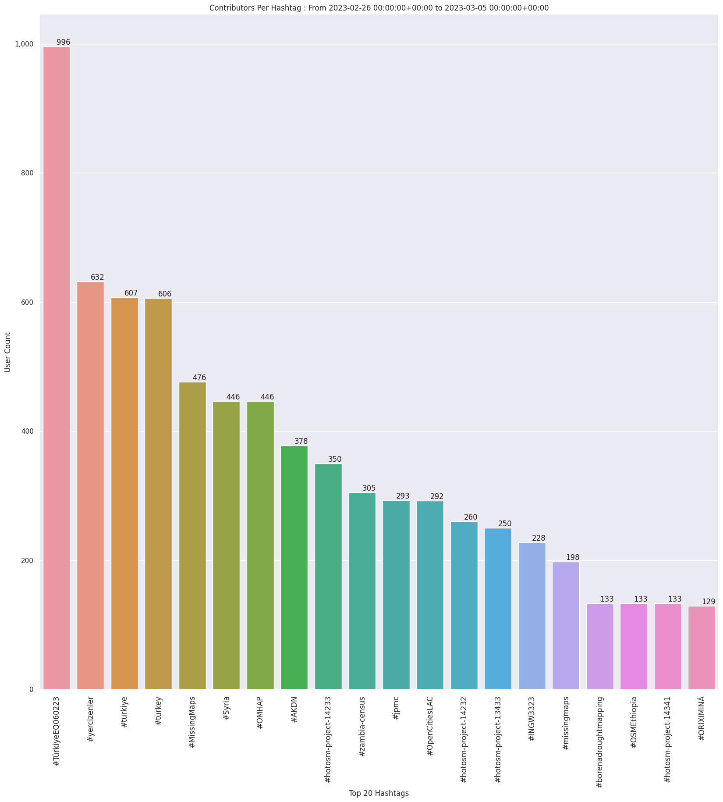
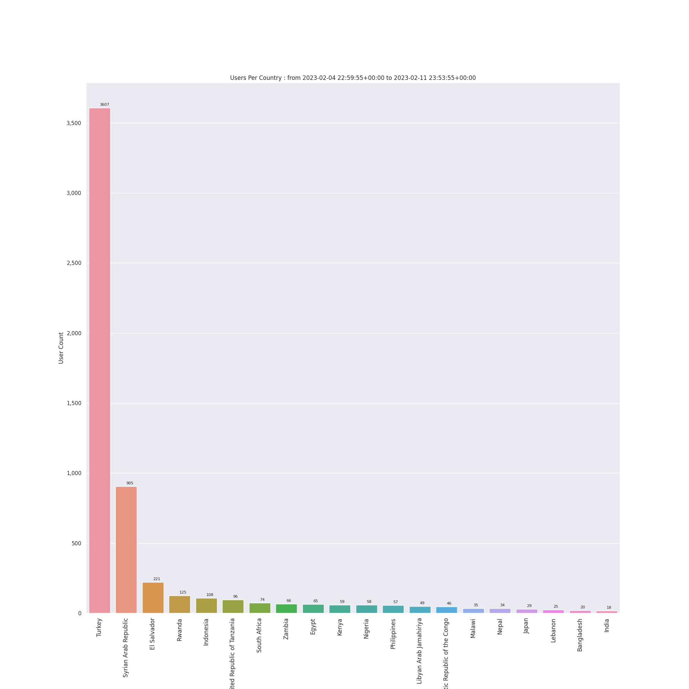
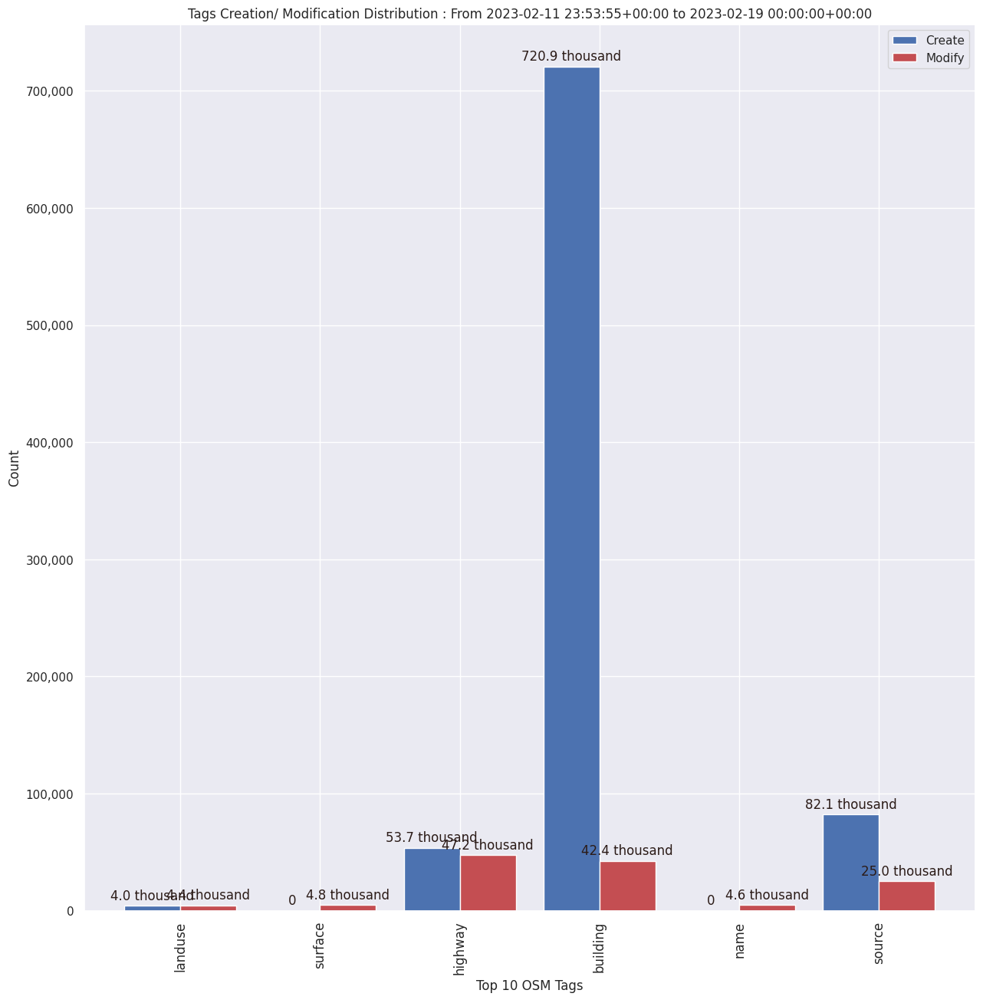

### Last Update : Stats from 2023-02-19 00:00:00+00:00 to 2023-02-26 00:00:00+00:00 (UTC Timezone)

#### 2.8 thousand Users made 36.7 thousand changesets with 4.7 million map changes.
#### 3.6 million OSM Elements were Created, 832.8 thousand Modified & 273.0 thousand Deleted.

Top 5 Users are : 
- Roselyn Peralta : 88.8 thousand Map Changes
- nyainariantsoa : 74.7 thousand Map Changes
- UPegasus : 62.5 thousand Map Changes
- anneeeeeeee : 58.5 thousand Map Changes
- Kraan46 : 56.9 thousand Map Changes

Summary of Supplied Tags
- poi = Created: 2.6 thousand, Modified : 1.3 thousand
- building = Created: 513.4 thousand, Modified : 32.3 thousand
- highway = Created: 29.7 thousand, Modified : 26.7 thousand
- waterway = Created: 670, Modified : 787
- amenity = Created: 854, Modified : 861

Top 5 Created tags are :
- building: 513.4 thousand
- source: 76.2 thousand
- highway: 29.7 thousand
- natural: 3.0 thousand
- layer: 2.6 thousand

Top 5 Modified tags are :
- building: 32.3 thousand
- highway: 26.7 thousand
- source: 12.7 thousand
- surface: 3.8 thousand
- name: 3.4 thousand

Top 5 trending hashtags are:
- #TürkiyeEQ060223 : 1960 users
- #MissingMaps : 1134 users
- #Syria : 1110 users
- #OMHAP : 1110 users
- #yercizenler : 1057 users

Top 5 trending Countries where user contributed are:
- Syrian Arab Republic : 1134 users
- Turkey : 1124 users
- El Salvador : 235 users
- Brazil : 153 users
- Malawi : 109 users

 Charts : 
 
 
 
 
