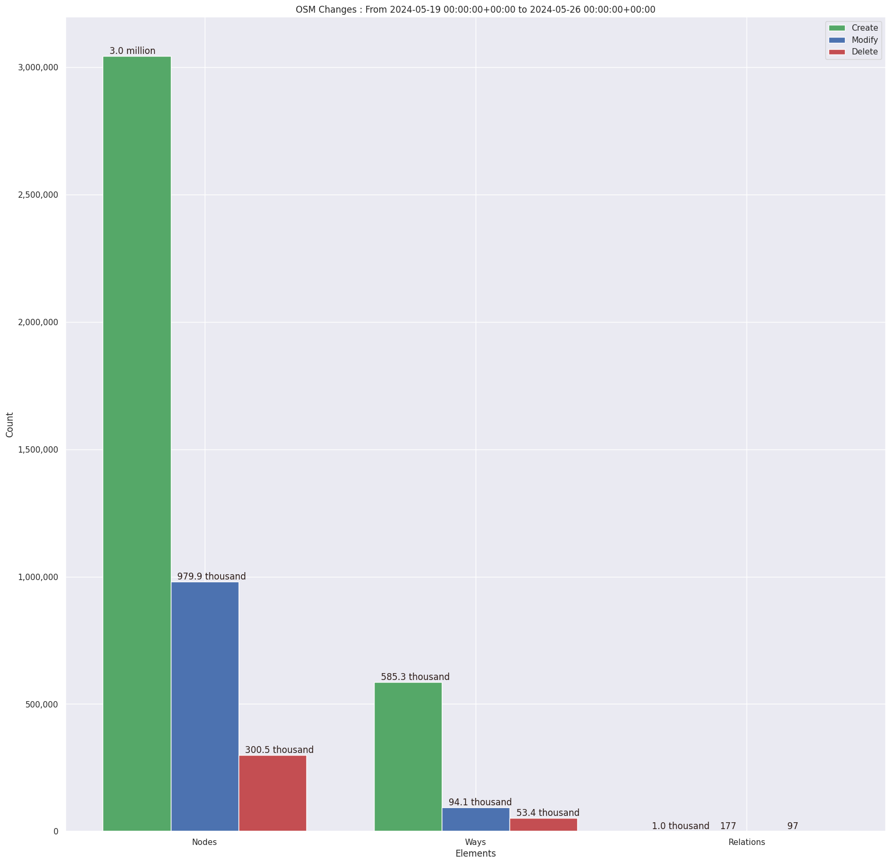
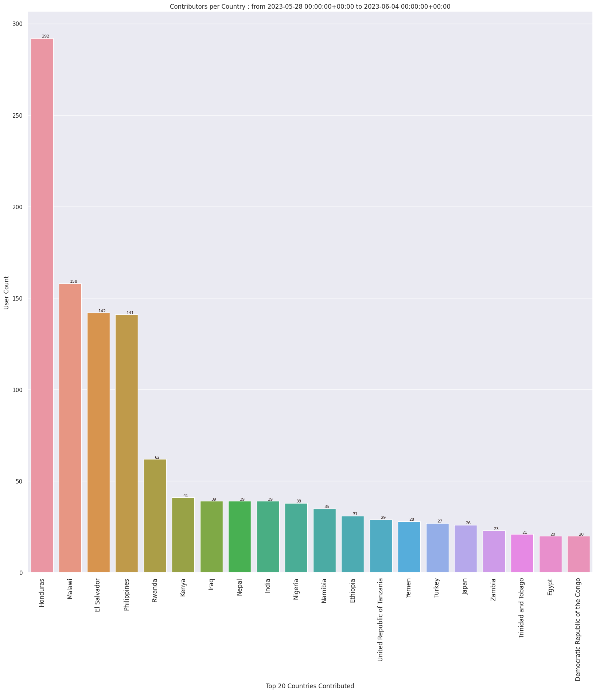
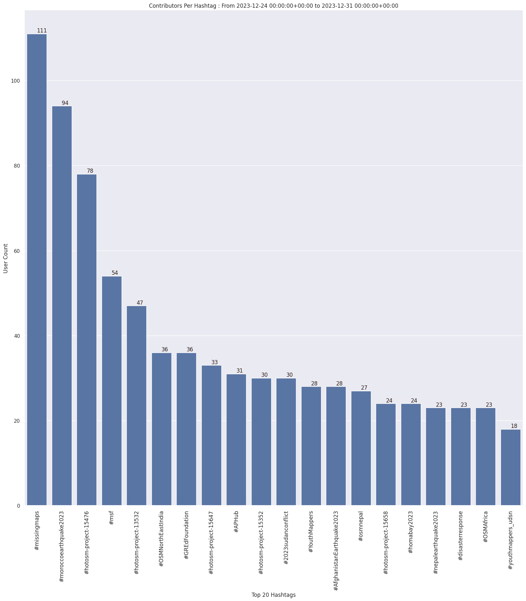
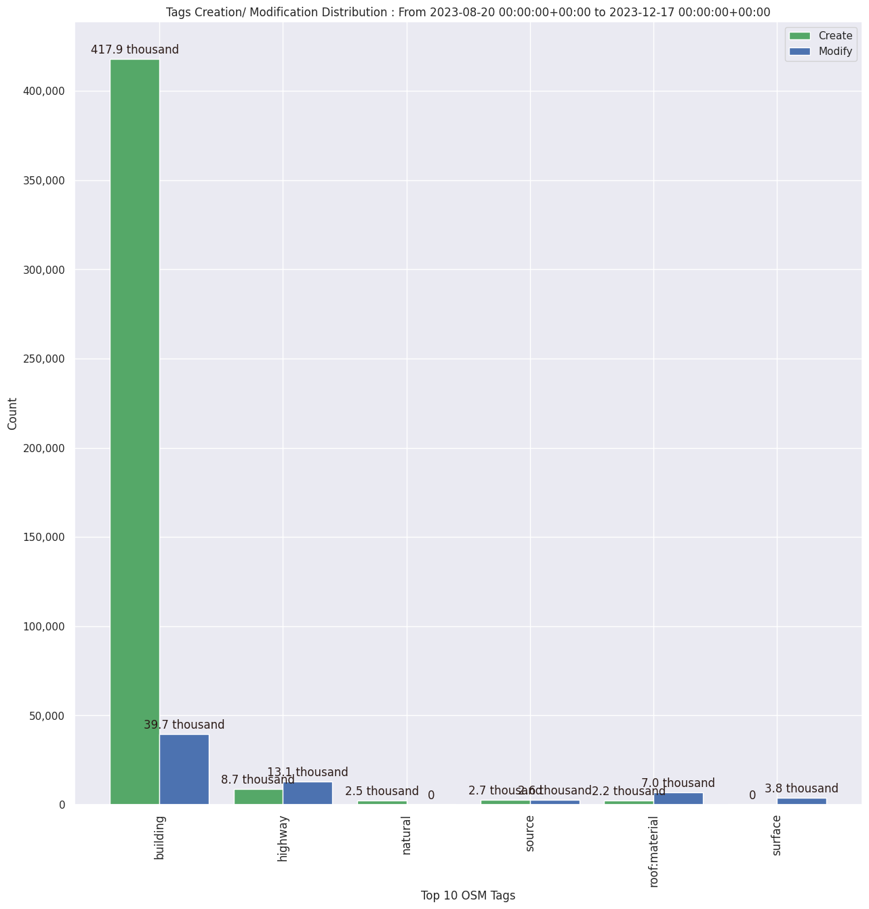

### Last Update : Stats from 2023-04-02 00:00:00+00:00 to 2023-04-09 00:00:00+00:00 (UTC Timezone)

#### 1.2 thousand Users made 18.7 thousand changesets with 2.7 million map changes.
#### 1.9 million OSM Elements were Created, 510.4 thousand Modified & 236.6 thousand Deleted.
Get Full Stats at [stats.csv](/stats/hotosm/Weekly/stats.csv)
 & Get Summary Stats at [stats_summary.csv](/stats/hotosm/Weekly/stats_summary.csv)

Top 5 Users are : 
- UPegasus : 82.5 thousand Map Changes
- nyainariantsoa : 58.8 thousand Map Changes
- Kicking Leaves : 52.6 thousand Map Changes
- Frans S : 46.5 thousand Map Changes
- Kraan46 : 45.5 thousand Map Changes

Summary of Supplied Tags
- poi = Created: 1.9 thousand, Modified : 670
- building = Created: 263.4 thousand, Modified : 18.0 thousand
- highway = Created: 12.5 thousand, Modified : 13.6 thousand
- waterway = Created: 837, Modified : 916
- amenity = Created: 150, Modified : 165

Top 5 Created tags are :
- building: 263.4 thousand
- source: 14.9 thousand
- highway: 12.5 thousand
- natural: 2.0 thousand
- landuse: 1.5 thousand

Top 5 Modified tags are :
- building: 18.0 thousand
- highway: 13.6 thousand
- source: 5.3 thousand
- building:levels: 4.6 thousand
- height: 4.2 thousand

Top 5 trending hashtags are:
- #OpenCitiesLAC : 250 users
- #TropicalCycloneFreddy : 205 users
- #CycloneFreddy : 205 users
- #missingmaps : 199 users
- #hotosm-project-14513 : 185 users

Top 5 trending Countries where user contributed are:
- Malawi : 261 users
- El Salvador : 188 users
- Ethiopia : 123 users
- Rwanda : 66 users
- Turkey : 65 users

 Charts : 
 
 
 
 
