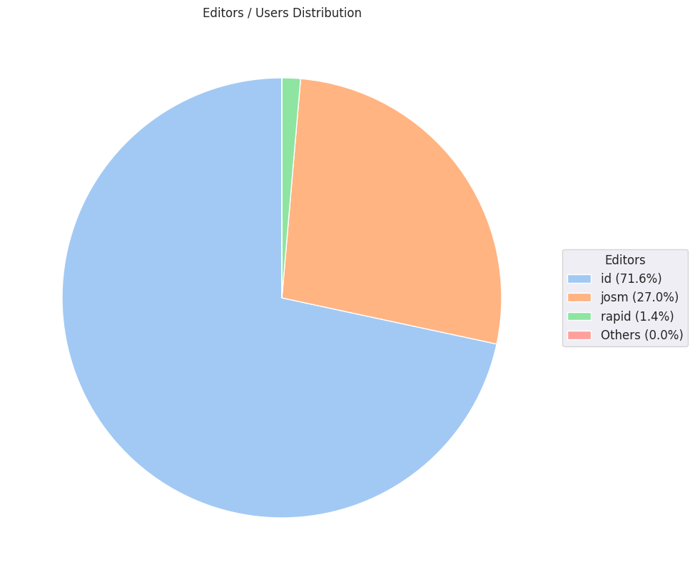

### Last Update : Stats from 2023-08-13 00:00:00+00:00 to 2023-08-20 00:00:00+00:00 (UTC Timezone)

#### 1.0 thousand Users made 18.3 thousand changesets with 2.3 million map changes.
#### 1.6 million OSM Elements were Created, 540.4 thousand Modified & 154.3 thousand Deleted.
Get Full Stats at [stats.csv](/stats/hotosm/Weekly/stats.csv)
 & Get Summary Stats at [stats_summary.csv](/stats/hotosm/Weekly/stats_summary.csv)

Top 5 Users are : 
- TeBaMa : 77.6 thousand Map Changes
- Noel Samson : 51.0 thousand Map Changes
- Atikur Rahman atik : 48.5 thousand Map Changes
- UPegasus : 41.8 thousand Map Changes
- Ashok Thakulla : 37.8 thousand Map Changes

Summary of Supplied Tags
- poi = Created: 5.2 thousand, Modified : 688
- building = Created: 247.9 thousand, Modified : 30.0 thousand
- highway = Created: 9.3 thousand, Modified : 9.6 thousand
- waterway = Created: 738, Modified : 606
- amenity = Created: 186, Modified : 186

Top 5 Created tags are :
- building: 247.9 thousand
- highway: 9.3 thousand
- source: 3.9 thousand
- natural: 1.9 thousand
- landuse: 1.6 thousand

Top 5 Modified tags are :
- building: 30.0 thousand
- building:levels: 11.2 thousand
- height: 10.2 thousand
- pmfsefin:idedif: 10.1 thousand
- highway: 9.6 thousand

Top 5 trending hashtags are:
- #missingmaps : 206 users
- #OpenCitiesLAC : 198 users
- #kalutara : 190 users
- #srilanka : 190 users
- #dmc : 190 users

Top 5 trending editors are:
- iD 2.21.1 : 747 users
- JOSM/1.5 (18789 en) : 56 users
- JOSM/1.5 (18746 en) : 38 users
- JOSM/1.5 (18772 en) : 20 users
- JOSM/1.5 (18721 fr) : 15 users

Top 5 trending Countries where user contributed are:
- Honduras : 195 users
- Sri Lanka : 192 users
- Kenya : 132 users
- Timor-Leste : 94 users
- India : 83 users

 Charts : 
 
 
 
 
 
