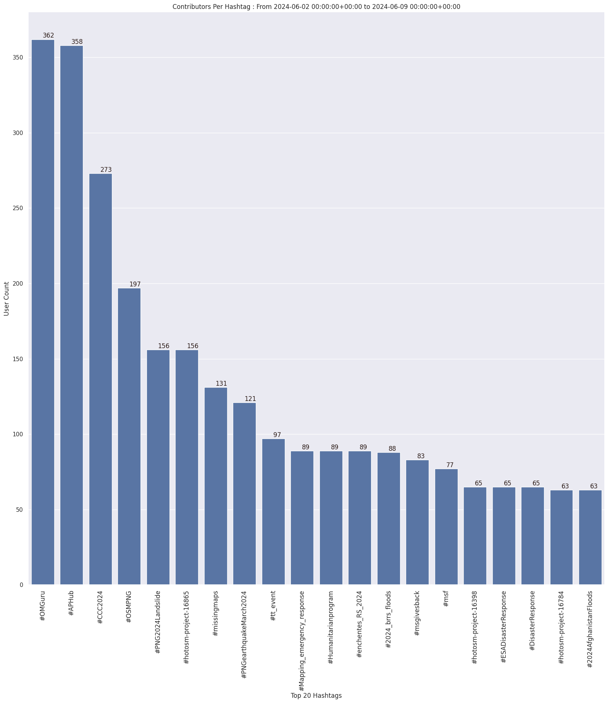

### Last Update : Stats from 2023-07-23 00:00:00+00:00 to 2023-07-30 00:00:00+00:00 (UTC Timezone)

#### 1.1 thousand Users made 15.8 thousand changesets with 1.9 million map changes.
#### 1.5 million OSM Elements were Created, 332.3 thousand Modified & 138.0 thousand Deleted.
Get Full Stats at [stats.csv](/stats/hotosm/Weekly/stats.csv)
 & Get Summary Stats at [stats_summary.csv](/stats/hotosm/Weekly/stats_summary.csv)

Top 5 Users are : 
- TeBaMa : 77.3 thousand Map Changes
- isabellklip : 41.7 thousand Map Changes
- Joshua Kacheyo : 41.5 thousand Map Changes
- UPegasus : 31.1 thousand Map Changes
- Henk Kamphuis : 28.5 thousand Map Changes

Summary of Supplied Tags
- poi = Created: 3.8 thousand, Modified : 368
- building = Created: 207.0 thousand, Modified : 19.1 thousand
- highway = Created: 15.5 thousand, Modified : 11.6 thousand
- waterway = Created: 1.2 thousand, Modified : 785
- amenity = Created: 83, Modified : 281

Top 5 Created tags are :
- building: 207.0 thousand
- highway: 15.5 thousand
- source: 4.8 thousand
- natural: 4.2 thousand
- surface: 1.6 thousand

Top 5 Modified tags are :
- building: 19.1 thousand
- highway: 11.6 thousand
- building:levels: 8.3 thousand
- height: 8.2 thousand
- pmfsefin:idedif: 8.1 thousand

Top 5 trending hashtags are:
- #missingmaps : 232 users
- #OpenCitiesLAC : 174 users
- #OSMIndia : 134 users
- #msf : 133 users
- #NorthIndiaFloods2023 : 96 users

Top 5 trending editors are:
- iD 2.21.1 : 812 users
- JOSM/1.5 (18772 en) : 47 users
- JOSM/1.5 (18746 en) : 39 users
- JOSM/1.5 (18721 fr) : 19 users
- JOSM/1.5 (18772 fr) : 16 users

Top 5 trending Countries where user contributed are:
- Honduras : 182 users
- India : 146 users
- Philippines : 114 users
- Sudan : 88 users
- Kenya : 80 users

 Charts : 
 
 
 
 
 
