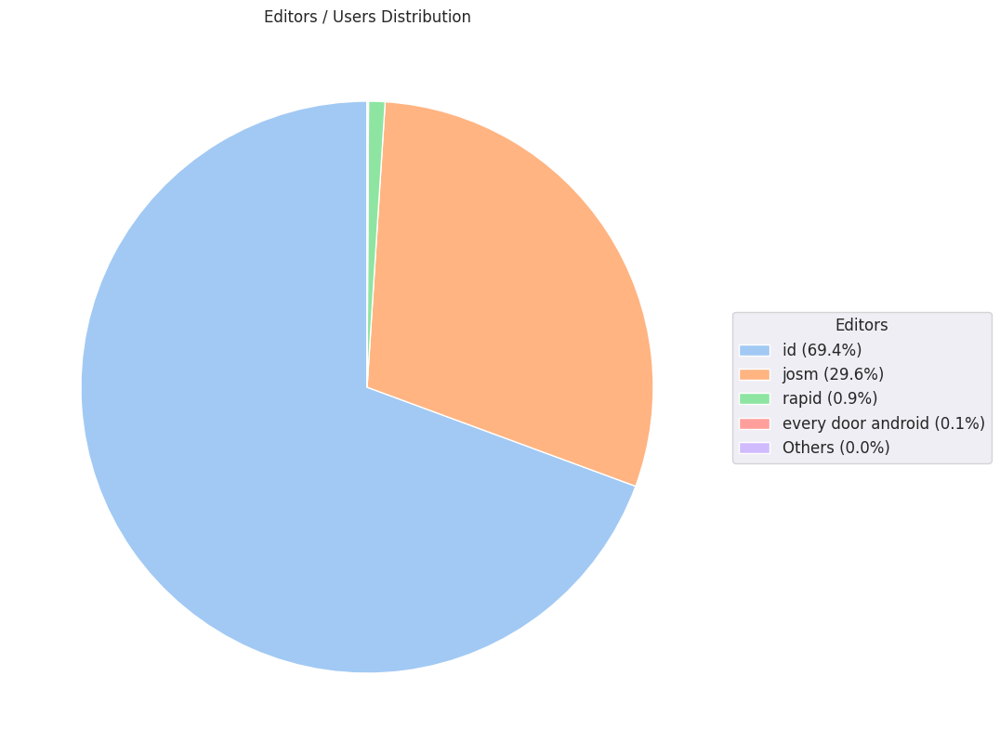

### Last Update : Stats from 2024-05-19 00:00:00+00:00 to 2024-05-26 00:00:00+00:00 (UTC Timezone)

#### 2.2 thousand Users made 33.6 thousand changesets with 5.1 million map changes.
#### 3.6 million OSM Elements were Created, 1.1 million Modified & 354.0 thousand Deleted.
Get Full Stats at [stats.csv](/stats/hotosm/Weekly/stats.csv)
 & Get Summary Stats at [stats_summary.csv](/stats/hotosm/Weekly/stats_summary.csv)

Top 5 Users are : 
- BladeTC : 123.7 thousand Map Changes
- demoore19 : 116.3 thousand Map Changes
- NicaTopo : 81.6 thousand Map Changes
- Ayomide_OJ : 78.8 thousand Map Changes
- Libor Bednarik : 73.3 thousand Map Changes

Summary of Supplied Tags
- poi = Created: 975, Modified : 2.6 thousand
- building = Created: 556.3 thousand, Modified : 66.1 thousand
- highway = Created: 18.7 thousand, Modified : 21.9 thousand
- waterway = Created: 1.8 thousand, Modified : 1.4 thousand
- amenity = Created: 293, Modified : 377

Top 5 Created tags are :
- building: 556.3 thousand
- source: 57.6 thousand
- highway: 18.7 thousand
- surface: 4.3 thousand
- landuse: 3.4 thousand

Top 5 Modified tags are :
- building: 66.1 thousand
- highway: 21.9 thousand
- surface: 11.1 thousand
- level: 10.5 thousand
- source: 6.9 thousand

Top 5 trending hashtags are:
- #missingmaps : 392 users
- #ourimpact : 383 users
- #GVM2024 : 380 users
- #OMGuru : 349 users
- #APHub : 334 users

Top 5 trending editors are:
- iD 2.21.1 : 1828 users
- JOSM/1.5 (19067 en) : 93 users
- JOSM/1.5 (18822 en) : 33 users
- JOSM/1.5 (19039 en) : 29 users
- JOSM/1.5 (19067 en_GB) : 29 users

Top 5 trending Countries where user contributed are:
- Nicaragua : 630 users
- Nigeria : 256 users
- Mozambique : 123 users
- Papua New Guinea : 117 users
- Afghanistan : 114 users

 Charts : 
 
 
 
 
 
