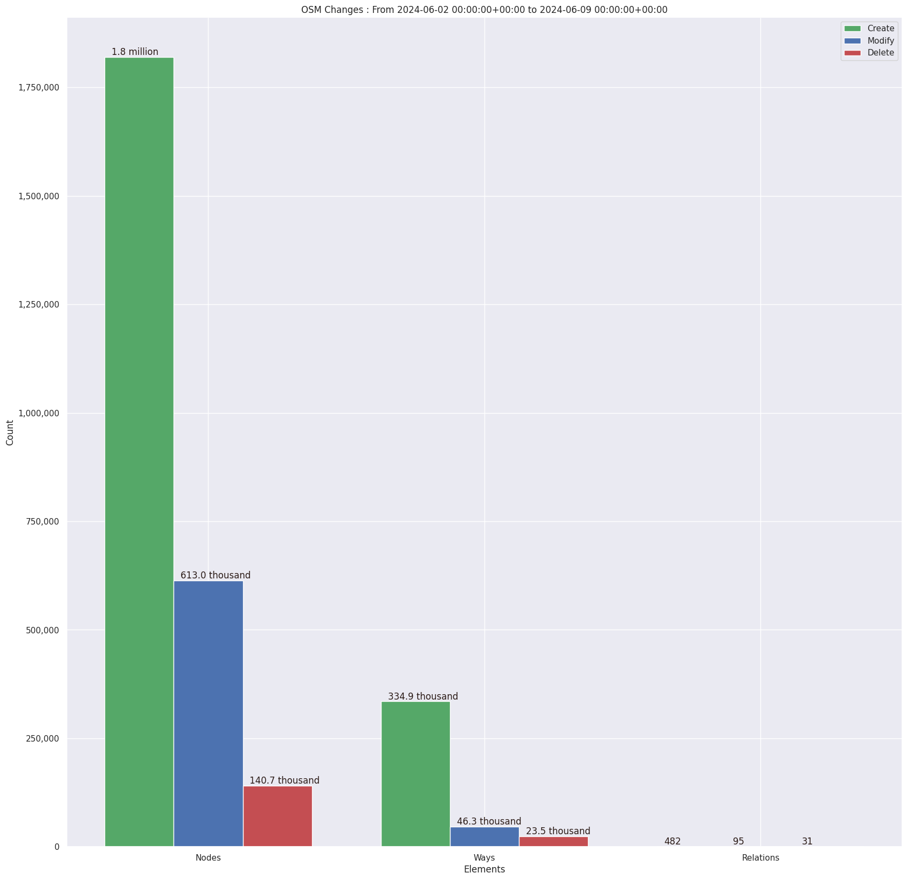

### Last Update : Stats from 2023-06-18 00:00:00+00:00 to 2023-06-25 00:00:00+00:00 (UTC Timezone)

#### 1.8 thousand Users made 21.8 thousand changesets with 2.0 million map changes.
#### 1.5 million OSM Elements were Created, 366.7 thousand Modified & 151.0 thousand Deleted.
Get Full Stats at [stats.csv](/stats/hotosm/Weekly/stats.csv)
 & Get Summary Stats at [stats_summary.csv](/stats/hotosm/Weekly/stats_summary.csv)

Top 5 Users are : 
- TeBaMa : 35.9 thousand Map Changes
- Libor Bednarik : 28.8 thousand Map Changes
- UPegasus : 25.4 thousand Map Changes
- youngmapper : 23.8 thousand Map Changes
- mjgk : 19.8 thousand Map Changes

Summary of Supplied Tags
- poi = Created: 1.2 thousand, Modified : 618
- building = Created: 228.9 thousand, Modified : 18.5 thousand
- highway = Created: 6.2 thousand, Modified : 9.3 thousand
- waterway = Created: 1.1 thousand, Modified : 678
- amenity = Created: 275, Modified : 175

Top 5 Created tags are :
- building: 228.9 thousand
- highway: 6.2 thousand
- source: 3.3 thousand
- landuse: 1.6 thousand
- waterway: 1.1 thousand

Top 5 Modified tags are :
- building: 18.5 thousand
- highway: 9.3 thousand
- surface: 3.6 thousand
- source: 3.0 thousand
- name: 1.4 thousand

Top 5 trending hashtags are:
- #OpenCitiesLAC : 571 users
- #missingmaps : 374 users
- #msgivesback : 326 users
- #kalutara : 304 users
- #hotosm-project-14637 : 304 users

Top 5 trending editors are:
- iD 2.21.1 : 1441 users
- JOSM/1.5 (18746 en) : 88 users
- JOSM/1.5 (18678 en) : 54 users
- JOSM/1.5 (18746 fr) : 18 users
- JOSM/1.5 (18721 fr) : 18 users

Top 5 trending Countries where user contributed are:
- Honduras : 568 users
- Sri Lanka : 351 users
- Democratic Republic of the Congo : 152 users
- Philippines : 120 users
- Malawi : 61 users

 Charts : 
 
 
 
 
 
