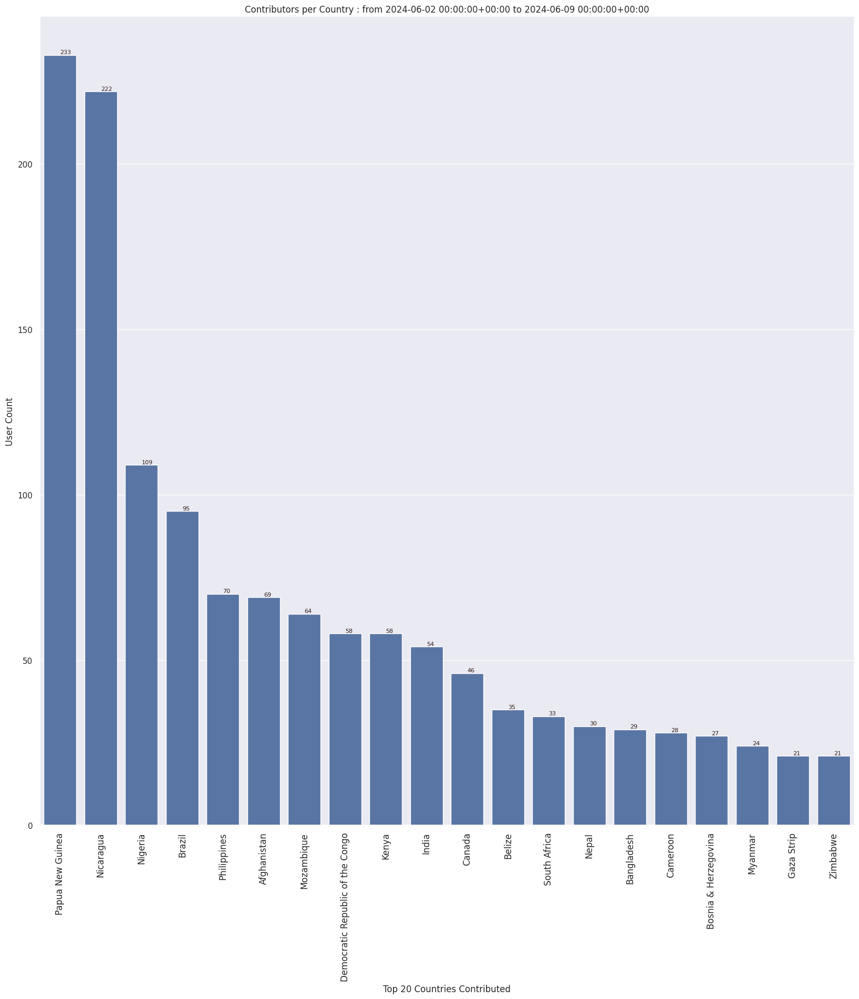

### Last Update : Stats from 2023-08-06 00:00:00+00:00 to 2023-08-13 00:00:00+00:00 (UTC Timezone)

#### 872 Users made 17.6 thousand changesets with 2.2 million map changes.
#### 1.6 million OSM Elements were Created, 546.7 thousand Modified & 134.2 thousand Deleted.
Get Full Stats at [stats.csv](/stats/hotosm/Weekly/stats.csv)
 & Get Summary Stats at [stats_summary.csv](/stats/hotosm/Weekly/stats_summary.csv)

Top 5 Users are : 
- TeBaMa : 72.9 thousand Map Changes
- samrat02 : 59.5 thousand Map Changes
- Yves umuganwa : 59.5 thousand Map Changes
- ahmed minta : 48.6 thousand Map Changes
- UPegasus : 46.1 thousand Map Changes

Summary of Supplied Tags
- poi = Created: 751, Modified : 1.8 thousand
- building = Created: 229.9 thousand, Modified : 35.0 thousand
- highway = Created: 15.9 thousand, Modified : 13.5 thousand
- waterway = Created: 1.0 thousand, Modified : 654
- amenity = Created: 96, Modified : 179

Top 5 Created tags are :
- building: 229.9 thousand
- highway: 15.9 thousand
- source: 10.3 thousand
- landuse: 1.2 thousand
- natural: 1.1 thousand

Top 5 Modified tags are :
- building: 35.0 thousand
- building:levels: 19.3 thousand
- height: 18.9 thousand
- pmfsefin:idedif: 18.8 thousand
- highway: 13.5 thousand

Top 5 trending hashtags are:
- #missingmaps : 196 users
- #dmc : 163 users
- #srilanka : 163 users
- #kalutara : 163 users
- #hotosm-project-14637 : 163 users

Top 5 trending editors are:
- iD 2.21.1 : 607 users
- JOSM/1.5 (18789 en) : 62 users
- JOSM/1.5 (18746 en) : 35 users
- JOSM/1.5 (18772 en) : 21 users
- JOSM/1.5 (18463 en) : 15 users

Top 5 trending Countries where user contributed are:
- Sri Lanka : 163 users
- Honduras : 134 users
- India : 80 users
- Philippines : 66 users
- Sudan : 55 users

 Charts : 
 
 
 
 
 
