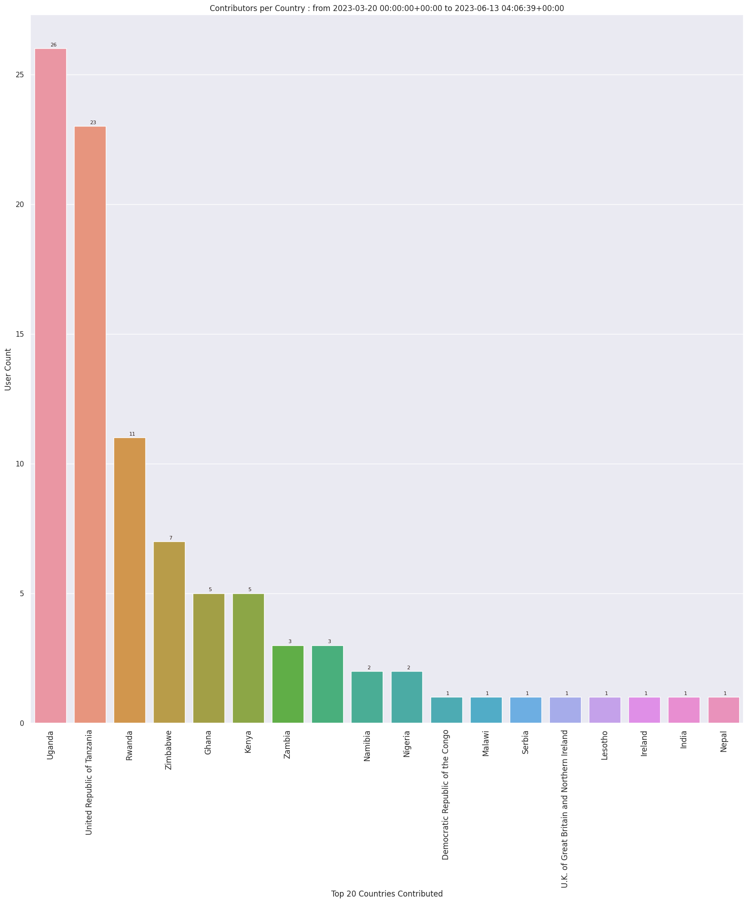
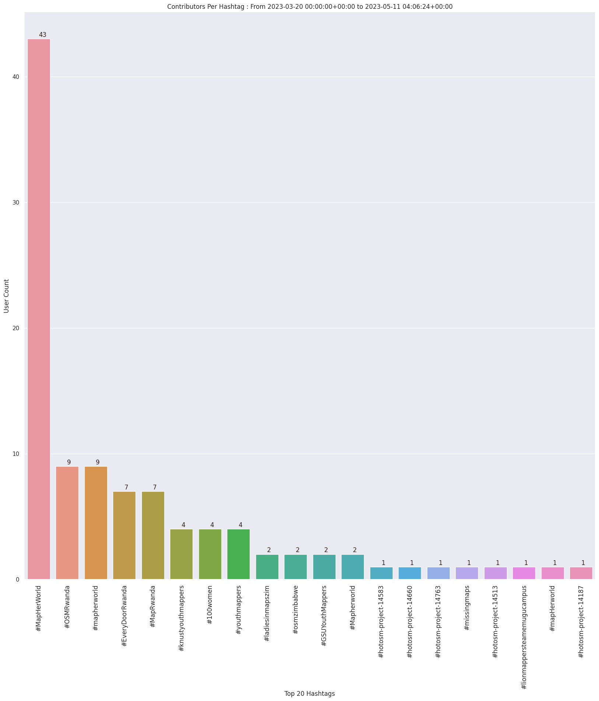
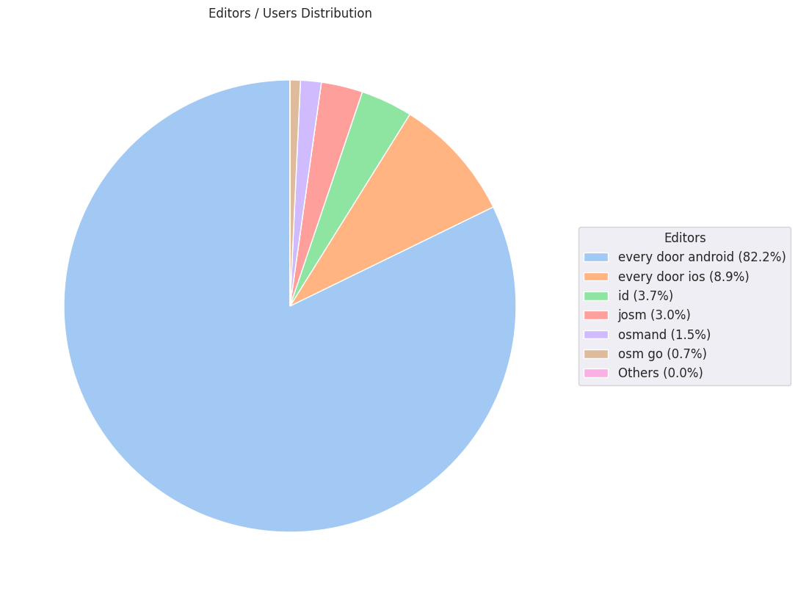
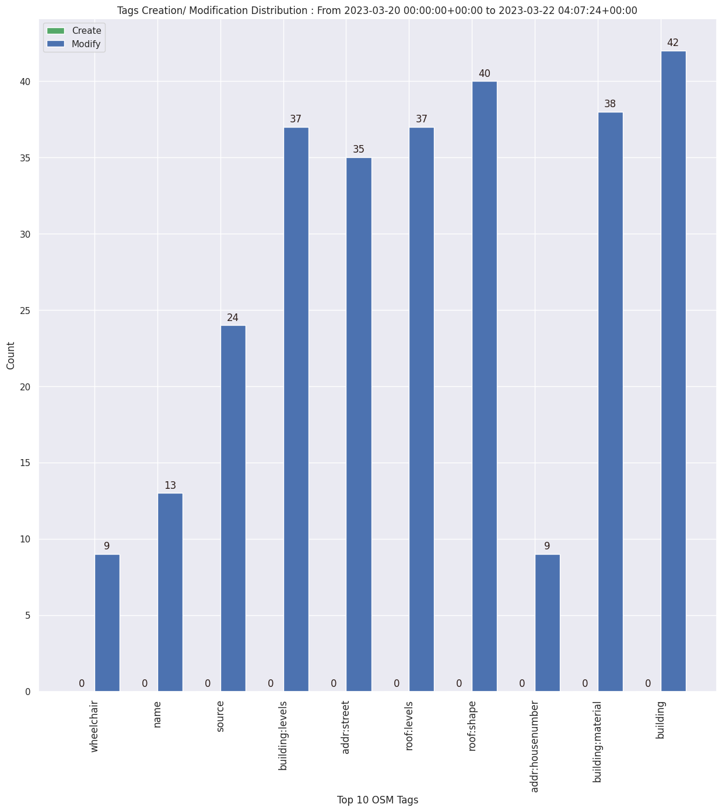

### Last Update : Stats from 2023-03-20 00:00:00+00:00 to 2023-07-24 04:07:12+00:00 (UTC Timezone)

#### 107 Users made 5.0 thousand changesets with 68.0 thousand map changes.
#### 20.7 thousand OSM Elements were Created, 47.1 thousand Modified & 128 Deleted.
Get Full Stats at [stats.csv](/stats/mapherworld/Daily/stats.csv)
 & Get Summary Stats at [stats_summary.csv](/stats/mapherworld/Daily/stats_summary.csv)

Top 5 Users are : 
- charles chilufya : 11.6 thousand Map Changes
- paulsangu14 : 11.0 thousand Map Changes
- Eugenie de Jesus : 8.1 thousand Map Changes
- Yves umuganwa : 3.9 thousand Map Changes
- Kelvin Manase : 3.5 thousand Map Changes

Summary of Supplied Tags
- poi = Created: 12.4 thousand, Modified : 16.9 thousand
- building = Created: 8.9 thousand, Modified : 27.5 thousand
- highway = Created: 1.6 thousand, Modified : 88
- waterway = Created: 12, Modified : 1
- amenity = Created: 1.5 thousand, Modified : 10.9 thousand
- highway length created = 4 Km

Top 5 Created tags are :
- building: 8.9 thousand
- roof:shape: 7.2 thousand
- addr:housenumber: 2.7 thousand
- building:levels: 2.4 thousand
- roof:levels: 2.3 thousand

Top 5 Modified tags are :
- building: 27.5 thousand
- roof:shape: 21.8 thousand
- building:levels: 21.0 thousand
- roof:levels: 19.8 thousand
- check_date: 19.6 thousand

Top 5 trending hashtags are:
- #MapHerWorld : 84 users
- #OsmUgcampaign : 15 users
- #mapherworld : 13 users
- #OSMRwanda : 11 users
- #EveryDoorRwanda : 8 users

Top 5 trending editors are:
- Every Door Android 3.0 : 53 users
- Every Door Android 3.1 : 53 users
- Every Door iOS 3.0 : 10 users
- iD 2.25.2 : 3 users
- OsmAnd 4.4.7 : 2 users

Top 5 trending Countries where user contributed are:
- United Republic of Tanzania : 44 users
- Uganda : 27 users
- Rwanda : 12 users
- Zimbabwe : 7 users
- Ghana : 6 users

 Charts : 
 
 
 
 
 
