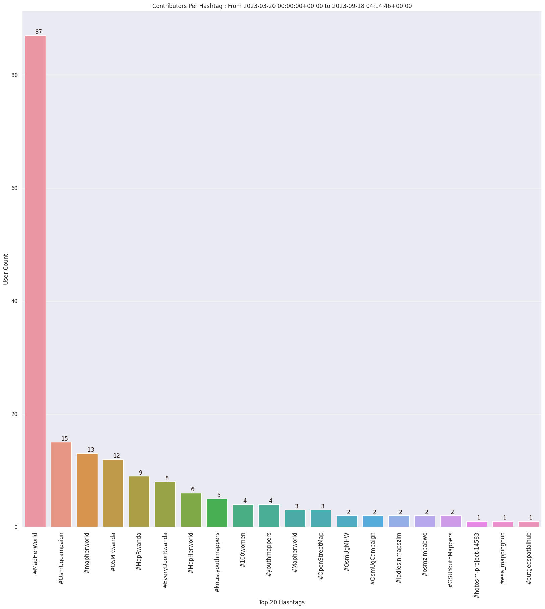

### Last Update : Stats from 2023-03-20 00:00:00+00:00 to 2023-04-27 04:06:47+00:00 (UTC Timezone)

#### 40 Users made 1.8 thousand changesets with 21.0 thousand map changes.
#### 5.1 thousand OSM Elements were Created, 15.9 thousand Modified & 31 Deleted.
Get Full Stats at [stats.csv](/stats/mapherworld/Daily/stats.csv)
 & Get Summary Stats at [stats_summary.csv](/stats/mapherworld/Daily/stats_summary.csv)

Top 5 Users are : 
- charles chilufya : 5.0 thousand Map Changes
- paulsangu14 : 3.6 thousand Map Changes
- Paxxy : 2.9 thousand Map Changes
- Kelvin Manase : 1.9 thousand Map Changes
- asmakulaga : 1.6 thousand Map Changes

Summary of Supplied Tags
- poi = Created: 1.9 thousand, Modified : 8.2 thousand
- building = Created: 875, Modified : 7.1 thousand
- highway = Created: 309, Modified : 35
- waterway = Created: 4, Modified : 0
- amenity = Created: 678, Modified : 5.1 thousand
- highway length created = 0 Km

Top 5 Created tags are :
- name: 894
- building: 875
- amenity: 678
- check_date: 652
- wheelchair: 332

Top 5 Modified tags are :
- check_date: 9.5 thousand
- name: 8.4 thousand
- building: 7.1 thousand
- roof:shape: 5.6 thousand
- addr:street: 5.5 thousand

Top 5 trending hashtags are:
- #MapHerWorld : 28 users
- #mapherworld : 6 users
- #knustyouthmappers : 4 users
- #MapRwanda : 3 users
- #EveryDoorRwanda : 3 users

Top 5 trending Countries where user contributed are:
- United Republic of Tanzania : 11 users
- Rwanda : 5 users
- Zimbabwe : 5 users
- Ghana : 4 users
- Zambia : 3 users

 Charts : 
 
 
 
 
